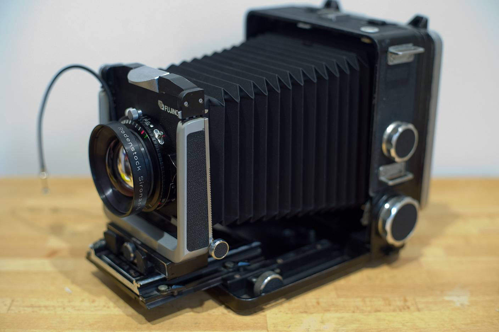
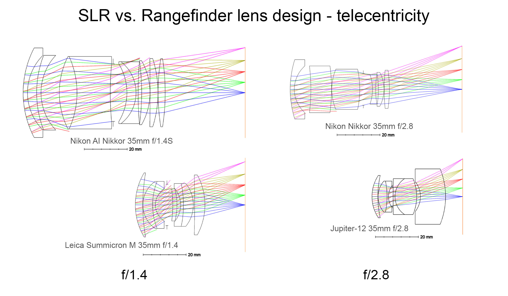
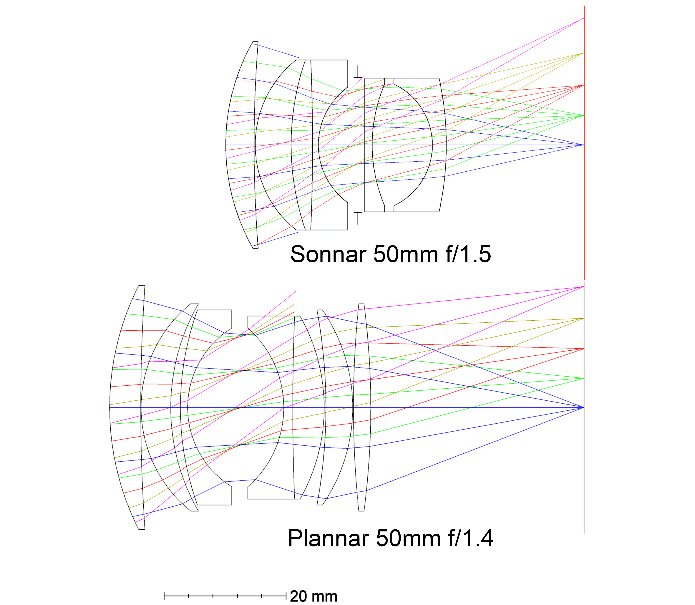
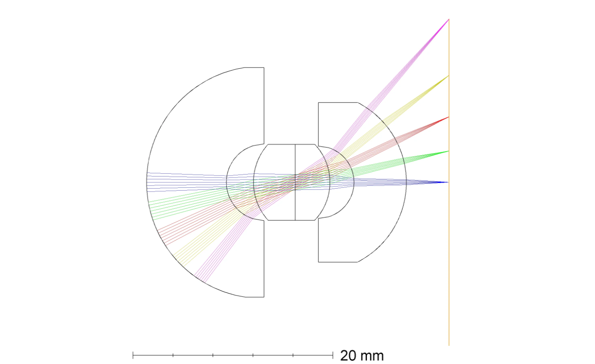
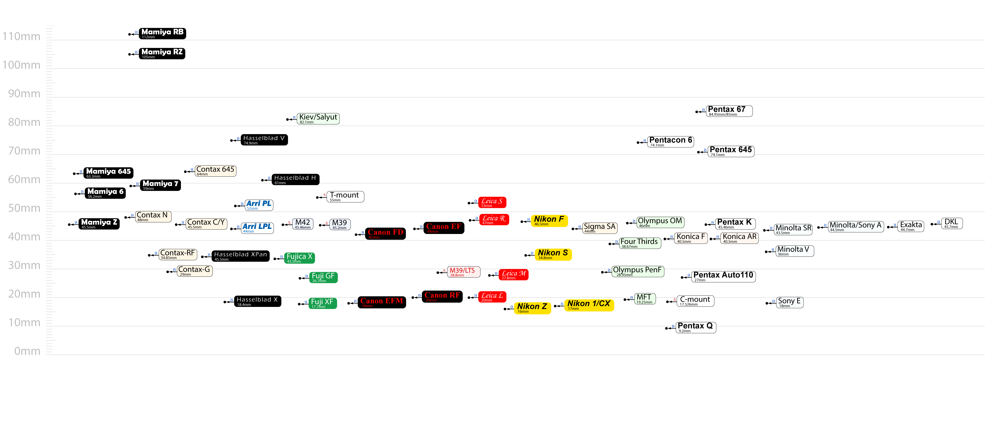
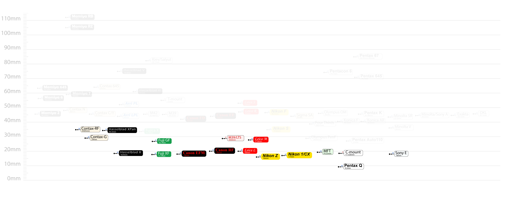
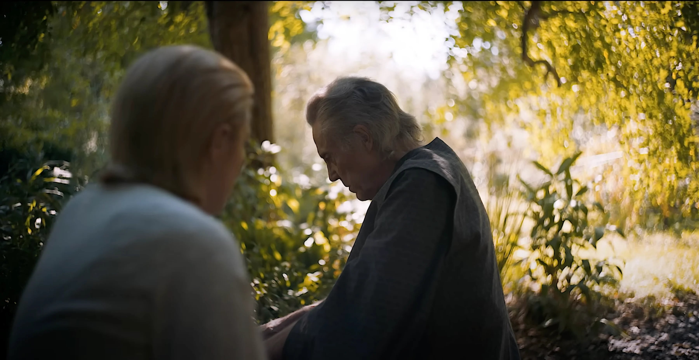
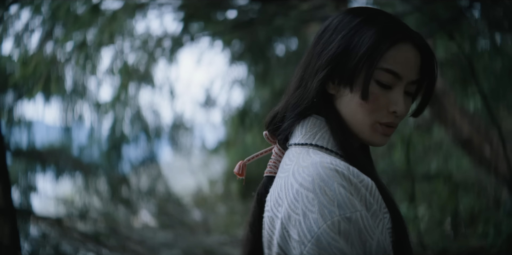
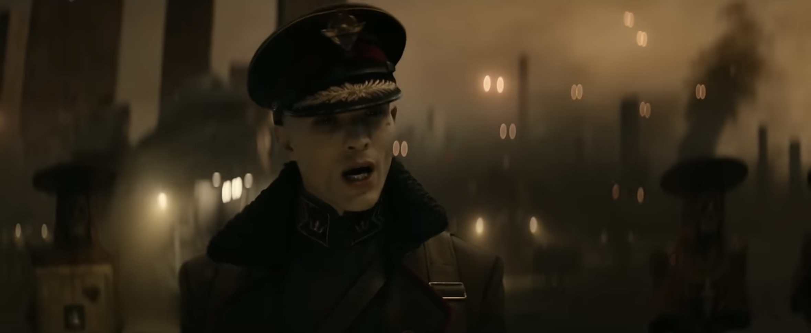

# 1.1 - Rise of the “vintage look”

While this wiki is not a photography/contemporary history class, some camera and lens design history would help explaining why vintage lens have gained popularity in recent years. 

## 1.1.1 - Dass alle unsere Erkenntnis mit der Erfahrung anfange

During the 19th and early 20th century, 8x10, 5x7, and 4x5 were the common photography formats. These numbers represent the size of the negative in inches, which is generally larger than the entire body of a modern digital camera. Large negative requires large cameras and large lenses, also expensive developing processes. Taking a photo was thus a slow and prohibitive process. 

	

$$
\textsf{Example of a large format camera (Lomography)}
$$

The cost of taking photos brought some problems, 1 photo in Daguerreotype was about $81.50 to $195.00 in modern standard (alice). Motion picture requires taking images in rapid succession, which, apparently, cannot afford to shoot film at the size and price rate of still photos.

To solve this, William Kennedy Dickson came up with a small and perforated film gauge in 1889. Using gears in the camera to bite into the perforations and let the film run vertically through the camera. The image area of this film, when shooting at the standard academy aspect ratio, is roughly 146 times smaller than a single 8x10 film, drastically reducing the cost. Because this film type has a width of 35mm, it is also referred to as the 35mm film. Later, Kodak popularized the name “135 film” as another name for the 35mm motion picture film.

	

In 1913, Oskar Barnack put 35mm motion picture film horizontally in a still camera, with a 3x2 aspect ratioed gate, this becomes the first 135 camera. The cameras that bear the traits of his invention have been referred to as Barnack camera ever since, these traits include: 

- **Dial winder.** Barnack cameras tend to use two dials, one for advancing the film after each shot, anther for rewinding the film.
- **Take up spool to attach the film lead**. The film roll attaches onto a take up spool. When the advance dial is rotated, the spool drags the film forward into next frame.
- **Removable bottom plate**. Film loading are typically done by removing the bottom plate, connecting the film onto the take up spool, pushing them into the back, then reattaching the bottom plate.

	

$$
\textsf{An existing Barnack camera used by Oscar Barnack himself (Kosmo Foto)}
$$

The Barnack is a quite straightforward camera design. It attaches the lens onto a camera body so that it can project the image directly onto the film, effectively miniaturizing a large format camera. Concealing the film in a canister also allowed the camera to take several dozens of images with one roll of film, a significant jump from large format. But this means the canister must remain inside and the user cannot use the viewing glass to see the composition like in large format cameras.

As a result, there is no way of knowing what the image looks like and where the lens is currently focusing at. Checking the focus can only be done by meter taping or by user estimation based on the focus marking on the lens, the latter is commonly known now as *zone focus*.

Another way to find the proper focus distance is by borrowing external optical devices, such as a coincidence rangefinder. These devices use trigonometry to find the distance of objects, which can then be used to focus the lens.

	

$$
\textsf{A Barnack camera with external conincident rangefinder (Kamerastore)}
$$

Using an external device was clearly a cumbersome way to find focus. Later, an internal coincident range finding method was introduced: a probe in the camera would touch the rear of the lens, allowing the current focus distance to be reflected in the viewfinder as the lens moved back and forth during focusing. This focusing method remains present in modern Leica M series digital and film cameras, and cameras using this built-in range finding mechanism are commonly known as rangefinder cameras.

 
## 1.1.2 - Once upon a time in lens design

Although the coincident rangefinder solved the focusing problem, it still had one significant limitation. 

The viewfinder, while providing a decent representation of the final image, is positioned differently from the lens and doesn't show exactly what the lens captures. This misalignment causes parallax, meaning that the view in the finder window differs slightly from the actual image. The effect became particularly noticeable during close-focus. As a result, most rangefinder lenses were limited to a minimum focus distance of 0.7m or 1m, and most camera bodies wouldn't even support rangefinder focusing at closer distances.

Additionally, the rangefinder and viewfinder mechanism limited lens size, since large lenses would block the viewfinder's view significantly. This restricted rangefinder lens designs to moderate sizes. 

	

$$
\textsf{The lens blocked part of the viewfinder. (Rockwell)}
$$

For these reasons, it made sense that single lens reflex (SLR) cameras gradually became photographers' new favorite as technology developed. 

As the name suggests, SLR incorporates a reflective mirror between the lens and the image plane. This mirror reflects the image upward into a focus screen, allowing photographers to see exactly what the lens sees.

The mirror flips the image upside down. Since the image is already inverted when it exits the lens, this flipping corrects the vertical orientation. 

However, the image remains reversed left to right with just the mirror. Later SLRs solved this by adding a prism with a ridge at the top, correcting the horizontal orientation to match normal vision. This means what photographers see in the viewfinder is precisely what they'll capture (ideally, in practice the prism does not always provide 100% view coverage).

Additionally, since the viewfinder now looks directly through the lens (TTL) rather than beside it, the size restrictions of rangefinder cameras no longer apply. SLR lenses can be built in any size and weight, allowing for greater flexibility in both focal length and maximum aperture designs.

But the transition from rangefinder to SLR was not without sacrifice, some lens designs, wide angle lenses particularly, were drastically limited for SLR cameras. 

The introduction of mirror means there must be a large space between the lens and the image plane to house the mirror. The space also have to be large enough for the mirror to flip up. Such space increased the flange distance, i.e., the distance from the flange of the lens mount to the image plane, and most SLR camera system would ended up having a flange distance of around 40mm. 

It should be pointed out that flange distance alone does not make lens design difficult, but a measurement closely related to it does: back focal distance (BFD). 

BFD refers to the distance between the lens’s last surfaces and the image plane. For rangefinder lenses, since there are nothing between the lens and the image plane, the BFD can be whatever it wants. The Soviet lens Jupiter-12, for example, has a rear element protruding so much that it pokes into the camera, its BFD is so small that it will hit the sensor glass of some modern digital cameras. 

SLR lenses, on the other hand, completely lost this privilege. The space between the lens and the image plane have to be big enough for a chamber that holds the mirror and other mechanisms that actuates the mirror. This chamber dictates that the rear element of lenses designed for SLR must stay out of the way, which also renders virtually all rangefinder lenses unusable on SLR.

	

The figure above shows the optical layout of 4 lenses of the same 35mm focal length for 135 cameras, differentiated only by camera system and maximum aperture. The left column are 2 lenses with a maximum aperture f/1.4, and the right f/2.8. The top row are lenses designed for SLR camera, and the bottom two for rangefinder cameras. 

The rangefinder lenses adopted a mostly symmetric design around the aperture stop. In comparison, the SLR lenses for this focal length almost universally chose the inverse telephoto arrangement with the signature negative group at the front in order to extend the exiting rays to reach the image plane over a longer distance. As a result, SLR lenses at wider angles have to use more and often larger elements to achieve what rangefinder lenses could do with fewer and smaller elements. 

The core of this difference is caused by the angle of the exiting rays, or the position of the exit pupil. The closer the exit pupil is to the image plane, the more oblique the exiting rays. With a small BFD, rangefinder lenses enjoys a full degree of freedom on the position of the exit pupil. But for SLR lenses, the exit pupil have to be further away from the image plane in order for the exiting rays to be projected through the mirror chamber and reach the image plane. 

One example of the effect of exit pupil is the shift of normal focal length design paradigm. When rangefinder was the mainstream, Sonnar was a popular optical design paradigm for fast normal focal length lenses. However, the Sonnar design often features highly oblique exiting rays, which requires a short BFD and makes it hard to compensate when put on SLR. This gave rise to the double Gauss and the later Planar design, which is arguably the most famous optical design paradigm.

	

$$
\textsf{Comparasion of a Sonnar design (top) and a Planar design (bottom).}
$$

A more extreme lens design example would be the famous Zeiss Hologon 15mm f/8. This lens uses only 4 elements in 3 groups to achieve a remarkable sharpness with virtually no distortion. But such oblique angles can only be achieved on rangefinder cameras *(in fact, these angles also makes this lens performing badly on digital sensors, as will be discussed later)*. 

	

$$
\textsf{Optical layout for the Zeiss Hologon 15mm f/8 lens.}
$$

The effect of BFD on wide angle lenses is so severe, that many SLR cameras decided to switch back to rangefinder in certain cases. The Nikon 21mm f/4 lens features a small and compact size by pretending it’s for rangefinder camera, thus having a protruding rear. To use it on F mount SLRs, the user have to lift the mirror and then mount the lens. This lens also effectively nullifies the prism viewfinder, and the photographer has to use external viewfinders instead, same applies to the Canon FL 19mm f/3.5. 

	

$$
\textsf{Nikon 21mm f/4 with its protruding rear. (Weitz)}
$$

Hasselblad made its name with the 500 series medium format SLRs but also experienced trouble designing wide angle lenses for its V mount cameras. Their 40mm f/4 and 50mm f/4 wide angle lenses are huge and heavy, later versions even featured a dual focus system in order to acquire a better image quality in close focus: the user have to turn the focus ring first, then turn a second focus ring that controls floating lens elements to match the focus distance. 

Eventually, Hasselblad decided to temporarily bail out the SLR method for wide angle lens and made the Hasselblad 903 SWC. The 903 removed the mirror entirely (jeez isn’t this familiar…) and put the film back directly against the lens. This allowed the exiting rays to have a much more oblique angle, also allowing the lens to be smaller and more symmetric while having great image quality. It did encountered the same problem Nikon and Canon had: without the mirror in the SLR and the distance coupling of rangefinder, they had to use an external viewfinder for composition reference and use the lens focus markings to guess focus. 

But in general, the gain of having a mirror vastly outweighs the slightly lack of freedom in lens design (nor do users really care about how lens designers feel). So the rangefinder cameras have not been gaining popularity until the digital era. 

## 1.1.3 - The Naked Sensor

During the first several years of the 21st century, film cameras were still the mainstream. Canon put out their EOS-1V in 2000, and Nikon released the Nikon F6 in 2004 (astonishingly the F6 remained active for the next 16 years until its eventual discontinuation in 2020). A lot of motion picture productions also used 135 film for their feature films. 

This digital era was ironically started by Kodak with their Fairchild charge-coupled device (CCD) sensor in 1975. Several years later in 1986, it was still Kodak who invented the first digital single lens reflex (DSLR) camera with a sensor with more then 1 mega pixel (archive.ph, McGarvey). Later in 1990s and early 2000s, Kodak also collaborated with Canon and Nikon to produce a series of digital cameras under the Digital Camera System (DCS) line. However, Kodak never seem to truly embraced digital cameras and have been treating them as mostly side hustles. As other manufactures progresses, Kodak’s reluctance made them unable to keep up with the competition and eventually filed bankruptcy in 2012.  

	

$$
\textsf{One of the Kodak DCS models with Nikon. (GcG)}
$$

CCD sensor was regarded as an almost revolutionary invention and has brought huge impact to both scientific applications and the daily life. In 2009, W. Boyle and G. E. Smith was awarded the Nobel price in physics for their contribution in inventing the sensor. Compare to other designs, CCD has a larger pixel pitch at the same density and is much more sensitive to light, thus gaining an advantage in their dynamic range. The dark current suppression is also much more effective in CCD, making it ideal for scientific applications. 

But some other traits of CCD has made it less desirable for consumer applications. For CCD sensors, their charge transfer is triggered by external voltages. For each clock cycle, the charge is shifted to its neighbor until reaching the readout circuit. This means that CCD sensor takes many cycles to read an image and thus tend to have a slower readout speed, especially when there are a large amount of pixels. 

A different type of sensor type is Complementary Metal-Oxide-Semiconductor (CMOS). This type of sensor feature a highly integrated design, with each photodiodes having its own amplifier. While putting the the photodiodes next to the circuitry reduced the pixel pitches and thus lower dynamic range, it does yield a faster readout speed. The integrated design also made CMOS better suited for large scale production. 

The faster readout speed of CMOS also enabled some DSLR cameras to have a live view mode. When live view is enabled, the mirror flips up to allow lights directly hit onto the sensor plane. In this way, the back screen shows directly of what the camera sensor sees. 

The difference between CCD and CMOS was inconsequential at first; DSLR was truly just SLR but swapping the film with a digital sensor, all other operations remained the same. However, within a decade, DSLR starts to reach a mechanical limit; the physical movement of the mirror can only be so fast, and further advancement was staggered. 

It was mentioned previously that for SLR with a prism finder, what one sees in the viewfinder is what one gets. This statement, however, is only true composition wise, there can still be exposure differences that makes the final image brighter or darker than what the scene in viewfinder appears to be. However, when live view is enabled, what the screen shows is **exactly** what the final image looks like. 

From hindsight, it is quite obvious what would happen next. 

In 2013, Sony announced their first α7 camera, which features the same sized sensor as Canon and Nikon’s mainstream DSLRs but without the mirror, commonly considered the 1st full frame mirrorless camera. The initial model still had problems in focus speed, battery capacity, and handling *(actually, no, the grip ergonomic of Sony α series is a piece of shit and it never improved)*, but later models gradually fixed these issues and it became apparent that mirrorless camera is the right direction. 

Other major manufactures quickly jumped in and established their own mirrorless series. in 2020, after the initial Canon R, Canon released 1Dx III DSLR together with what turned out to be one of the most popular mirrorless camera models, the EOS R5 and R6. Nikon rolled out the DSLR Nikon D6, at the same year releasing the next generation of their mirrorless Z6 and Z7 cameras. The 1Dx III and D6 are the last professional DSLRs ever released; in 2021 and 2022, Canon and Nikon officially announced that there will be no more development on DSLRs. 

In the cinema world, digital sensors were introduced slightly earlier to motion pictures to cut cost and to facilitate post production special effects. 2002 *Star Wars: Episode II – Attack of the Clones* was the first feature film to be shot digitally. Camera powerhouse ARRI released their first digital cinema camera D-20 and D-21 in 2006. RED released the first 4k digital cinema camera, the RED ONE in 2007. In 2008, *Slumdog Millionaire*, shot on Silicon Imaging SI-2K digital camera, won the Oscar Best Cinematography, further solidifying the ability of digital cameras. And now, over 90% of Hollywood productions are shot digitally. 

Old cinema cameras using film still requires a mirror for the operator to see what the cameras sees. But a mirror flipping up and down like still photo SLR camera will be very cumbersome and extremely shaky, motion picture film cameras thus uses a 45-degree tilted spinning disk as the mirror. The disk is cut to have 2 opening to let light through, at 12 rounds per second, this allows 24 exposures per second (this is also where the 180-degree shutter came from). It should be quite apparent that such spinning mirror contraption was not easy to build or maintain. As a result, the first thing cinema cameras did in the dawn of the digital era is to remove the mirror. 

Now that the mirror is removed, the BFD of lenses designed for mirrorless cameras become unrestricted again - the exact same situation as rangefinder cameras. This means that old lenses designed for rangefinder film cameras can be adapted and used again on these digital mirrorless cameras (it should be pointed out that rangefinder cameras are also, by definition, mirrorless cameras). 

Again, BFD is commonly proportionate to the flange distance, a theoretical unlimited BFD makes it possible to have very small flange distance. In general, a lens for a system with a longer flange distance can be adapted onto another system that has a shorter flange distance. This is further evidenced if the flange distance of most popular camera systems are plotted, it is easy to see that the new mirrorless systems have some of the smallest flange distances, making them possible to adapt almost all of the vintage lenses. 

	

$$
\textsf{Flange distance graph of most photographic camera mounts}
$$

 

	

$$
\textsf{Flange distance graph with mirrorless/rangfinder systems highlighted}
$$

The short flange distance among still and cinema cameras only makes it possible to use vintage lenses but does not explain why people would choice the vintage lens over newer modern ones. It would take a shift of mentality for the vintages lens and the vintage look to become popular. 

## 1.1.4 - Wabi Sabi

In the 2024 animated TV show *Arcane* season II, there is a character named Viktor, whose physical disability limited his mobility and exerted heavy damage on his health. This situation indirectly made him to dedicate his research on eliminating all imperfections. Viktor succussed in one timeline, but also practically destroyed that world. Upon questioning, Viktor reflected: 

> *I thought I could bring an end to the world's suffering. But when every equation was solved, all that remained were fields of dreamless solitude.*

Eliminating imperfection is also what optical design have been doing ever since the beginning. Currently, there are now more high refractive power or extremely low dispersion glass materials, the design are done with computer aided design software, manufactured in extreme high quality and precision. These new technologies have levered the accuracy and speed of lens design to a degree that would have been deemed as impossible decades ago. 

With these privileges, modern prosumer lenses have reached a point that their performances are near perfect, the images are as clear and sharp as it can be and there are practically no aberrations to be seen. While landscape, animal, and event documentary photographers revels at such advancement, wedding, portrait, and street photographers started to feel cornered. Their subjects, in many cases, do not want to be presented in the highest level of details. The flares and glares, the lack of clarity of the old lenses are more welcomed due to their ability to conceal textures and creating artifact. In another word: the pursuit of perfection has revealed more unwanted imperfection. 

Photography and cinematography are largely creative professions, but the abundance of perfection in the images is eliminating the uniqueness in every voice. This gradually led to a change of attituded. Like painters choosing their preferred paint, photographer and cinematographers started to think lenses as a tool of introducing their creative decisions. Like Bonsai, the satisfaction comes not from a prefect result, but the controlled imperfections. 

## 1.1.5 - Ghost in the shell

> What is mind?

Reduce this question into a more simple case, what is a university precisely? Is its administrative section? The faculties and staffs? Or a certain revered department? None of them alone seems to constitute the university, but the concept of a university is born from the holistically sum of them all. 

Similarly, mind could be the result of all parts of the body functioning together. But if a functioning human body could produce mind, would not a complex functioning machine also be able to have its mind? This thought experiment is then known as the ghost in the machine, which also is the namesake for the animated film series *Ghost in the Shell*. 

It would then appear that the same ghost haunts photography and cinematography. While people claim that images from vintage lenses and cameras or films has a *vintage look*, no one seems to be able to define what makes an image vintage-looking. This vintage quality seems to be an intangible but, at the same time, solid result from using a vintage lens or shot on film. 

From a scientific point of view, this vintage look could easily be understood as a function of one or more variables, at certain combinations and certain values, it creates a vintage feel in the audience. But miraculously, it appeared that not a single person have proposed a systemic hypothesis of the variables that contributes to this vintage look function. All related discussions have stopped at broad and vague terms like “rich colors”, “…right amount of softness”, “attractive flares”, etc. 

While not having a vintage equation would not destroy the world, it does mean a very certain group of people will struggle at a very certain place: the render and composite artists in special effects and animation productions. 

Imagine being one of those artists, and the director or the DP, out of nowhere, gives the instruction *“I want this shot to look more vintage”*. How would you go about it? What if a further instruction is given to *“make it look like it’s shot with a Nikon lens on Kodachrome”*? Would that makes it easier? 

For the more seasoned person, the latter instruction might quickly bring the realization that the director/DP is thinking about the Afghan Girl photo. Which could then establish a starting point and a visual reference. But regardless of experience level or historical knowledge, trying to materialize an idea of a visual style will always be struggling exactly because these styles are holistic concepts and do not possess definitive traits. 

In a more specifically philosophical way, like mind, the “vintage look” is the result of a complex system at work; it is emergent.  

However, just like many other complex systems, a photograph is acquired from a myriad of relatively simple and deterministic procedural. The same object will always be imaged the same way through the same lens and camera setting (radiometry wise, for physical optics there are some time domain concerns); the same film developer will always produce the same granularity on the same film under the same temperature and time condition. If, **instead of trying to emulate the results, we simulate the process, then it would logically follow that the same vintage look will emerge out of the same procedural**. 

## 1.1.6 - Fantastic images and where to find them

A similar logic is already being applied on set. If we are looking for a vintage look, instead of trying to painstakingly poke at the post productions dials that makes little sense, why not just use actual vintage lens and film? 

There are some minor problems regarding vintage lens in motion picture production though. The old lenses are almost all manual focus photographic lenses, they are designed to be manually rotated by hand in order to focus or change aperture. However, modern cinema productions do not have the patience to let a human using their hands to turn the lens, instead, a gear is coupled onto the lens, with the 1st camera assist (i.e., the 1st AC) turning a wheel remotely to achieve focus, an action know as focus pulling. 

To make these vintage lens compatible with cinema production, a rehousing is needed. This modification process takes out the glass elements in the origin lens and put them in a new casing specifically designed for these elements. The new casing is also designed to accommodate motion picture production, with cine lens features such as follow-focus and iris gears, click-less aperture, and a bigger front diameter for matte boxes to be clamped on more easily. This process is commonly referred to as a lens rehousing. 

	

$$
\textsf{Before and after of a lens rehousing (Rhodes, Phil)}
$$

A very popular vintage lens used in cinema production is the Helios-44, a soviet version of the Zeiss Biotar 58mm f/2 from Germany. It was used in the new _Batman_, and _Dune Part II_. 

	

The swirl is not exclusively to vintage lenses, but it is certainly a welcoming trait. Shogun primarily used newly produced modern lenses, but these lenses was designed specially to create a swirly background. 

	

Another way to recreate the vintage feel is to intentionally deteriorate the image quality using some optical modifiers. 

Cinematographer Roger Deakins is famous for his love of clear and sharp images, which is why he almost never shoots in anamorphic lenses. However, in *The Assassination of Jesse James by the Coward Robert Ford*, he delicately created an optical contraption that deteriorates the image and make it look more like an old photo. This device is later referred to as the *Deakinizer*. 

	

A similar effect can be seen in the newer movies as well, such as in the _Civil War_. 

	

The popularity of physical optics and the vintage look goes not only to live action movies, fully animated movies are also picking up effects from physical optics. Starting at and ever since *Toy Story 4*, Pixar have been collaborating with Cooke Optics to bring the *Cooke Look™* in their animated movies. 

When 3D animated film could achieve anything it wants, the production instead choose to be limited by physical optics like shooting a real film. Real lens can only focus at one distance at a time, as such, if the frame requires 2 different subjects at different distances to be both in focus, spilt diopter is often used to bring both subjects in focus. In Toy Story 4, 

	

Aside from realistic rendering, cartoon and stylized animation also have picked up physical lens effects in their productions. 

	

# 1.2 - You can(not) replicate

(Optical material availability)

(Post production)

As an example, in *Rebel Moon*,  Zack Snyder used vintage Canon and Leica lenses as the taking lens, then putting anamorphic adapters in front. This resulted in highly distorted image edges and extreme flares. In the shot below, however, the CGI background showed no vignette, no distortion and no aberration: 

	

In a similar setup of vintage Cooke SP spherical lens with LOMO anamorphic front, the image below [(OLD FAST GLASS)](https://app.notion.com/p/1-General-17aee08ae11080d1bb6bd51416ad51f0?pvs=21) with physical lens shows a significant amount of character: 

	

In comparison, the CGI background from the *Rebel Moon* apparently lacks the optical character. In fact, given the lens combination, it is physically impossible for such anamorphic setup to have a rendering as prefect as the shot shown. 

However, the visual effect team behind Rebel Moon did try to replicate the optical effect. The team shot several bokeh chart, distortion chart to guide the post artists adjusting the CGI sequences. 

Now it becomes necessary to enter the technical part of optics. From the aspect of optical imaging, an image is the sum of all the light sources and their point spread function on the imager. 

(EXPLAIN PSF)

For optical imaging, the point spread function of a lens takes many parameters, include the spectral intensity of the light source, the position of the light source, the focus distance of the lens, the aperture opening of the lens, 

## References 

<aside>
OLD FAST GLASS. “Rent LOMO Cooke Anamorphic Lenses.” Accessed January 13, 2025. [https://www.oldfastglass.com/lomo-cooke-1](https://www.oldfastglass.com/lomo-cooke-1).
</aside>

<aside>
Keshmirian, Arash. “A Physically-Based Approach for Lens Flare Simulation.” M.S., University of California, San Diego. Accessed November 3, 2023. [https://www.proquest.com/docview/304658692/abstract/D5A3C4AF2DE14759PQ/1](https://www.proquest.com/docview/304658692/abstract/D5A3C4AF2DE14759PQ/1). ↩
</aside>

<aside>
Zheng, Quan, and Changwen Zheng. “Adaptive Sparse Polynomial Regression for Camera Lens Simulation.” The Visual Computer 33, no. 6 (June 1, 2017): 715–24. [https://doi.org/10.1007/s00371-017-1402-9](https://doi.org/10.1007/s00371-017-1402-9). ↩
</aside>

<aside>
Hach, Thomas, Johannes Steurer, Arvind Amruth, and Artur Pappenheim. “Cinematic Bokeh Rendering for Real Scenes.” In Proceedings of the 12th European Conference on Visual Media Production, 1–10. CVMP ’15. New York, NY, USA: Association for Computing Machinery, 2015. [https://doi.org/10.1145/2824840.2824842](https://doi.org/10.1145/2824840.2824842). ↩
</aside>

<aside>
Make Your Renders Unnecessarily Complicated, 2023. [https://www.youtube.com/watch?v=YE9rEQAGpLw](https://www.youtube.com/watch?v=YE9rEQAGpLw).
</aside>

<aside>
“Achieving True Photorealism With Lens Simulation - YouTube.” Accessed January 20, 2025. [https://www.youtube.com/watch?v=jT9LWq279OI](https://www.youtube.com/watch?v=jT9LWq279OI).
</aside>

<aside>
Kosmo Foto. “Leica Once Owned by Oskar Barnack Breaks Camera World Record Price,” June 12, 2022. [https://kosmofoto.com/2022/06/leica-once-owned-by-oskar-barnack-breaks-camera-world-record-price/](https://kosmofoto.com/2022/06/leica-once-owned-by-oskar-barnack-breaks-camera-world-record-price/).
</aside>

<aside>
Rhodes, Phil. “Repurposing Still Lenses for the Cinema.” Accessed February 28, 2025. [https://www.redsharknews.com/production/item/3266-true-lens-services-repurposing-still-lenses-for-cinema-use](https://www.redsharknews.com/production/item/3266-true-lens-services-repurposing-still-lenses-for-cinema-use).
</aside>

<aside>
“Lomography - Large-Format Field Camera Restoration Project.” Accessed April 7, 2025. [https://www.lomography.com/magazine/344975-large-format-field-camera-restoration-project](https://www.lomography.com/magazine/344975-large-format-field-camera-restoration-project).
</aside>

<aside>
alice. “Cost of That 19th Century Photo | FamilyTree.Com.” *Family Tree* (blog), May 19, 2014. [https://www.familytree.com/blog/cost-of-that-19th-century-photo/](https://www.familytree.com/blog/cost-of-that-19th-century-photo/).
</aside>

<aside>
Kamerastore. “Leica I (Model A) - Camera.” Accessed April 7, 2025. [https://kamerastore.com/en-us/products/leica-i-model-a](https://kamerastore.com/en-us/products/leica-i-model-a).
</aside>

<aside>
Rockwell, Ken. “Voigtländer 50mm f/1.1 Nokton Review.” Accessed April 21, 2025. [https://kenrockwell.com/voigtlander/50mm-f1.htm](https://kenrockwell.com/voigtlander/50mm-f1.htm).
</aside>

<aside>
Weitz, Allan. “Vintage Lens Review: Non-Retrofocus Ultra-Wide-Angle Lenses | B&H eXplora.” Accessed April 21, 2025. [https://www.bhphotovideo.com/explora/photography/hands-on-review/vintage-lens-review-non-retrofocus-ultra-wide-angle-lenses](https://www.bhphotovideo.com/explora/photography/hands-on-review/vintage-lens-review-non-retrofocus-ultra-wide-angle-lenses).
</aside>

<aside>
archive.ph. “History of the Digital Camera,” May 25, 2012. [https://archive.ph/hJrp](https://archive.ph/hJrp).
</aside>

<aside>
McGarvey, James. “Electro-Optic Camera: The First DSLR.” Accessed April 21, 2025. [http://eocamera.jemcgarvey.com/](http://eocamera.jemcgarvey.com/).
</aside>

<aside>
GcG (GcG~commonswiki), CC BY-SA 3.0, [https://commons.wikimedia.org/w/index.php?curid=78164504](https://commons.wikimedia.org/w/index.php?curid=78164504)
</aside>