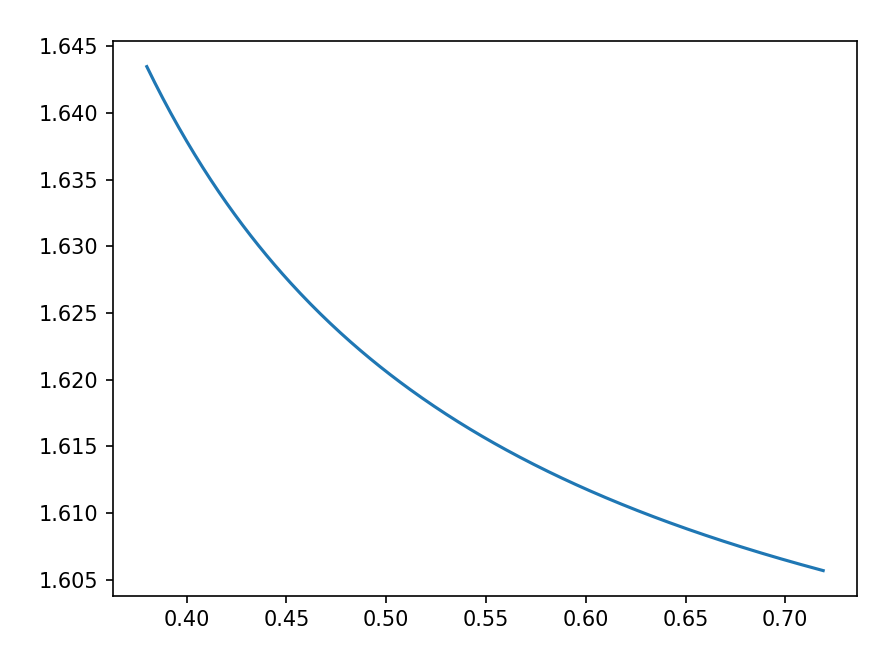

# 2.1 - Optical material

One of the most important thing for optical imaging, and one that most CG renderer did not replicate, is the optical materials and their unique characteristics. 

Virtually in all CG implementations, transparent materials are calculated using a refraction index (RI). This, however, is not what actual transparent materials like glass would behave. Lights with different wavelength will be refracted differently, i.e., the RI of a material is not a scalar value, but a function of wavelength. 

Depending on the usage, range, and convention, there are many different functions to describe the RI property of a material. 

One of the most common one is the **Schott** equation (although Schott themselves no longer use this in their material datasheets), defined as: 

$$
n ^2 = a _0 + a _1 \lambda ^ 2 + a _2 \lambda ^ {-2} + a _3 \lambda ^ {-4} + a _4 \lambda ^ {-6} + a _5 \lambda ^ {-8} 
$$

Sellmeier equation is also used to describe some common materials, with **Sellmeier 1** defined as: 

$$
n ^2 - 1 = \frac{K _1 \lambda ^2}{\lambda ^2 - L _1} + \frac{K _2 \lambda ^2}{\lambda ^2 - L _2} + \frac{K _3 \lambda ^2}{\lambda ^2 - L _3}
$$

**Sellmeier 2** is used less often, no actually I have never seen it being used in the glass catalogs offered from mainstream manufactures, but for the purposes of OCD here, it defined as: 

$$
n ^2 - 1 = A + \frac{B _1 \lambda ^2}{\lambda ^2 - \lambda ^2 _1}+ \frac{B _2}{\lambda ^2 - \lambda ^2 _2}
$$

The **Sellmeier 3**:

$$
n ^2 - 1 = \frac{K _1 \lambda ^2}{\lambda ^2 - L _1} + \frac{K _2 \lambda ^2}{\lambda ^2 - L _2} + \frac{K _3 \lambda ^2}{\lambda ^2 - L _3} + \frac{K _4 \lambda ^2}{\lambda ^2 - L _4} 
$$

And the **Sellmeier 4**:

$$
n ^2 = A + \frac{B \lambda ^2}{\lambda ^2 - C} + \frac{D \lambda ^2}{\lambda ^2 - E} 
$$

**Sellmeier 5** also exists, although Infrared KRS5 is the only material I know that uses it. Sellmeier 5 simply has one more term than Sellmeier 3:

$$
n ^2 - 1 = \frac{K _1 \lambda ^2}{\lambda ^2 - L _1} + \frac{K _2 \lambda ^2}{\lambda ^2 - L _2} + \frac{K _3 \lambda ^2}{\lambda ^2 - L _3} + \frac{K _4 \lambda ^2}{\lambda ^2 - L _4} + \frac{K _5 \lambda ^2}{\lambda ^2 - L _5}
$$

Many materials also use the extended formula to describe their properties. Original Extended is defined as:  

$$
n^2= a _0 + a_1 \lambda ^2  + a_2 \lambda ^{-2} + a_3 \lambda ^ {-4} + a_4 \lambda ^{-6} + a_5 \lambda ^{-8} + a_6 \lambda ^{-10} + a_7 \lambda ^{-12}
$$

The **Extended 2** is very much the same, but the last two terms have a different power: 

$$
n^2= a _0 + a_1 \lambda ^2  + a_2 \lambda ^{-2} + a_3 \lambda ^ {-4} + a_4 \lambda ^{-6} + a_5 \lambda ^{-8} + a_6 \lambda ^{4} + a_7 \lambda ^{6} 
$$

And **Extended 3**: 

$$
n ^2 = a _0 + a_1 \lambda ^2  + a_2 \lambda ^{4} + a_3 \lambda ^ {-2} + a_5 \lambda ^{-4} + a_6 \lambda ^{-6} + a_1 \lambda ^{-8} + a_7 \lambda ^{-10} + a _8 \lambda ^{-12} \\ 
$$

Other less “franchise” formulas include the **Herzberger** :

$$
n = A + BL + CL ^ 2 + D \lambda ^2 + E \lambda ^ 4 + F \lambda ^6
$$

Where:

$$
L = \frac{1}{\lambda ^2 - 0.028}
$$

And the **Conrady**, with a diabolical 3.5 power term: 

$$
n = n _0 + \frac{A}{\lambda} + \frac{B}{\lambda ^ {3.5}}
$$

To acquire the RI of a certain material at a certain wavelength, the equation used to describe it must first be known. Use `E-KZFH1` as an example, the equation it uses is Extended 2, taking the square root of equation 2.15 will then give the RI function of this material: 

$$
n \left( \lambda \right)= \sqrt{a _0 + a_1 \lambda ^2  + a_2 \lambda ^{-2} + a_3 \lambda ^ {-4} + a_5 \lambda ^{-8} + a_6 \lambda ^4 + a_1 \lambda ^2 + a_7 \lambda ^6} 
$$

Through the Nikon material library [[1]](https://app.notion.com/p/2-1-Optical-material-167ee08ae11080879915d6b9a47351ff?pvs=21), it can be found that: 

$$
\begin{align*}
A0=2.54662904 \\
A1=-0.01229723 \\
A2=0.01874646 \\
A3=0.00046030 \\
A4=0.00000079 \\
A5=0.00000173 \\
A6=-0.00013348 \\
A7=0
\end{align*}
$$

Using these coefficients, it is then possible to plot the RI of the material `E-KZFH1` : 

<p align="center">
	
</p>

$$
\textsf{RI graph of material E-KZFH1}
$$

In the figure above, the horizontal axis represents wavelength, ranging from $0.38\mu m$ to $0.72\mu m$, roughly corresponds to the visible spectrum. 

# 2.1.1 - Finding the material used in patents

It is worth to discuss briefly how to find the material used in lens patents, since in almost all cases, the material used in each element is not explicitly stated. Only the index of refraction and corresponding Abbe number is supplied. 

Since index of refraction is a function of wavelength and not a fixed number, it must be noted which Fraunhofer line the patent is using. The common Fraunhofer lines are listed below, with some default definitions used in this project. 

```python
LambdaLines = {
    "i" : 365.01,  
    "h" : 404.66, 
    "g" : 435.84,  
    "F'": 479.99, 
    "F" : 486.13,  
    "e" : 546.07,  
    "d" : 587.56,  
    "D" : 589.3,   
    "C'": 643.85,  
    "C" : 656.27, 
    "r" : 706.52, 
    "A'": 768.2,   
    "s" : 852.11,
    "t" : 1013.98,
}
```

In most cases, $e$, $d$, and $D$ are used to describe the optical material. Most modern patents will describe the material in terms of $n_d$ and $V_d$. 

$n_d$ is the index of refraction when the light is a Helium source. Reference the list above, $\lambda _d = 587.56nm$.  

$V_d$ is the Abbe number on the $d$ line, defined as: 

$$
V_d = \frac{n_d - 1}{n_F - n_C} 
$$

In some cases, particularly old patents and precision optics,  $n_d$ and $V_d$ may be replaced by $n_e$ and $V_e$, which are defined very similarly: 

$$
V_e = \frac{n_e-1}{n_{F'} - n_{C'}} 
$$

It is also possible to see the Sodium line in historical patents: 

$$
V_D = \frac{n_ D-1}{n_{F} - n_{C}} 
$$

Unfortunately, there is no direct and deterministic answer of what material the pair of $n_d$ and $V_d$ is describing, it can only be achieved by iterating through a library of materials and find the material that matches the most. 

There are some common patterns and tricks when selecting materials. For example, modern lenses designed for mirrorless cameras tend to have more diversity and not restricted to one single material manufacture. Japanese lens designs by Canon, Cosina, etc. may incorporate materials made by German manufacturer Schott and Sumita, or Chinese based manufacturer CDGM and NHG. 

In comparison, older patents are more geographically retractive. Old Leica patents are more likely to be using Schott/Sumita exclusively, and old Canon patents lean more towards using only  Hikari, Ohara, and Hoya. Old lenses also has a higher tendency of reuse the same material in a single lens as a mean of reducing production cost. 

It is worth noting that it was quite common for major manufactures to have their own proprietary glass materials, which is not present in modern glass catalogs. Such as Leica and the glass factory of their own, which produced the exotic glasses used in the making of the Summilux 35mm lens and several other masterpieces. Additionally, many old glasses uses radioactive elements to acquire a higher index of refraction, then sandwiching the radiative element with lead glasses. Both type of glass is now discarded, making them somewhat inaccessible in the glass catalog. 

# 2.1.2 - Automate material finding

Previous discussions should have made it painfully obvious that locating a material from a library of over three thousands by matching a pair of number is no easy feat. It also happens that every lens tend to use several different materials, many even go as far as one material for every lens element. Locating the optical material by manual labor is thus highly undesirable. AS such, an automatic material match is provided in this framework implementation as well. The process is possibly the simplest algorithm in this entire framework. 

First, notice that index of refraction and Abbe number has a certain range, for example, there does not exist a practical optical material for photographic lenses with an Abbe number of $-20$. The practical range of the values can be used to normalize the two categories: 

$$
n_{norm} = \frac{n-1.4}{2.0-1.4}
$$

There are definitely materials with higher IOR, diamond, for instance, has an IOR around 2.4. But again, no one is using diamond in a photographic lens, so these values are almost guaranteed to be absent. 

And for Abbe number: 

$$
V_{norm} = \frac{V-20}{90-20}
$$

Note that the input IOR and Abbe number needs to correspond to the desired Fraunhofer line, older patents might not be using the $d$ line, but $D$ or $e$. 

All that’s left is to calculate the Euclidean distance between materials in the library (indexed $i$ in the expression below) and the input (indexed $t$): 

$$
d_i = \sqrt{
\left( n_{i, norm} - n_{t, norm} \right) ^2 +
\left( V_{i, norm} - V_{t, norm} \right) ^2
}
$$

Ranking this distance will then provide the candidate materials that best matches the input. Although, since the material choice is a compound problem involving the lens’ history, geographic region of design/manufacturing, and optical goal, it is best to look at the provided ranking list and make educated decisions of which one to use. 


## References 

<aside>

“KZF | Optical Glass (J-Series) | Nikon Business.” Accessed February 9, 2025. [https://www.nikon.com/business/components/lineup/materials/optical-glass/catalog/kzf.html](https://www.nikon.com/business/components/lineup/materials/optical-glass/catalog/kzf.html).

</aside>