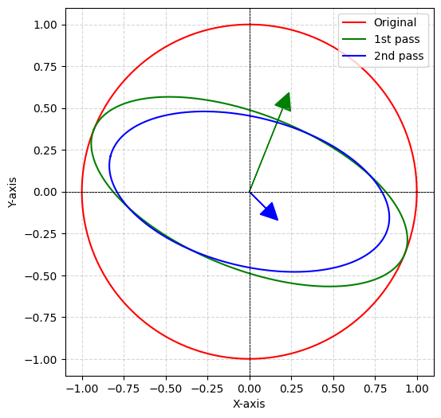
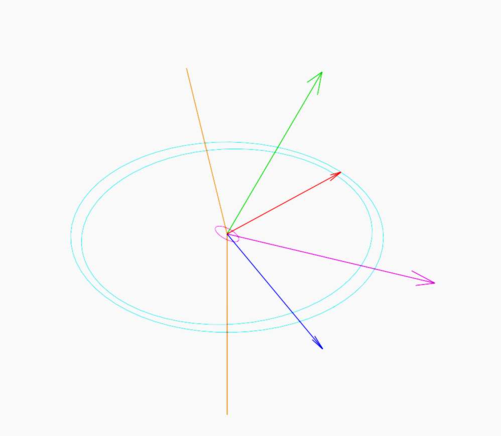

# 2.2 - Refraction, Reflection and Vignette

This chapter discusses the simple physics of how geometric rays react upon contacting a surface. 

# 2.2.1 - Refraction

For rays that reaches a refractive surface, the refraction can be expressed by the incident angle $\theta$ and index of refraction $n$: 

$$
n_1 \sin \theta _1=n_2 \sin \theta _2 
$$

Known as the Snell’s law. 

This would be very easy to implement for ray matrix method, in which rays are represented by 2 parameters: 

$$
\binom{h}{\gamma } 
$$

In the vector above, $h$ is ray height and $\gamma$ represents the angle of the ray. 

However, as discussed in the beginning of chapter 2, the ray transfer matrix cannot represent rays that are not in the meridional plane, nor is it able to handle surfaces that are not axial symmetric. As such, the vector form of refraction is adapted. The refraction equation can be converted into the following vector form (Wu, Zhang, et. al.): 

$$
\mathbf{R} _r=\frac{n_1}{n_2}\left ( \mathbf{I} - \left ( \mathbf{I} \cdot \mathbf{N} \right ) \mathbf{N} \right ) - \mathbf{N} \sqrt{ 1 - \left ( \frac{n_1}{n_2} \right ) ^{2} \left ( 1 -  \left( \mathbf{I} \cdot \mathbf{N} \right )^{2} \right ) } 
$$

In the expression above, $\mathbf{R}_r$ is the refracted ray, the small $r$ subscript is to differentiate refracted form the reflected ray later. $\mathbf{I}$ is incident, $\mathbf{N}$ is normal, $n_1$ and $n_2$ are index of refraction for the two mediums respectively. 

It needs to be noted, however, that a ray reaching a surface is not guaranteed to be refracted. Depending on the incident angle and the index of refraction, the ray can also be reflected entirely, known as total internal reflection (TIR). 

Using the Snell’s law, the critical angle at which TIR occur can be expressed as: 

$$
\theta _c = \arcsin \left( \frac{n_2}{n_1} \right) 
$$

But, again, the angular representation is not enough. The TIR condition has to be converted into vector form, which happens to be the same as the later part of equation the vector refraction: 

$$
\Delta=\sqrt{ 1 - \left ( \frac{n_1}{n_2} \right ) ^{2} \left ( 1 -  \left( \mathbf{I} \cdot \mathbf{N} \right )^{2} \right ) } 
$$

TIR will occur for $\Delta <0$. 

# 2.2.2 - Reflection

The vector form of reflection can be calculated very conveniently as: 

$$
\mathbf{R} _l = \mathbf{I} - 2 \left(   \mathbf{I} \cdot \mathbf{N} \right) \mathbf{N} 
$$

A subscript $l$ is used to distinguish reflection form refraction equation from the last section. 

It should be quite apparent that this reflection equation represents specular reflection where the incident angle and reflected angle are the same around the normal. While not very common here in this application, a non-specular reflection is still used in some places, such as in section 2.3.5 clear boundaries. 

The more diffused reflection could be calculated strictly using established standards such as BRDF. However, there are very limited benefit of employing such algorithm here, but the drawback of additional calculation overhead is for certain. 

For this reason, a very naive implementation is adapted to calculate diffuse reflection $\mathbf{R}_{lr}$: 

$$
\mathbf{R}_{lr}=k \cdot \mathbf{R}_{l} + \left( 1-k \right)\mathbf{R}_{r}
$$

Where $\mathbf{R}_{r}$ is a random unit vector. Note that $\mathbf{R}_{r}$ must go through a prior check to see if it is in the same direction as the normal $\mathbf{N}$, if not, invert it to keep it pointing at the same hemispherical direction as the normal. 

# 2.2.3 - Polarized reflectance

Up till this point, the discussion of refraction and reflection has been limited to their directions. For the intensity of the rays, it might seem easy to use a single scalar value to record the radiance, but in certain scenarios this might not be enough. Especially when considering the complicated things that may happen at a surface. 

A ray from one refractive medium reaching at another refractive medium is almost never fully refracted, rather, some reflection will also happen, depending on the angle on incident. And the amount of reflection happens differently at different directions. It might be fitting to model the change on two primary directions, $s$ and $p$ (not the ETF). 

$s$ stands for senkrecht, German for “perpendicular”, representing the wave direction perpendicular to the incident plane; $p$ stands for parallel, representing the wave direction parallel to the incident plane. The reflectance on the two direction is defined by the Fresnel equation: 

$$
R_s = \left| \frac{n _1 \cos \theta _i - n _2 \cos \theta _t}{ n _1 \cos \theta_i + n _2 \cos \theta_t }  \right| ^2 
$$

$$
R_p = \left| \frac{n _1 \cos \theta _t - n _2 \cos \theta _i}{ n _1 \cos \theta_t + n _2 \cos \theta_i }  \right| ^2 
$$

Where $n _ 1$ and $n _ 2$ are the index of refraction of the 2 mediums; $\theta _ i$ and $\theta _ t$ are the incident angle and refraction angle respectively. It must be pointed out that the incident angle and refraction angle are typically calculated using the dot product between the normal and incident/refraction, it must be ensured that the normal direction is flipped to face the same side as the incident/refraction. If not, the $\cos \theta$ could become negative, causing $R _s$ and $R _p$ to go above 1, which breaks the conservation of energy. 

While for one single lens surface, the $s$ and $p$ direction can be acquired easily, it is rather apparent that there does not exist a unified global $s$ and $p$ direction during the propagation of ray, their direction tend to change at every surface. Notice that for polarization rejection, their distribution follows the Malus' Law. Thus, ellipses may be used in representing the polarized radiance of rays. 

The $s$ and $p$ polarization can be modelled based on polarization ellipse as:

$$
\mathbf{x}^{T} A \mathbf{x} = 1
$$

Matrix $A$ is the ellipse’ quadratic form, i.e., a symmetric positive-definite matrix: 

$$
A =  \begin{bmatrix}
 a & b  \\
 b & c \\
\end{bmatrix} 
$$

Then the area of the ellipse can be treated as the radiance of the ray. To obtain the area, first calculate the semi axes using the eigenvalues $\lambda _1$ and $\lambda _2$:

$$
s _x = \frac{1}{ \sqrt{\lambda _1} }, \ \ s _y = \frac{1}{ \sqrt{\lambda _2} }
$$

And the 2 eigenvector of matrix $A$ corresponding to the direction of the semi-axis. 

With this representation of the polarized radiance ellipse, it is then possible to perform vector math on it. Let $\mathbf{v}$ be the modifying vector of polarization, compute its direction angle:

$$
\theta = \arctan \left( \frac{v _y}{ v _x}  \right)
$$

The rotation matrix to align $\mathbf{v}$ with the x-axis is then: 

$$
R =  \begin{bmatrix}
 \cos \theta & -\sin \theta  \\
 \sin \theta & \cos \theta \\
\end{bmatrix} 
$$

Next is to scale the ellipse along the vector direction, the scale matrix is represented as: 

$$
S = \begin{bmatrix}
 s & 0  \\
 0 & 1 \\
\end{bmatrix} 
$$

The new transformed matrix, i.e., the quadratic form of the polarized radiance ellipse, can be acquired by:

$$
A _ {new} = R S ^{-1} R ^{T} A R S ^{-1} R^ T 
$$

The focus is now on how to calculate the scale factor $s$. Note that in this framework, the polarized radiance ellipse modification is directional and monotonically decreasing, because the ray will only lose radiance as they reflect off a surface, they will not magically gain radiance from the propagation (interference could do this, but the geometric representation of ray does not factor in interference). This means that $s$ is always contracting, i.e., reduce the ellipse’s extent in direction $\mathbf{v}$ by its magnitude. The original extent can be calculated by: 

$$
L_{ori} = \frac{m}{\sqrt{ \mathbf{v} ^T A \mathbf{v} }}
$$

Where $m=\left\| \mathbf{v} \right\|$. So the new extent after subtraction will be: 

$$
L_{new} = L_ {ori} - m
$$

$$
s = \frac{L _{new} }{ L _{ori} }=1-\frac{1 }{L _{ori}} 
$$

Note that despite heavily borrowing from wave optics concept, thanks to how the typical exposure time vastly exceeds the period of the wave, the fluctuation in time domain can be ignored. As such, the polarized ellipse here still represent the radiance, a radiometry measurement. This also means the scale cannot be negative. It should be ensured that $L_ {new} \geq 0$, otherwise the radiance will be inverted and become invalid. 

	

The figure above shows effect of the ellipse modification effect. The original circle is in red, the green ellipse is the original after subtracting the green vector, and the blue ellipse is the green ellipse after subtracting the blue vector. 

In practice, the reflectance are calculated from the Fresnel equation mentioned at the beginning of the section; their directions are the $s$ and $p$ direction calculated using the normal $\mathbf{N}$ and incident direction $\mathbf{I}$, and their magnitude equal to the corresponding direction’s reflectance. 

$$
\mathbf{v} _ s= \frac{ \mathbf{I} \times \mathbf{N} }{ \left\| \mathbf{I} \times \mathbf{N} \right\| } \cdot R_s 
$$

$$
\mathbf{v} _ p= \frac{ \mathbf{N} \times \mathbf{v}_s }{ \left\| \mathbf{N} \times \mathbf{v}_s \right\| } \cdot R_p 
$$

The refracted rays first inherit the full radiance of the incident ray, these 2 calculated vectors will then be used to subtract from the refracted rays’ polarized radiance ellipse. 

At the same time, the subtracted amount also creates a reflected ray, whose polarized radiance ellipse is constructed from the $\mathbf{v} _ s$ and $\mathbf{v} _ p$ above. 

To create an ellipse using the 2 vectors, first normalize the vectors to create an orthonormal basis:

$$
\mathbf{e} _ 1 = \frac{\mathbf{v} _ s}{\left\|\mathbf{v} _ s \right\|}, \quad \mathbf{e} _ 2 = \frac{\mathbf{v} _ p}{\left\|\mathbf{v} _ p \right\|}
$$

Then construct a rotation matrix $R$:

$$
R=\left[ \mathbf{e} _ 1 \ \ \mathbf{e} _ 2  \right]
$$

Define a diagonal matrix $D$: 

$$
D = \begin{bmatrix}
\frac{1}{\left\| \mathbf{v} _ s \right\| ^ 2} & 0 \\
0 & \frac{1}{\left\| \mathbf{v} _ p \right\| ^ 2} \\
\end{bmatrix}
$$

The reflected ray’s polarized radiance ellipse is then: 

$$
A =  R D R ^ T 
$$

For rays that already propagated through several surfaces, their polarized radiance is no longer full. The reflectance calculated, however, is a ratio and not an amount. Subtracting the ratio directly from the polarized radiance ellipse may result in the radiance quickly going below zero after several surfaces. In fact, assuming a ray is propagated through lenses whose index of refraction is $1.5$ for its wavelength, each lens will take away $0.08$ unit of radiance, which means the radiance will become negative after the 13th lens. 

To solve this, the reflectance also have to time the leftover polarized radiance. This can be done by measuring the magnitude or height of the radiance ellipse at the vector direction:

$$
h= \frac{ \left\| \mathbf{v} \right\| }{ \sqrt{ \mathbf{v} ^T A \mathbf{v} } }
$$

Perform this with the local senkrecht and parallel direction on the incident ray’s polarized radiance ellipse will then yield the magnitude of the radiance on these directions respectively. Add the radiance into equation (2.2.9) gives the complete form of the local Fresnel reflectance:

$$
\mathbf{v} _ s= \frac{ \mathbf{I} \times \mathbf{N} }{ \left\| \mathbf{I} \times \mathbf{N} \right\| } \cdot R _s \cdot h _s 
$$

$$
\mathbf{v} _ p= \frac{ \mathbf{N} \times \mathbf{v}_s }{ \left\| \mathbf{N} \times \mathbf{v}_s \right\| } \cdot R _p \cdot h _p  
$$

For refracted rays, their polarized radiance ellipse will be subtracted by $\mathbf{v} _ s$ and $\mathbf{v} _ s$. At the same time, a reflected ray will be created, whose polarized radiance ellipse is represented by the two reflectance. 

If a ray experiences TIR, although technically it would go through a phase change, radiance-wise the polarization direction and intensity will not change. As such, it will carry the same polarized radiance ellipse as the incident ray. 

The figure below is an example of the polarized radiance ellipse after propagated through a surface: 

	

The earth colored line represents the incident ray before and after the refraction. The green arrow represents the normal direction at the point of intersection; the red arrow is the local parallel direction and the blue arrow the senkrecht direction, these 3 arrows are perpendicular to each other and are conveniently colored in RGB. At last, the pink/magenta arrow is the reflected ray. 

The largest ellipses in cyan is the polarized radiance ellipse of the incident ray and the smaller one is for the refracted ray. The small ellipse in the middle is the polarized radiance ellipse of the reflected ray. Note that because the ray is refracted into a medium with higher IOR with fairly large incident angle, the reflected ellipse has a larger semi axis along senkrecht direction, i.e., the ray is reflected more along the senkrecht direction. 

## References 

<aside>

Wu, Jiaze, Changwen Zheng, Xiaohui Hu, Yang Wang, and Liqiang Zhang. “Realistic Rendering of Bokeh Effect Based on Optical Aberrations.” *The Visual Computer* 26, no. 6 (June 1, 2010): 555–63. [https://doi.org/10.1007/s00371-010-0459-5](https://doi.org/10.1007/s00371-010-0459-5).

</aside>