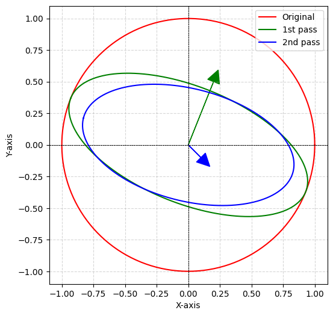
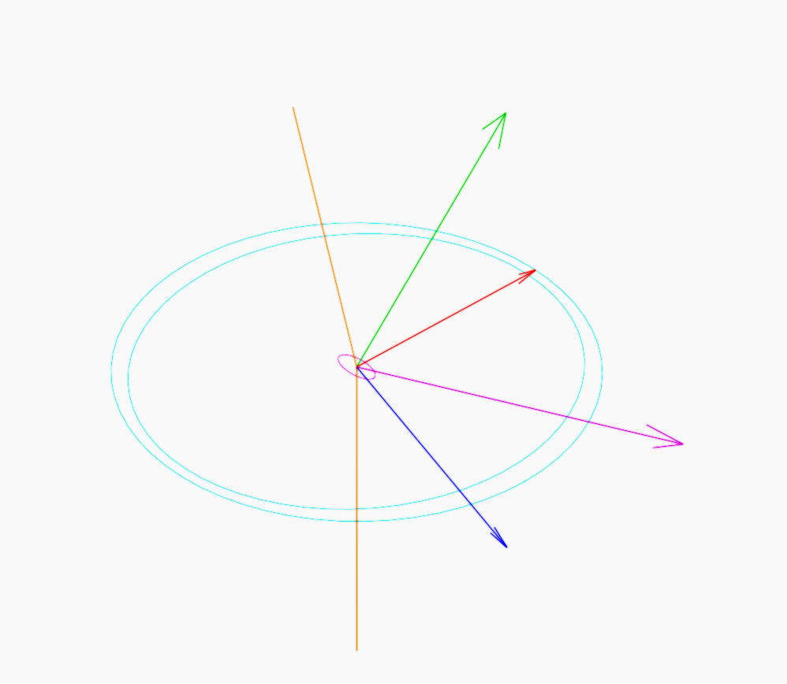

# 2.2 - Refraction, Reflection and Vignette

This chapter discusses the simple physics of how geometric rays react upon contacting a surface, particularly, a refractive surface. 

# 2.2.1 - Refraction

For rays that reaches a refractive surface, the refraction can be expressed by the incident angle $\theta$ and index of refraction $n$: 

$$
n_1 \sin \theta _1=n_2 \sin \theta _2 
$$

Known as the Snell’s law. 

This would be very easy to implement for ray matrix method, in which rays are represented by 2 parameters: 

$$
\binom{h}{\gamma } 
$$

In the vector above, $h$ is ray height and $\gamma$ represents the angle of the ray. 

However, as discussed at the beginning of chapter 2, the ray transfer matrix cannot represent rays that are not in the meridional plane, nor is it able to handle surfaces that are not axial symmetric. As such, the vector form of refraction is adapted. The refraction equation can be converted into the following vector form (Wu, Zhang, et. al.): 

$$
\mathbf{R} _r=\frac{n_1}{n_2}\left ( \mathbf{I} - \left ( \mathbf{I} \cdot \mathbf{N} \right ) \mathbf{N} \right ) - \mathbf{N} \sqrt{ 1 - \left ( \frac{n_1}{n_2} \right ) ^{2} \left ( 1 -  \left( \mathbf{I} \cdot \mathbf{N} \right )^{2} \right ) } 
$$

In the expression above, $\mathbf{R}_r$ is the refracted ray, the small $r$ subscript is to differentiate refracted form the reflected ray later. $\mathbf{I}$ is incident, $\mathbf{N}$ is normal, $n_1$ and $n_2$ are index of refraction for the two mediums respectively. 

It needs to be noted, however, that a ray reaching a surface is not guaranteed to be refracted. Depending on the incident angle and the index of refraction, the ray can also be reflected entirely, known as total internal reflection (TIR). 

Using the Snell’s law, the critical angle at which TIR occur can be expressed as: 

$$
\theta _c = \arcsin \left( \frac{n_2}{n_1} \right) 
$$

But, again, the angular representation is not enough. The TIR condition has to be converted into vector form, which happens to be the same as the later part of equation the vector refraction: 

$$
\Delta=\sqrt{ 1 - \left ( \frac{n_1}{n_2} \right ) ^{2} \left ( 1 -  \left( \mathbf{I} \cdot \mathbf{N} \right )^{2} \right ) } 
$$

TIR will occur for $\Delta <0$. 

# 2.2.2 - Reflection

The vector form of reflection can be calculated very conveniently as: 

$$
\mathbf{R} _l = \mathbf{I} - 2 \left(   \mathbf{I} \cdot \mathbf{N} \right) \mathbf{N} 
$$

A subscript $l$ is used to distinguish reflection form refraction equation from the last section. 

It should be quite apparent that this reflection equation represents specular reflection where the incident angle and reflected angle are the same around the normal. While not very common here in this application, a non-specular reflection is still used in some places, such as in section 2.3.5 clear boundaries. 

The more diffused reflection could be calculated strictly using established standards such as BRDF. However, there are very limited benefit of employing such algorithm here, but the drawback of additional calculation overhead is for certain. 

For this reason, a very naive implementation is adapted to calculate diffuse reflection $\mathbf{R}_{lr}$: 

$$
\mathbf{R}_{lr}=k \cdot \mathbf{R}_{l} + \left( 1-k \right)\mathbf{R}_{r}
$$

Where $\mathbf{R}_{r}$ is a Lambertian direction, here modelled as a direction generated with cosine-weighted hemisphere distribution by the following procedural. 

First create two random numbers: 

$$
u _ 1 , \ u _ 2 \in  \left [ 0, 1 \right ]
$$

These two numbers are then used to construct a polar coordinate: 

$$
\begin{align*}
r = \sqrt{ u _ 1 }\\
\phi = 2 \pi u _ 2
\end{align*}
$$

Local outgoing direction is then: 

$$
\begin{align*}
x _ {local} = r \cos \phi
 \\ y _ {local} = r \sin \phi
 \\ z _ {local} = \sqrt{\max \left ( 0, \ 1-u _ 1 \right )}
\end{align*}
$$

The same vector at local coordinate is thus: 

$$
\begin{align*}
\sqrt{ u _ 1} \cos \left ( 2 \pi u _ 2 \right )
 \\ \sqrt{ u _ 1} \sin \left ( 2 \pi u _ 2 \right )
 \\ \sqrt{1 - u _ 1}
\end{align*}
$$

Next a vector $\mathbf{h}$ not parallel to the normal at the intersection is needed. Since it is statistically near impossible to get a vector exactly parallel with the normal, especially so in double precision, it can be generated randomly. 

Then the tangent vector would be: 

$$
\mathbf{t} = \frac{\mathbf{h} \times \mathbf{n}}{ \left\| \mathbf{h} \times \mathbf{n}\right\| }
$$

And the bitangent vector: 

$$
\mathbf{b} = \frac{\mathbf{n} \times \mathbf{t}}{ \left\| \mathbf{n} \times \mathbf{t}\right\| }
$$

This led to the $\mathbf{R}_{r}$: 

$$
\mathbf{R}_{r} = x _ {local} \mathbf{t} +
y _ {local} \mathbf{b}  +
z _ {local} \mathbf{n} 
$$

It might occur to some that the procedural discussed here has not covered about how many rays would be emitted and what would be their corresponding radiance, this is the neat part: we don't. 

Since it is known for sure that the working scenario for this entire framework will be in a Monte Carlo case, with millions of rays and countless iterations, it becomes entirely inconsequential to mingle with individual reflection's radiance. The statistical spirit of Monte Carlo can be exploited here, each diffuse reflected ray only receives a directional change that abides the Lambertian rule, but no change in the radiance is made (unless the material itself has some absorption index) and no more rays are spawned. With tens, hundreds, and thousands of millions of rays, this naive reflection would eventually converge and behave just like the more complex and complicated diffuse model.  

# 2.2.3 - Polarized Reflectance

Up till this point, the discussion of refraction and reflection has been limited to their directions. For the intensity of the rays, it might seem easy to use a single scalar value to record the radiance, but in certain scenarios this might not be enough. Especially when considering the complicated things that may happen at a surface. 

## Real coherency representation

The current implementation records three real coefficients for each ray. These describe the distribution of power between transverse polarization components, rather than the boundary of a radiance ellipse. Rays are mutually incoherent: powers from independent rays are added at the detector, without interference between their optical phases. However, the two transverse components of one ray may still be correlated. Discarding that correlation would also discard the orientation of linear polarization.

Let $\mathbf{k}$ be the unit propagation direction, and let $\mathbf{e}_x$ and $\mathbf{e}_y$ be unit vectors such that $(\mathbf{e}_x,\mathbf{e}_y,\mathbf{k})$ is an orthonormal, right-handed frame. In this frame the real coherency matrix is

$$
C=\begin{bmatrix}a&b\\b&c\end{bmatrix}
=\begin{bmatrix}
\langle |E_x|^2\rangle&\operatorname{Re}\langle E_x E_y^*\rangle\\
\operatorname{Re}\langle E_x E_y^*\rangle&\langle |E_y|^2\rangle
\end{bmatrix}.
$$

The field components here include the normalization needed to express their mean squared magnitudes as ray power weights. The brackets denote a time or ensemble average. No optical phase or time-resolved electric field is stored by the tracer.

The total power weight and the equivalent linear Stokes parameters are

$$
I=\operatorname{tr}(C)=a+c,\qquad Q=a-c,\qquad U=2b.
$$

In the existing ray array, columns 7, 8, and 9 contain $a,c,b$, respectively. `RadianceTerms()` returns the matrix-order tuple $(a,b,c)$. This keeps the ray width unchanged. The methods named `Radiance()` and `PolarizedRadiance()` both return $I$. Strictly, this is a Monte Carlo ray power weight, not radiance per unit projected area and solid angle; refraction changes the ray bundle geometry. Consequently, power conservation is used at an interface, without introducing an additional $n^2$ radiance factor into the ray weight.

A physical matrix is positive semidefinite:

$$
a\geq0,\qquad c\geq0,\qquad ac-b^2\geq0.
$$

Zero eigenvalues are allowed. They occur for fully linearly polarized light, including the surviving component of a Brewster reflection. A zero matrix describes a ray with zero power. Neither state requires division by an eigenvalue or a special minimum intensity.

An unpolarized source of power $I_0$ starts with

$$
C_0=\frac{I_0}{2}\begin{bmatrix}1&0\\0&1\end{bmatrix}.
$$

For a linear analyzer pointing along the transverse unit vector $\mathbf{u}=(\cos\alpha,\sin\alpha)^T$, the measured power is

$$
I_\alpha=\mathbf{u}^T C\mathbf{u}
=a\cos^2\alpha+2b\sin\alpha\cos\alpha+c\sin^2\alpha
=\frac12\left(I+Q\cos2\alpha+U\sin2\alpha\right).
$$

This gives Malus' law for a fully linearly polarized input. Two orthogonal analyzers always satisfy $I_\alpha+I_{\alpha+\pi/2}=I$. A detector without a polarization analyzer therefore only needs the sum $a+c$, regardless of the reference frame. Incoherent contributions expressed in the same frame add as matrices; an ordinary detector may sum their traces directly even when the rays arrive from different directions.

> Figure placeholder: show unpolarized, partially linearly polarized, and fully linearly polarized states, together with their analyzer response $I_\alpha$. Distinguish this response from the radial extent of a geometric ellipse.

## Transverse frames and the incidence plane

The coefficients need a reference frame, but storing two additional 3D vectors per ray is unnecessary. The implementation deterministically selects the Cartesian axis $\mathbf{h}$ least aligned with $\mathbf{k}$, breaking ties in x, y, z order, and constructs

$$
\mathbf{e}_x=\frac{\mathbf{h}-(\mathbf{h}\cdot\mathbf{k})\mathbf{k}}
{\|\mathbf{h}-(\mathbf{h}\cdot\mathbf{k})\mathbf{k}\|},\qquad
\mathbf{e}_y=\mathbf{k}\times\mathbf{e}_x.
$$

This canonical frame can be reconstructed from the ray direction at any time. Its axis choice can change as the direction changes; the coherency coefficients must be transformed with it. Merely dropping a 3D vector's z component does not produce transverse polarization coordinates.

At a specular interface, let $\mathbf{n}$ be the unit normal facing the incident medium. The local axes are

$$
\mathbf{s}=\frac{\mathbf{k}_i\times\mathbf{n}}
{\|\mathbf{k}_i\times\mathbf{n}\|},\qquad
\mathbf{p}_i=\mathbf{k}_i\times\mathbf{s},\qquad
\mathbf{p}_o=\mathbf{k}_o\times\mathbf{s}.
$$

The incoming and outgoing p axes differ because each must be transverse to its own ray. At normal incidence the incidence plane is undefined. The implementation chooses the incident canonical x axis for s when $\|\mathbf{k}_i\times\mathbf{n}\|\leq10^{-12}$; the isotropic interface has no preferred transverse direction in the exact normal-incidence limit.

Define the $3\times2$ matrices $B_i=[\mathbf{e}_{xi},\mathbf{e}_{yi}]$, $B_o=[\mathbf{e}_{xo},\mathbf{e}_{yo}]$, $S_i=[\mathbf{s},\mathbf{p}_i]$, and $S_o=[\mathbf{s},\mathbf{p}_o]$. For local amplitude multipliers $f_s,f_p$, the complete map between the canonical frames is

$$
J=B_o^T S_o
\begin{bmatrix}f_s&0\\0&f_p\end{bmatrix}
S_i^T B_i,\qquad C_o=J C_i J^T.
$$

Thus each interaction consists of a change into the incident s/p coordinates, the optical action, and a change into the outgoing canonical coordinates. This retains the off-diagonal correlation even when successive incidence planes are not aligned.

> Figure placeholder: a refracting and reflecting ray at one surface, showing separate transverse incident, reflected, and transmitted p axes, their common s axis, and each ray's canonical frame.

## Fresnel power splitting

For positive real refractive indices $n_i,n_t$, write $c_i=|\mathbf{k}_i\cdot\mathbf{n}|$ and

$$
\Delta=1-\left(\frac{n_i}{n_t}\right)^2(1-c_i^2),\qquad
c_t=\sqrt{\Delta}.
$$

For $\Delta\geq0$, the signed reflection amplitudes in the preceding s/p convention are

$$
r_s=\frac{n_i c_i-n_t c_t}{n_i c_i+n_t c_t},\qquad
r_p=\frac{n_t c_i-n_i c_t}{n_t c_i+n_i c_t}.
$$

The power reflectances are $R_s=r_s^2$ and $R_p=r_p^2$. The sign of $r_p$ differs from some Fresnel conventions because those choose the outgoing p axis differently. Power reflectance alone hides this distinction, but transporting $C_{sp}$ requires the signed product $r_s r_p$ and a consistent basis.

For a lossless interface, the power transmittances are $T_s=1-R_s$ and $T_p=1-R_p$. The tracer uses power-normalized transmission amplitudes

$$
\tau_s=\sqrt{T_s},\qquad \tau_p=\sqrt{T_p}.
$$

These include the flux normalization that would otherwise accompany the field transmission coefficients: $T=(n_t c_t)/(n_i c_i)\,|t|^2$ away from the grazing limit. In local s/p coordinates, if $C_i=\left[\begin{smallmatrix}a&b\\b&c\end{smallmatrix}\right]$, then

$$
C_r=\begin{bmatrix}R_s a&r_s r_p b\\r_s r_p b&R_p c\end{bmatrix},\qquad
C_t=\begin{bmatrix}T_s a&\tau_s\tau_p b\\\tau_s\tau_p b&T_p c\end{bmatrix}.
$$

Both branches are calculated from the original incident state. Transmission is not obtained by subtracting the reflected matrix: the branches have different propagation frames and their cross-correlations do not obey that subtraction rule. Their powers do obey

$$
I_r+I_t=(R_s+T_s)a+(R_p+T_p)c=a+c=I_i.
$$

For example, an unpolarized unit-power ray at normal incidence from air into index 1.5 produces reflected power 0.04 and transmitted power 0.96. At Brewster's angle, $r_p=0$ and a purely p-polarized incident ray has zero reflected power. For equal refractive indices the interface is transparent, including the limiting grazing case.

Disabling stray-ray generation only suppresses the reflected output; it does not disable the transmitted Fresnel loss. The primary surface trace, its transmission-only variant, clear boundaries, and sensor/microlens refraction use the same coherency transport. The standalone MLA retains its transmission-only output contract: TIR rays have zero transmitted power and do not spawn a reflected branch there.

## Scope of the three-coefficient model

The full coherency matrix is complex Hermitian and has four real degrees of freedom. Its imaginary off-diagonal component supplies the circular Stokes parameter $V$. The three-coefficient model assumes that component is absent. Real Jones maps at ordinary lossless dielectric interfaces preserve this restriction, so arbitrary sequences of such interactions are represented without an ellipse approximation. Mutual incoherence between different rays by itself is not sufficient to justify dropping $V$.

TIR occurs when $\Delta<0$. Its exact reflection amplitudes have unit magnitude but generally different phases, which can convert linear polarization into elliptical polarization. The current real model explicitly approximates TIR by $r_s=r_p=1$ and $\tau_s=\tau_p=0$ in the local s/p frames. It preserves power and the local real coherency state, but omits retardance. It therefore does not reproduce general polarization evolution after TIR. The ideal mirror and the existing simplified metal boundary use $r_s=-1,r_p=1$; they are not complex-index metal or thin-film coating models.

Prescribed direction changes, such as haze and the diffuse part of a clear-boundary reflection, use minimal-rotation transport. For incoming and outgoing directions, set $\mathbf{v}=\mathbf{k}_i\times\mathbf{k}_o$ and $d=\mathbf{k}_i\cdot\mathbf{k}_o$. Away from exact reversal, a transverse vector is transported by

$$
R\mathbf{e}=\mathbf{e}+\mathbf{v}\times\mathbf{e}
+\frac{\mathbf{v}\times(\mathbf{v}\times\mathbf{e})}{1+d}.
$$

At reversal the chosen half-turn axis is the incident canonical x axis. The rotated transverse frame is then expressed in the outgoing canonical frame. This preserves power and the degree of linear polarization; it is a nondepolarizing approximation for the existing directional scattering models, not a polarized scattering law. A rigid scene transform instead rotates both the ray and its field axes by the actual scene rotation, including rotation about the ray itself.

Scalar attenuation multiplies all three coefficients by the same nonnegative factor. Any explicitly added unpolarized ambient power is split equally between the two diagonals. Such optional absorption or ambient models are separate from the lossless interface conservation statement above.

## Evaluation and storage

No eigendecomposition is needed to propagate or measure power. If $J=\left[\begin{smallmatrix}u&v\\w&z\end{smallmatrix}\right]$, the three output coefficients are evaluated directly:

$$
\begin{aligned}
a'&=u^2a+2uvb+v^2c,\\
b'&=uwa+(uz+vw)b+vzc,\\
c'&=w^2a+2wzb+z^2c.
\end{aligned}
$$

Power readout is a single addition per ray. Zero-power and fully polarized states remain finite, and every real congruence transform preserves positive semidefiniteness. Numerical tolerances are used for geometric degeneracies and explicit diagnostics, rather than to inflate dark polarization components. The calling contract supplies aligned arrays, unit directions and normals, physical coherency states, and positive real refractive indices; the transport routines do not perform type or attribute discovery.

The coefficient semantics have changed even though the core ray-array width has not. Saved light fields containing the old ellipse coefficients must be regenerated or explicitly converted; they must not be silently treated as coherency data. The CSV coefficient headings are now `Cxx,Cyy,Cxy`; the NPZ array layout is unchanged. For a positive-definite legacy ellipse matrix $A$, the interpretation $C=\tfrac12 A^{-1/2}$ preserves its former semiaxis-average power, but cannot recover polarization information already discarded by the old propagation method. Stop-emitted diagnostic rays now store their launch angle as the first AOV (column 12), leaving column 9 exclusively for the polarization cross-correlation.

# 2.2.3.1 Legacy method

This section is for a legacy version of the polarization implementation that no longer applies. Its ellipse construction and TIR statements below are retained as historical descriptions, not as the physical model used by the current tracer.

A ray traveling in a refractive medium reaching at another refractive medium is almost never fully refracted, rather, some reflection will likely to happen depending on the angle on incident. The amount of reflection is different along the two different directions. It might be fitting to model the change to be based on two primary directions, $s$ and $p$ (not the ETF). 

$s$ stands for senkrecht, German for “perpendicular”, representing the wave direction perpendicular to the incident plane; $p$ stands for parallel (also a German word), representing the wave direction parallel to the incident plane. The reflectance on the two direction is defined by the Fresnel equation: 

$$
R_s = \left| \frac{n _1 \cos \theta _i - n _2 \cos \theta _t}{ n _1 \cos \theta_i + n _2 \cos \theta_t }  \right| ^2 
$$

$$
R_p = \left| \frac{n _1 \cos \theta _t - n _2 \cos \theta _i}{ n _1 \cos \theta_t + n _2 \cos \theta_i }  \right| ^2 
$$

Where $n _ 1$ and $n _ 2$ are the index of refraction of the 2 mediums; $\theta _ i$ and $\theta _ t$ are the incident angle and refraction angle respectively. It must be pointed out that the incident angle and refraction angle are typically calculated using the dot product between the normal and incident/refraction, it must be ensured that the normal direction is flipped to face the same side as the incident/refraction. If not, the $\cos \theta$ could become negative, causing $R _s$ and $R _p$ to go above 1, which breaks the conservation of energy. 

While for one single lens surface, the $s$ and $p$ direction can be acquired easily, it is rather apparent that there does not exist a unified global $s$ and $p$ direction during the propagation of ray, their direction tend to change at every surface. Notice that for polarization rejection, their distribution follows the Malus' Law. Thus, ellipses may be used in representing the polarized radiance of rays. 

The $s$ and $p$ polarization can be modelled based on polarization ellipse as:

$$
\mathbf{x}^{T} A \mathbf{x} = 1
$$

Matrix $A$ is the ellipse’ quadratic form, i.e., a symmetric positive-definite matrix: 

$$
A =  \begin{bmatrix}
 a & b  \\
 b & c \\
\end{bmatrix} 
$$

Then the area of the ellipse can be treated as the radiance of the ray. To obtain the area, first calculate the semi axes using the eigenvalues $\lambda _1$ and $\lambda _2$:

$$
s _x = \frac{1}{ \sqrt{\lambda _1} }, \ \ s _y = \frac{1}{ \sqrt{\lambda _2} }
$$

And the 2 eigenvector of matrix $A$ corresponding to the direction of the semi-axis. 

With this representation of the polarized radiance ellipse, it is then possible to perform vector math on it. Let $\mathbf{v}$ be the modifying vector of polarization, compute its direction angle:

$$
\theta = \arctan \left( \frac{v _y}{ v _x}  \right)
$$

The rotation matrix to align $\mathbf{v}$ with the x-axis is then: 

$$
R =  \begin{bmatrix}
 \cos \theta & -\sin \theta  \\
 \sin \theta & \cos \theta \\
\end{bmatrix} 
$$

Next is to scale the ellipse along the vector direction, the scale matrix is represented as: 

$$
S = \begin{bmatrix}
 s & 0  \\
 0 & 1 \\
\end{bmatrix} 
$$

The new transformed matrix, i.e., the quadratic form of the polarized radiance ellipse, can be acquired by:

$$
A _ {new} = R S ^{-1} R ^{T} A R S ^{-1} R^ T 
$$

The focus is now on how to calculate the scale factor $s$. Note that in this framework, the polarized radiance ellipse modification is directional and monotonically decreasing, because the ray will only lose radiance as they reflect off a surface, they will not magically gain radiance from the propagation (interference could do this, but the geometric representation of ray does not factor in interference). This means that $s$ is always contracting, i.e., reduce the ellipse’s extent in direction $\mathbf{v}$ by its magnitude. The original extent can be calculated by: 

$$
L_{ori} = \frac{m}{\sqrt{ \mathbf{v} ^T A \mathbf{v} }}
$$

Where $m=\left\| \mathbf{v} \right\|$. So the new extent after subtraction will be: 

$$
L_{new} = L_ {ori} - m
$$

$$
s = \frac{L _{new} }{ L _{ori} }=1-\frac{1 }{L _{ori}} 
$$

Note that despite heavily borrowing from wave optics concept, thanks to how the typical exposure time vastly exceeds the period of the wave, the fluctuation in time domain can be ignored. As such, the polarized ellipse here still represent the radiance, a radiometry measurement. This also means the scale cannot be negative. It should be ensured that $L_ {new} \geq 0$, otherwise the radiance will be inverted and become invalid. 

	

The figure above shows effect of the ellipse modification effect. The original circle is in red, the green ellipse is the original after subtracting the green vector, and the blue ellipse is the green ellipse after subtracting the blue vector. 

In practice, the reflectance are calculated from the Fresnel equation mentioned at the beginning of the section; their directions are the $s$ and $p$ direction calculated using the normal $\mathbf{N}$ and incident direction $\mathbf{I}$, and their magnitude equal to the corresponding direction’s reflectance. 

$$
\mathbf{v} _ s= \frac{ \mathbf{I} \times \mathbf{N} }{ \left\| \mathbf{I} \times \mathbf{N} \right\| } \cdot R_s 
$$

$$
\mathbf{v} _ p= \frac{ \mathbf{N} \times \mathbf{v}_s }{ \left\| \mathbf{N} \times \mathbf{v}_s \right\| } \cdot R_p 
$$

The refracted rays first inherit the full radiance of the incident ray, these 2 calculated vectors will then be used to subtract from the refracted rays’ polarized radiance ellipse. 

At the same time, the subtracted amount also creates a reflected ray, whose polarized radiance ellipse is constructed from the $\mathbf{v} _ s$ and $\mathbf{v} _ p$ above. 

To create an ellipse using the 2 vectors, first normalize the vectors to create an orthonormal basis:

$$
\mathbf{e} _ 1 = \frac{\mathbf{v} _ s}{\left\|\mathbf{v} _ s \right\|}, \quad \mathbf{e} _ 2 = \frac{\mathbf{v} _ p}{\left\|\mathbf{v} _ p \right\|}
$$

Then construct a rotation matrix $R$:

$$
R=\left[ \mathbf{e} _ 1 \ \ \mathbf{e} _ 2  \right]
$$

Define a diagonal matrix $D$: 

$$
D = \begin{bmatrix}
\frac{1}{\left\| \mathbf{v} _ s \right\| ^ 2} & 0 \\
0 & \frac{1}{\left\| \mathbf{v} _ p \right\| ^ 2} \\
\end{bmatrix}
$$

The reflected ray’s polarized radiance ellipse is then: 

$$
A =  R D R ^ T 
$$

For rays that already propagated through several surfaces, their polarized radiance is no longer full. The reflectance calculated, however, is a ratio and not an amount. Subtracting the ratio directly from the polarized radiance ellipse may result in the radiance quickly going below zero after several surfaces. In fact, assuming a ray is propagated through lenses whose index of refraction is $1.5$ for its wavelength, each lens will take away $0.08$ unit of radiance, which means the radiance will become negative after the 13th lens. 

To solve this, the reflectance also have to time the leftover polarized radiance. This can be done by measuring the magnitude or height of the radiance ellipse at the vector direction:

$$
h= \frac{ \left\| \mathbf{v} \right\| }{ \sqrt{ \mathbf{v} ^T A \mathbf{v} } }
$$

Perform this with the local senkrecht and parallel direction on the incident ray’s polarized radiance ellipse will then yield the magnitude of the radiance on these directions respectively. Add the radiance into equation (2.2.9) gives the complete form of the local Fresnel reflectance:

$$
\mathbf{v} _ s= \frac{ \mathbf{I} \times \mathbf{N} }{ \left\| \mathbf{I} \times \mathbf{N} \right\| } \cdot R _s \cdot h _s 
$$

$$
\mathbf{v} _ p= \frac{ \mathbf{N} \times \mathbf{v}_s }{ \left\| \mathbf{N} \times \mathbf{v}_s \right\| } \cdot R _p \cdot h _p  
$$

For refracted rays, their polarized radiance ellipse will be subtracted by $\mathbf{v} _ s$ and $\mathbf{v} _ s$. At the same time, a reflected ray will be created, whose polarized radiance ellipse is represented by the two reflectance. 

If a ray experiences TIR, although technically it would go through a phase change, radiance-wise the polarization direction and intensity will not change. As such, it will carry the same polarized radiance ellipse as the incident ray. 

The figure below is an example illustrating how polarized radiance work for a ray hitting a refractive surface: 

	

The earth colored line represents the incident ray before and after the refraction. The green arrow represents the normal direction at the point of intersection; the red arrow is the local parallel direction and the blue arrow the senkrecht direction, these 3 arrows are perpendicular to each other and are conveniently colored in RGB. At last, the pink/magenta arrow is the reflected ray. 

The largest ellipses in cyan is the polarized radiance ellipse of the incident ray and the smaller one is for the refracted ray. The small ellipse in the middle is the polarized radiance ellipse of the reflected ray. Note that because the ray is refracted into a medium with higher IOR with fairly large incident angle, the reflected ellipse has a larger semi axis along senkrecht direction, i.e., the ray is reflected more along the senkrecht direction. 

## References 

<aside>

Wu, Jiaze, Changwen Zheng, Xiaohui Hu, Yang Wang, and Liqiang Zhang. “Realistic Rendering of Bokeh Effect Based on Optical Aberrations.” *The Visual Computer* 26, no. 6 (June 1, 2010): 555–63. [https://doi.org/10.1007/s00371-010-0459-5](https://doi.org/10.1007/s00371-010-0459-5).

</aside>
