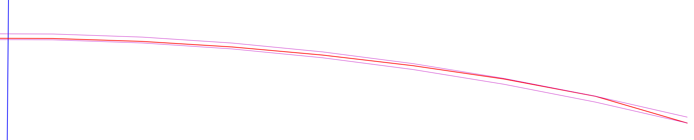
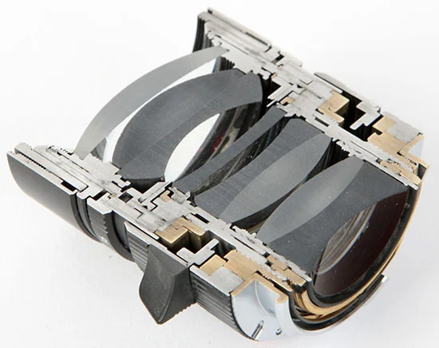
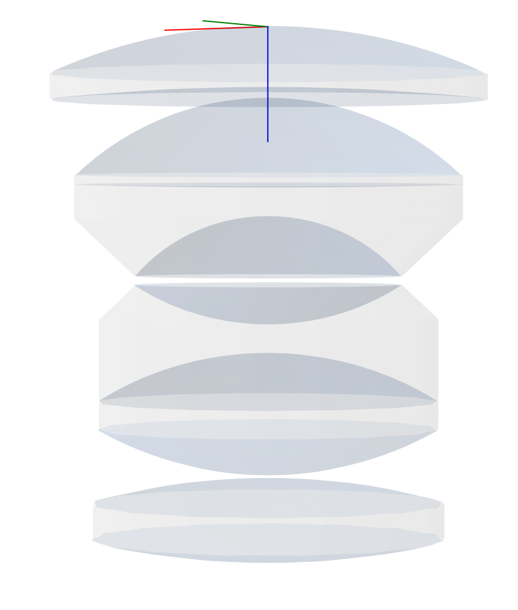
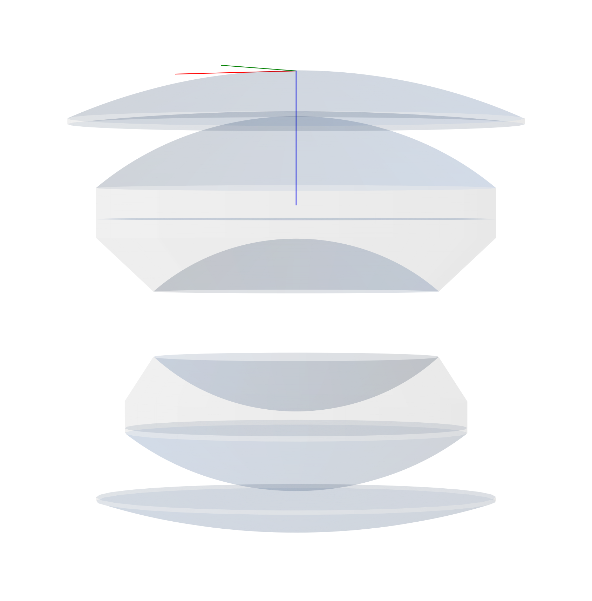
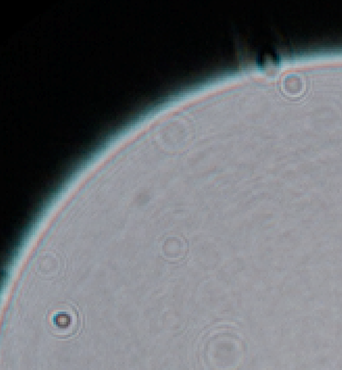
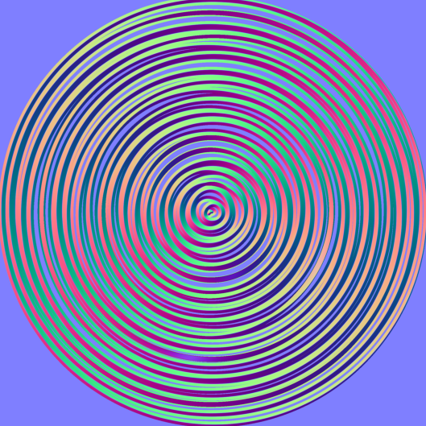
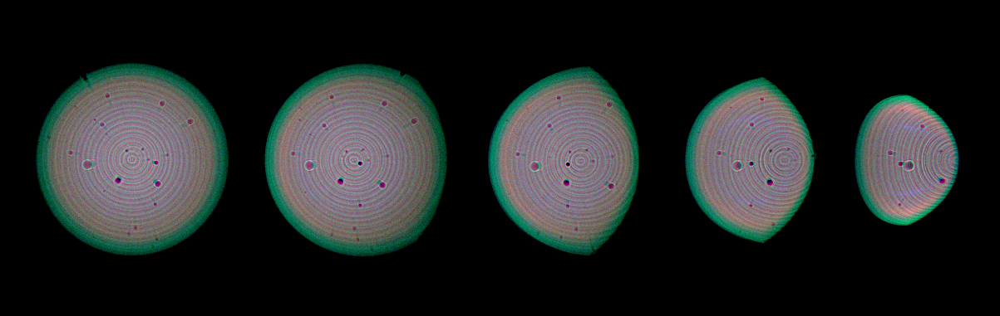

# 2.3 - Surface

A lens surface is defined by 3 key parameters: 

- **Radius** $r$
The surface curvature. A positive value means the surface is convex with respect to the object space direction; a negative value means the surface is concave with respect to the object space direction.
- **Thickness** $t_l$ 
The distance between this surface and the next surface along positive $z$ direction. The $l$ subscript is used to differentiate it from the parametric coefficient $t$ that will be recurring in this article.
- **Clear semi-diameter** $s_d$
This name is borrowed from Zemax, CodeV and similar optical design software, it describes the working radius of the surface, calculated by height from the optical axis. This value is non-negative and should not be larger than the radius.

A vertex position $\mathbf{v}$ is also frequently needed, it denotes the point at which the local axis intersect with the surface. In the case of an axisymmetric lens, the vertex is the point on the surface that intersects the lens’ optical axis. The vertex is important because it offers a positional reference of the surface, and is used to convert ray positions in global space into the surface’s local space. 

During calculation, the surface will also have to provide some other parameters, but in the form of methods that take some input. These include: 

- Intersection points when giving incident rays.
- Normal vectors at certain surface positions.

# 2.3.1 - Incident intersections

For spherical surfaces, finding the intersection between the surface and incident rays can be viewed as finding the intersection between a sphere and a ray consists of an origin and a direction. The intersections can be can be represented as: 

$$
 \left ( \left ( o_x + t d_x \right )-c_x \right )^2+ \left ( \left ( o_y + t d_y \right )-c_y \right )^2+ \left ( \left ( o_z + t d_z \right )-c_z \right )^2=r^2 \\ 
$$

Where: 

- $\mathbf{c} =\left( c_x, c_y, c_z \right)$ represents the sphere center.
- $\mathbf{o} = \left( o_x, o_y, o_z \right)$ represents the origin of the ray.
- $\mathbf{d} = \left( d_x, d_y, d_z \right)$ represents the direction of the ray.
- $r$ is the sphere radius.
- $t$ is the line point coefficient of the intersection, as in $\mathbf{p} \left( t \right) =\mathbf{o}+t\mathbf{d}$. Please note that $t$ has been used very often through this entire wiki as a parametric coefficient, it should be treated locally and not as a global thing.

Equation 2.3.1 can be rearranged into the form of: 

$$
A t^2 +Bt+C=0 
$$

Where:

- $A=d_x^2+ d_y^2 + d_z^2$, note that when $\mathbf{d}$ is normalized, $A=1$
- $B=2\left[ d_x \left ( o_x-c_x \right ) + d_y \left ( o_y-c_y \right ) + d_z \left ( o_z-c_z \right ) \right]$
- $C=\left ( o_x-c_x \right )^2+\left ( o_y-c_y \right )^2+\left ( o_z-c_z \right )^2-R^2$

Solving $t$ yields: 

$$
t=\frac{-B \pm \sqrt{B^2-4AC} }{2A} 
$$

It should be obvious that an incident ray can encounter one of three situations when casted towards a sphere: 

- No intersection with the sphere (when $t$ has no real solution).
- The vector is tangent with the sphere, having only 1 intersection (when $t$ has exactly 1 real solution).
- The vector projects through the sphere and have 2 intersections ($t$ has 2 real solutions).

However, for the intersection between rays and a spherical surface, some of these situations may not happen. 

Firstly, due to the clear semi-diameter always being smaller than the radius of the surface, it is practically impossible for the ray to be in tangent with the surface. The 1 intersection situation can be viewed as non-existent. 

Second and most notably, the surface is an ideal surface and not a volume, thus, ray can at most intersect with the surface once. 

In the sphere-line intersection, the 2 intersections’ $t$ can be represented as: 

$$
t_1=\frac{-B - \sqrt{B^2-4AC} }{2A} 
$$

$$
t_2=\frac{-B + \sqrt{B^2-4AC} }{2A} 
$$

The correct intersection between ray and a spherical surface can be determined by the sign of the radius and the sign of the incident ray along the $z$ axis. $t_1$ should be used when the sign of the radius is the same as the sign of the $z$ component of the incident ray. i.e.,

$$
t =
\left\lbrace
\begin{matrix}
t_1 \quad \textrm{if} \quad \textrm{sign}\left(r\right) = \textrm{sign}\left(d_z\right) \\
t_2 \quad \textrm{if} \quad \textrm{sign}\left(r\right) \neq \textrm{sign}\left(d_z\right)
\end{matrix}
\right.
$$

There is, however, another caveat. In some cases, particularly reflection and vignette, the ray could be pointing **away** from the surface. As such, the line this ray coincide does intersect with the surface, but the ray does not. 

This situation can be determined by the value of $t$. Recall that $t$ indicates the position of the point along the ray direction $\mathbf{p} \left( t \right) =\mathbf{o}+t\mathbf{d}$. As such, the ray will not intersect the surface regardless of the sphere-line intersection result, if:

$$
\left\lbrace
\begin{matrix} 
t_1 < 0 \\ 
t_2 < 0
\end{matrix}
\right. 
$$

In another words, if both $t$ is smaller than $0$, then all possible intersections are **behind** where the ray starts, which will not intersect the surface. 

Even if the ray passed all these conditions and indeed intersect with the spherical surface, an additional radius check is still needed. Optical surfaces are finite, they have an edge that restricts their size, which also functions as a field stop that limits the light. The intersection is valid if and only if they pass the field stop:

$$
\sqrt{p _x ^2 + p _y ^2} \leq s_d 
$$

Expression 2.3.7 works but only works for a surface that is cut with a circular border. In practice, however, many optical elements are cut with a rectangular border, such as most anamorphic front elements, or the plastic molded aspherical elements in recent lenses. For those, explicit height $h$ and width $w$ need to be defined, then the field stop can be expressed as: 

$$
\left\lbrace
\begin{matrix} 
\textup{abs}\left( p_x \right) \leq \frac{w}{2}  \\
\textup{abs}\left( p_y \right) \leq \frac{h}{2}
\end{matrix}
\right. 
$$

# 2.3.2 - Normal

For a sphere with center located at point $\mathbf{c}$, given a point $\mathbf{p}$ on the sphere, the normal $\mathbf{n}$ can be easily calculated by:

$$
\mathbf{n} = \mathbf{p} - \mathbf{c}
$$

The goal of acquiring the normal is to perform reflection and refraction calculation, which means the normal does have to be pointing at the opposite direction of the incident ray. The same logic from equation (2.3.5) can be used here to correct the normal if needed: 

$$
\mathbf{n}=
\left\lbrace
\begin{matrix} 
\mathbf{p}-\mathbf{c} \quad \textrm{if} \quad \textrm{sign}\left ( r \right )= \textrm{sign}\left ( d_z \right ) \\ 
\mathbf{c}-\mathbf{p} \quad \textrm{if} \quad \textrm{sign}\left ( r \right ) \neq \textrm{sign}\left ( d_z \right ) 
\end{matrix}
\right. 
$$

# 2.3.3 - Even aspheric surface

TODO: image comparison 

An even aspheric surface is expressed as follow: 

$$
z=\frac{ cr ^2 }{ 1 + \sqrt{ 1 + k c ^2 r ^2}  }+ \alpha _1 r^2 + \alpha _2 r^4 + \alpha _3 r^6 + \alpha _4 r^8 +\cdots 
$$

The term $k$ is the conical constant. When $k=0$ the surface is spherical, when $k=-1$ the surface is parabolical, when $k<-1$ the surface is hyperbolical, and then $k>-1$ the surface is elliptical. 

The name “even” in even aspheric refers to the power terms. Notice that in the expression above, all terms of $\alpha _n r ^ m$ has an even powers. The power has to be even in this case so that the surface remains axial symmetric, otherwise the surface will become asymmetric on all axis. 

For most modern aspheric surfaces, their power terms starts with the 4th power. However, some lenses, such as the famous Canon EF 50mm f/1.0 L, has an aspherical surface that feature a term with the power of two. It is thus suggested to treat the first power coefficient as a power of two to maximize compatibility. 

## 2.3.3.1 - Intersection with aspherical surface

The intersection between rays and an even aspherical surface, while still calculatable, is not easy. The power terms dictates that direct computation requires Newton approximation or other methods of optimization, which is hard to implement on GPU and certainly does not help reducing or preserving the time complexity of the program. 

However, just like how time and space complexity can often be traded, so too does the runtime and pre-run calculation. Here, we could create two proxy spherical surfaces for the aspherical surface, and use these 2 spherical surfaces - whose intersection is far easier to calculate - to interpolate the ray intersection of the aspherical one. 

*(The author would like to apologize for the mildly inconsistent signs that are about to appear. In hindsight, the letter $r$ appeared a myriad of times in several different forms, yet each represents something different. It could be about the ray, related to the radius, or a function used to calculate height from the optical axis)*

Start by defining the sag of the ASPH surface as $f\left( r \right)$ where $r \in \left[ 0, \ C\right]$, and $r=\sqrt{x ^ 2 + y ^ 2}$. It should also be apparent that $C$ cannot be larger than the clear semi diameter of the given surface. 

The goal here is to find an $R _ s$ and such that two proxy surfaces could closely encapsulate the ASPH surface, both with radius $R _ s$ but shifted forward and backward respectively. 

For the spherical surface with radius $R _ s$, its sag is: 

$$
g _ {R_s} \left( r \right) = R _ s - sign\left( R _ s \right)
\sqrt{R _ s ^ 2 - r ^ 2}
$$

We can thus write the residual of the enclosure between spherical surface and the ASPH as: 

$$
\Delta \left( r ; \ R _ s \right)=
f\left( r \right) - g _{R _ s}\left( r \right)
$$

The thickness, or the distance between the two spherical surfaces $T \left( R _ s \right)$ would then be represented as: 

$$
T \left( R _ s \right) = \max \Delta \left( r ; \ R _ s \right) - \min \Delta \left( r ; \ R _ s \right)
$$

Since both $f\left( r \right)$ and $g _{R _ s}\left( r \right)$ are known (the $f\left( r \right)$ can be acquired from the ASPH definition using 2.3.11), finding the best $T \left( R _ s \right)$ then becomes a min-max optimization problem that **can be calculated before runtime**. 

In another word, this process transfers the optimization problem from runtime to pre-runtime, increasing the “warmup” time complexity in order to reduce the time complexity at runtime . 

The two spherical proxy surfaces enabled us to calculate, deterministically, where the intersections between an incoming ray and these proxies are. We can then average the results of the two spherical intersection to approximate the true ASPH intersection. 

	

In the plot above, the red line is the sag of the aspheric surface, and the thinner magenta lines are the sags of the two enclosing proxy surfaces. Lens data is from the 25th surface of the Sigma 85mm f/1.4 ART lens, patent JP 2018-005099, example 1. 

This proxy approach would ideally transform intersection calculation from an optimization problem to two ordinary ray-sphere intersection calculations. The final intersection point can be acquired by interpolating between the two spherical results. 

However, the simple fact that both the spherical and the aspherical sag are clearly visible should make it immediately obvious that, while **using these two proxies could reduce the need of optimization, mere interpolation is not likely to offer enough accuracy**. It is then necessary to perform some further refinement and ensure the result is as close as possible to the real intersection. 

Recall that a ray is defined as:

$$
\mathbf{r}\left( t \right)=\mathbf{o}+t\mathbf{d}
$$

The intersection of the ray on the ASPH surface would satisfy: 

$$
o _{z}+t _{z} = t _ {lc} +  f\left( 
r \left( t \right)
 \right) 
$$

Recall that $f\left(  \right)$ is the ASPH sag. For the rest, $t _{lc}$ is the cumulative thickness, i.e., the distance between the first surface to the current surface, and $r \left( t \right)$ is used to acquire the height of the point in regard to the optical axis, defined as: 

$$
r \left( t \right)=\sqrt{
\left( o_x+t d_x  \right)^2 +
\left( o_y+t d_y  \right)^2 
}
$$

We could then model it into a function of $t$: 

$$
F \left( t \right)  = \left(o _{z}+t _{z} \right) - \left( t _ {lc} +  f\left( 
r \left( t \right)
 \right) \right)
$$

The intersection would then be the $F \left( t \right)=0$, and more importantly, the sign of the $F \left( t \right)$ would be able to inform us about where the intersection is in relative to the true result (despite we technically do not know the true result). 

In this way, we could exploit $F \left( t \right)$ and perform bisection interpolation using the two spherical intersections $t _1$ and $t _2$. The number of iterations will also offer a fine control over cost and accuracy. 

Alternatively, since  $F \left( t \right)$ is already explicitly written, it is also possible to perform a step or two’s Newton method using a pre-calculated derivative. We could then acquire: 

$$
F'\left( t \right) =d _z - \frac{d z_{asph}}{dt}
$$

Which can be further expanded considering that $z _{asph}$ is the same as $f \left( r \right)$ : 

$$
F'\left( t \right)  d_z - \frac{df}{dr}\cdot \frac{dr}{dt}  = d_z -  \frac{df}{dr} \cdot \frac{x \ d_x + y \ d_y}{r}
$$

# 2.3.4 - Conical surface

While barely ever appear in photographic lenses, conical lenses are a corner stone for “cinematic” images due to its use in anamorphic lens and the resulting stripe flares. 

Compared to even aspherical surfaces, conical surfaces are a bit easier to represent and to calculate. In this framework, for compatibility and extendibility purposes, conical elements are defined using a biconic surface, with the sag defined as:

$$
z \left(x, y \right)=\frac{c _ x x ^ 2 + c _ y y ^ 2}{1+\sqrt{1 - \left(1 + k _ x \right)c _ x ^ 2 x ^ 2 - \left( 1 + k _ y\right) c _ y ^ 2 y ^ 2}}
$$

In which:

- $k _ x$ and $k _ y$ are the conical factor along x and y axis
- $c _ x$ and $c _y$ are the curvature along x and y axis, calculated from the radii of the corresponding direction.

To find the intersection between a ray and a biconic surface, we are effectively trying to solve the following implicit equation:

$$
o _ z + t  d _ z =z _ v + sag\left( 
o _ x + t d _ x,  o _ y + t d _ y
\right)
$$

Where $\mathbf{o}$ is, again, the ray origin/position, $\mathbf{d}$ is ray direction, $t$ is the distance coefficient, and $z _ v$ is the z position of the biconic surface’s vertex. To avoid the use of $z _v$ and $z\left( x, y \right)$ becoming confusing, $sag \left( x, y \right)$ is used instead. 

First find the intersection between the ray and the front vertex plane:

$$
t _ 0 = \frac{z _ v - o _ z }{d _ z}
$$

Using Newton method, at each iteration, evaluate:

$$
f \left ( t  \right ) =z \left ( t \right ) - z _ v - sag\left ( x\left ( t \right ), y\left ( t \right ) \right )
$$

This has a derivative: 

$$
f ' \left ( t  \right ) =D _z -\frac{\partial z}{\partial x} D _ x-\frac{\partial z}{\partial y} D _ y
$$

Update the following: 

$$
t _ {n + 1} = t _ n - \frac{f\left ( t _ n \right )}{f ' \left ( t _ n \right )} 
$$

Each iteration approaches the correct solution, and it is generally fine to accept whatever is left after about ten iterations. 

But these complicated equations would be for true biconic surfaces. In the context of photographic lenses, anamorphic lenses especially, many of the “biconic” surfaces are nothing but cylindrical. A cylindrical surface has 0 conic factor on both axis, and only 1 axis has a valid radius, so effectively a directional sweep of a part of a circle. 

For cylindrical surfaces, calculating the intersection and normal is even simpler than the ordinary spherical surface, since one axis basically vanishes. As such, there is no need to detail their calculation here. 

# 2.3.5 - Clear Boundary

For sequential propagation, rays go through the lens surfaces one by one and never turn back. But these lens surfaces are not the only ones that contributes to the final image, their boundary defined by the semi clear diameter also has significant effects. 

## 2.3.5.1 - Creating the clear boundary

Creating the clear boundaries involves iterating through the lens and lens groups. The identification and grouping of lenses will be discussed in chapter 2.4, here it is taken for granted that the lens surfaces has already been grouped. To differentiate a single lens from a compound lens consists of many lens elements, a single lens will be referred to as a lens **element** or a **singlet**. 

A singlet consists of 2 surfaces, and in many cases, the 2 surfaces have an equal clear semi-diameter $s _d$. This means that the clear boundary can be created between these 2 surfaces as a simple cylinder. 

However, if the surfaces are in a cemented doublet (a lens group consists of 2 lens elements and effectively 3 surfaces), quite often the $s _d$ of the 3 surfaces are not the same. This is particularly true for doublets around the aperture stop, the image is inverted here and thus making the rays the thinnest. As a result, the surface next to the aperture stop tend to have a smaller $s _d$, as shown in the image below (Zhang), note how the 2 curved surfaces in the middle have a shorter $s _d$, forming a chamfer. 

	

To model this, acquire the maximum $s _d$ of the group and iterate through the surfaces in the group. If the current surface’s $s _d$ is smaller than the group $s _d$, calculate the difference and subtract them from the z position of the edge of the clear semi-diameter, acquiring the chamfer. 

Using a typical Planar variant, the Biotar 50mm f/1.4 as an example. The 2 surfaces in the middle have a smaller $s _d$ than their corresponding doublet, and are thus chamfered: 

	

This does leave the limitation that in rare cases, a lens element with 3 different clear boundaries cannot be modelled. But limiting clear boundaries to a max of 2 per surface could simplify the calculation greatly and is generally a worthy tradeoff. 

## 2.3.5.2 - Visualizing the clear boundary

Normally, the clear boundary is a circle  whose radius is the same as the clear-semi diameter of the surface that creates it, i.e., $r = s _d$. However, in programming practices, its coordinate still has to be calculated by a $\sin \left( \right)$ and $\cos \left( \right)$ pair, it might as well be represented as an ellipses to have a bit more flexibility. 

Parametrically, an ellipse in space can be expressed as: 

$$
\mathbf{P} \left(  \theta \right) = \mathbf{C} + a \cos \left(  \theta \right) \cdot \mathbf{u} + b \sin \left(  \theta \right) \cdot \mathbf{v}
$$

Where $\mathbf{C}$ is the ellipse center $\mathbf{C} = \left( x, y, z \right)$. $\theta \in \left[ 0, \ 2 \pi  \right)$, $\mathbf{u}$ and $\mathbf{v}$ are the direction vector of the ellipse pointing at the 2 semi-axis, $\mathbf{u} \perp  \mathbf{v}$. $a$ and $b$ are the length of the semi axis respectively. 

A clear boundary is defined by 2 of these ellipses (in most cases, round circles where $a=b$), the 2 ellipses can be expressed as: 

$$
\mathbf{P} _ 1 \left(  \theta \right) = \mathbf{C} _ 1 + a _1 \cos \left(  \theta \right) \cdot \mathbf{u} _1 + b _1 \sin \left(  \theta \right) \cdot \mathbf{v} _1
$$

$$
\mathbf{P} _ 2 \left(  \theta \right) = \mathbf{C} _ 2 + a _2 \cos \left(  \theta \right) \cdot \mathbf{u} _2 + b _2 \sin \left(  \theta \right) \cdot \mathbf{v} _2
$$

It is then possible to defined a conical frustum that connects the 2 ellipses representing the clear boundary of the lens:

$$
\mathbf{S}  \left (  \theta, \ t  \right )= \mathbf{C} \left ( t \right ) + a \left ( t \right ) \cos \theta \cdot \mathbf{u} \left ( t \right )+ b \left ( t \right ) \cos \theta \cdot \mathbf{v} \left ( t \right )
$$

Where $a \left ( t \right )$ and $b \left ( t \right )$ are linear interpolation of the semi axis: 

$$
a \left( t \right) = \left( 1-t \right) a _1 + t a _2, \quad b \left( t \right) = \left( 1-t \right) b _1 + t b _2
$$

$\mathbf{u} \left ( t \right )$ and $\mathbf{v} \left ( t \right )$ are spherical linear interpolations (slerp):

$$
\mathbf{u} \left ( t \right ) = \textup{slerp} \left ( \mathbf{u} _1, \ \mathbf{u} _2 ; \ t\right ), \quad \mathbf{v} \left ( t \right ) = \textup{slerp} \left ( \mathbf{v} _1, \ \mathbf{v} _2 ; \ t\right )
$$

Luckily, the expressions above are mostly for debugging and display purposes, in most of the cases, the calculation of clear boundary edges will be using simple circles. 

The ellipses form only comes handy when the lens surface is displaced, tilt-shifted, or when simulating machining errors. In these situations, the corresponding clear boundary surface will no longer be axial symmetric along the z axis, the spatial ellipse and the conical frustum will then be helpful in plotting them. 

## 2.3.5.3 - Circular frustum intersection

In calculation, the 2 ellipses can be treated as **prefect circles** parallel to the $xy$ plane and on the $z$ axis, i.e., the optical axis. In this way, $\mathbf{C} _ 1 = \left( 0, \ 0, \ z _1  \right)$ and $\mathbf{C} _ 2 = \left( 0, \ 0, \ z _2  \right)$, note that the only difference between them is the $z$ coordinate. And the circles’ radii are $r _1$ and $r _2$ respectively. 

Define the ray as: 

$$
\mathbf{r} \left( t \right) =\mathbf{o}+t\mathbf{d} = \left ( o _x + t d _x, \ o _y + t d _y, o _z + t d _z   \right), \ t > 0
$$

And at height  $z\left ( t \right )$, the radius  $r_a \left ( t \right )$ is:

$$
 r_a \left ( t \right ) = r_1 +\frac{r _ 2 - r _1}{z _2 - z _ 1} \left ( z \left ( t \right ) - z _1 \right ) 
$$

The intersection between the ray and the frustum can be expressed as a circle equation: 

$$
x \left( t \right) ^2 + y \left(t  \right) ^2 = r _a \left( t\right) ^2 
$$

Where $x \left( t \right)=o _x + t d _x$ and $y \left( t \right) = o _y + t d _y$ .

To make sure the intersection is valid, compute $t _{in}$ and $t _{out}$ as:

$$
t _{in} = \frac{z _1 - o _z}{d _z}, \quad t _{out} = \frac{z _2 - o _z}{d _z}
$$

And check if $t _{in} \leq t _{out}$ and $t _{out} \geq 0$. 

Afterwards, substitute the $z \left ( t \right )$ in (2.3.xb): 

$$
 r_a \left ( t \right ) = r_1 +\frac{r _ 2 - r _1}{z _2 - z _ 1} \left ( o _z + t d _z - z _1 \right )
$$

Using this  $r_a \left ( t \right )$ to replace the one in (2.3.xa): 

$$
\left ( o _x + t d _x \right ) ^ 2 + \left ( o _y + t d _y \right ) ^ 2 = \left( r_1 +\frac{r _ 2 - r _1}{z _2 - z _ 1} \left ( z \left ( t \right ) - z _1 \right ) \right) ^ 2
$$

This can be simplified into a quadratic equation:

$$
A t ^ 2+ B t + C = 0
$$

Where: 

$$
A = d _x ^2 + d _y ^2 - \left( \frac{r _2 - r _2}{z _2 - z _1} d _z  \right)  ^ 2
$$

$$
B = 2 \left( o _x d _x + o _y d _y \right)  - 2 \left( \frac{r _2 - r _2}{z _2 - z _1}  \right) ^2 \left( o _z - z _1 \right) d _z
$$

$$
C = o _x ^2 + o _y ^2 - \left( r _1 + \frac{r _ 2 - r _1}{z _2 - z _1} \left( o _z - z _1 \right)  \right) ^2
$$

Please bear in mind that the notation $d _z$ in the expressions above all means the $z$ component of the directional vector, not derivative with regard to $z$. 

Now, the intersection solution can be acquired by solving:

$$
t = \frac{-B \pm \sqrt{B ^2 - 4 AC} }{2A}
$$

The correct solution would the the one that the $t$ value lies in $\left[ t _{in}, \ t _{out} \right]$. 

## 2.3.5.4 - Cylindrical boundary

When the 2 circles defining the frustum have the same radii, making the frustum a cylinder. This could greatly simplify the calculation. 

The cylinder can be expressed as: 

$$
x ^2 + y ^ 2 = r ^2, \quad z \in \left[ z _1, z _2 \right]
$$

The ray representation remains the same. And in the same way as the frustum situation, we would acquire the quadratic form and the terms: 

$$
A = d _x ^2 + d _y ^2
$$

$$
B = 2 \left( o _x d _x + o _y d _y \right) 
$$

$$
C = o _ x ^2 + o _y ^2 - r^2
$$

Solve $t$ and ensure $t \geq 0$. 

Use the $t$ value to calculate the intersections, check if the intersection $z$ range is within $\left[ z _1, z _2 \right]$. 

And here are some tricks to play. When a frustum appears, there also tend to have a cylinder next to it. A very typical example is the doublets in a Planar arrangement: 

	

$$
\textsf{3D layout of a Canon FD 50mm f/1.8}
$$

Note that in the figure above, the 2 doublets next the the aperture stop consists of a cylinder and a frustum. 

It is quite apparent that the cylinder intersection is significantly easier to calculate than the frustum. So, a way to reduce unnecessary computation would be to calculate the cylinder intersection first and remove the rays that do intersect, then the rest of the rays should all be intersecting with the frustum, the intersection range check can then be skipped entirely. 

# 2.3.6 - Surface Artifacts

Ideal surfaces have ideal normal, ideal intersection, and ideal refractions/reflections, but such may not always be the case. Here we discuss some artifacts that commonly appear on the surfaces and how they affect the final image. 

## 2.3.6.1 - Haze

The haze effect can be caused by a myriad of reasons, heavy scratches can form haze on the resulting image *(e.g., early Leica Summar and Summicron, some Canon L39, have very soft front element and are exceptionally susceptible to scratches)*; the evaporation and condensation of mechanical oil or lubricant can haze the glass *(Soviet lenses are quite famous for this)*; or a massive amount of evenly distributed dust.  

At its core, the haze effect here is a stochastic scattering. The severity of the effect is mainly by a sigma factor, which first determines the probability of scatter:

$$
p _{scatter} = \frac{\sigma}{\sigma + 1}
$$

Note that numerically the probability of scattering will never be 100%, which ensures that at least some rays will still be unaffected and adhere to the ordinary imaging route. 

For the rays that are being scattered, they receive a small directional change, represented as: 

$$
\mathbf{d_s} = \left( 1- b \right) \mathbf{n} _ {\perp} + b \mathbf{d}
$$

Where $b$ is a forward bias factor controlling how much perturbance is applied to the rays. 

Notice that the bias direction $\mathbf{n} _ {\perp}$ has the perpendicular mark on it, this is because the additional directional change of forward scattering has to be perpendicular to the ray’s direction, otherwise the “forward” part would not be true. This bias direction is acquired by: 

$$
\mathbf{n} _ {\perp} = \mathbf{n} - \left( \mathbf{n} \cdot \mathbf{d}  \right) \mathbf{d}
$$

Some other optional steps include a radius control and a wavelength bias. The radius is also controlled by sigma: 

$$
r = \sigma U ^ k
$$

Where $U \in \left[0, 1 \right]$, and $k$ is a multiplier of $b$, the forward bias factor. 

This radius can then be scaled by:

$$
\sqrt{\frac{550}{\lambda}}
$$

So that blue lights are scattered more than red. 

And lastly do another blend:

$$
\mathbf{d}' = \mathbf{d} + r \mathbf{d} _ s
$$

## 2.3.6.2 - Dust

Realistically speaking, dust is similar to haze, but are much larger and more isolated. As a result, their effects can be induvial visible on the final image, especially in de-focused spots, i.e., bokeh. 

The easiest way to implement dust is apparently to just cull the rays intersecting with a piece of dist. However, at the size of a dust, diffraction is also starting to contribute towards the visual result. The image below is a real photo of a defocused spot from a Helios-44 lens, it can be seen that the dusts have caused some rippled craters instead of a single black dot. In a way, this is almost an inverse of an Airy disk. 

	

Fully recreating this interference effect would be computationally impossible, not to mention the framework still needs to operate on geometric optics. As such, a trick is used to perturb the directions. 

Each dust is given a size and an opacity, two attributes that are virtually free to calculate in a geometric ray propagation model. However, aside from these, they also slightly changes the direction of the ray, with the direction being represented by a partial Airy disk, whose radius is clamped to the end of the first black ring. The directional change is pre-calculated and recorded as a normal map, and example is shown below: 

	

During run time, it is first determined whether the rays falls within the effect range of the dust. If it does, then its intersection is mapped into the dust’s local range, the radiance is modulated by the opacity term, and the direction is blended with the pre-calculated normal map. 

Some notes for better effects and 

- The dimension of the dust normal can be relatively small, 256 would be very usable, since the dust only takes a tiny part of a bokeh, which takes even a smaller part on an entire image.
- Since the amount of dusts are often very low, only a handful per surface, it is entirely okay to do the ray-dust intersection check by manual iteration.
- With the direction change, dusts around the two ends of the lens might become a micro lens. To avoid that, it is suggested to add a pupil position factor when creating the dust. The pupil position records the z-position of the entrance pupil, **if a dust is far away from the pupil, its effect can be reduced or even removed**. 
This also makes physical sense as most of the real dusts seen in the bokeh are located near the pupil plane, whereas the further ones tend to have their effects evened out.

## 2.3.6.3 - Onion Rings

When the surface sag is no longer spherical, traditional spherical grinding method can no longer produce the surface, alternative manufacturing methods have to be adapted. For polymer elements, they can directly be injection molded. But for glasses, which are much harder to mold and grind, injection mold does not work as well, and CNC grinding is often used instead. 

However, even if the final surface looks fine, the grinding manufacturing process still leaves artifacts at the micro level. The artifacts cause the actual surface sag to look more like a collection of concatenated straight lines instead of a G1 continuous curve. 

For in-focus area, this unevenness has very limited effect. But for de-focused spots, these manufacturing artifacts may appear as concentric rings, which is fittingly referred to as the “onion rings”. 

To replicate this onion ring effect, a similar pre-calculated perturbance approach is used. A number of ring attribute decides the total amount of circles, and a disturbance attribute controls how much these circles could drift away from being perfectly concentric. It should be noted that in the implementation, the maximum amount of disturbance should still be controlled so that a ring does not exceed the ideal boundary of the neighboring ring. 

After establishing the ring size and location, they are assigned an alternating direction, i.e., `convex - concave - convex …`, this is to conserve the total power of the surface. If all of the rings are concave or convex, they might become a pseudo Fresnel lens and introduce additional optical power to the surface. 

To convert all these info into a recorded look-up table instead of doing it in runtime, the circles and the curves are rendered into a normal map, and example is shown below. 

	

Please note that the image above is significantly exaggerated, 24 times to be exact. The actual normal direction perturbance is much weaker. 

As mentioned in the beginning of the chapter, a surface have a semi-diameter attribute that determines its size. The normal map is regarded to take exactly that amount of the surface, thus establishing a world space to local surface space transform. 

However, unlike dust, whose effect is applied to the refracted rays. The effect of onion ring is applied before refraction, at the intersection normal calculation part, i.e., **the perturbance of the onion ring is blended to the normal directions at the ray-surface intersections** since this is the more physically plausible model. 

The image below shows the bokeh of 5 spots at different fields, with both onion rings and dusts. 

	

Do know that in the image above, the light sources are ideal point lights with a precise location and no size. In almost all scenarios, the light source is not an ideal point with no volume or area, so the onion rings and dusts will be blurred and evened out, thus becoming far less obvious. 

## Reference 

<aside>

Zhang, Michael. “Cross Section Views of Leica Lenses.” PetaPixel, May 13, 2011. [https://petapixel.com/2011/05/13/cross-section-views-of-leica-lenses/](https://petapixel.com/2011/05/13/cross-section-views-of-leica-lenses/).

</aside>
