# 2.4 - Tracing over the lens

The previous chapter defined what a surface is and introduced the three key parameters of a surface: the radius $r$, the thickness $t _ l$, and the clear semi-diameter $s _ d$. However, the keen minds might have realized that $t _ l$ was not used much in the last chapter. This is due to the thickness parameter describes the distance between **this** surface and the **next** surface, which means it only makes sense when several surfaces are grouped together. 

# 2.4.1 - Tracing the focal point and principal plane

For a thin lens, its focal length can be easily calculated by projecting a group of collimated rays toward the lens, these rays converge (for a lens with positive power) at a focal point, the distance between the focal point and the lens is the focal length. 

<p align="center">
	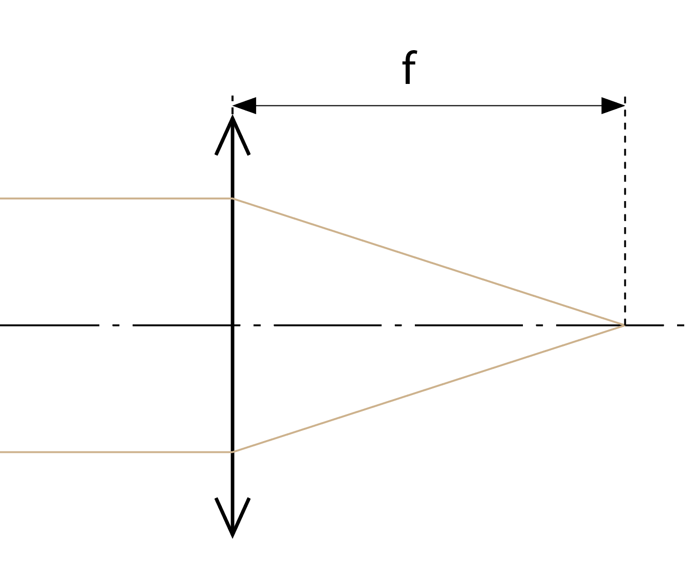
</p>

However, for thick lens, while the focal point can be located, the lens’ exact position becomes harder to find. The thick lens occupies a spatially continuous range on its optical axis, so there does not exists a single point that could represent its position. 

Principal plane is thus used to find the reference point for focal length. To locate the principal plane of a thick lens, extending the exit rays backward, their intersection with the incident ray is the position of the principal plane. The intersection between principal plane and optical axis is the principal point $H$. And the distance between principal point and focal point would be the focal length. 

<p align="center">
	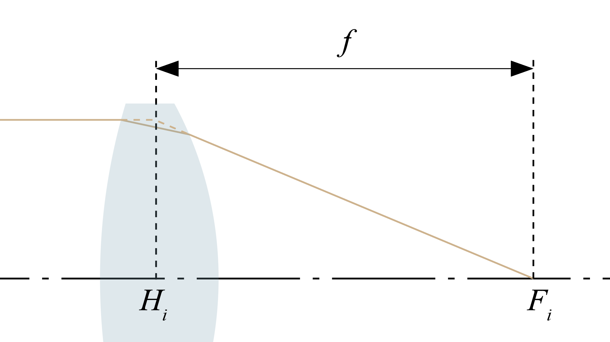
</p>

The subscript $i$ in the figure above indicates with respect to the image. Another set of principal plane and focal length pair can be acquired in the same way by emitting collimated rays from the image side. But for this framework, that rear principal plane is almost never needed. 

Tracing the principal plane of a lens consists of several element is the same way. Projecting a set of collimated rays at the lens and propagate them through, then invert the exiting rays, the intersection between them and the incident rays are the position(s) of the principal plane: 


<p align="center">
	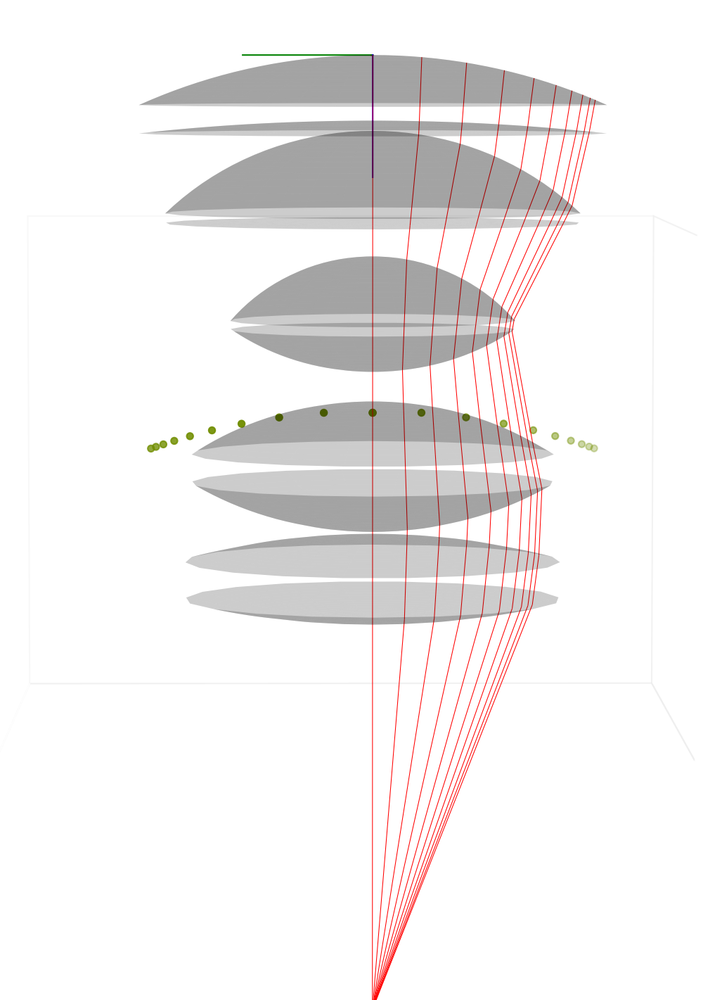
</p>


The whole principal plane is also not a plane, but a curved surface. It should be noted that such curvature is not an artifact, but expected. 

However, when selecting the point that reference the principal plane, it is always the point on the optical axis that is chosen to be the location of the principal plane. To find the focal point, a nearest neighbor is adopted to find the point that is closest to all of the existing rays. The distance between the principal point and the focal point would then be the focal length. 

# 2.4.2 - Tracing the entrance pupil

The easiest way to cast rays to the lens is to brutally generate a group of rays and cast them towards the first surface. However, while this certainly could propagate some rays through the lens, it can be quite  inefficient. 

Consider a lens with a maximum f-number of $f/1.4$, when it is stopped down to $f/4$, i.e., 3 stops, the aperture is 8 times smaller than at the maximum f-number. For the rays that arrives at the aperture stop, at most only 1/8 of them can pass through, the rest all but absorbed or diffused and no longer make contribution to the direct image formation. 

However, entrance pupil is also not the physical diaphragm. When looking at a lens wide open, it is quite often to feel that the lens has a giant opening, even bigger than the physical rear lens mount. 

<p align="center">
	
</p>


$$
\textsf{A Canon EF 85mm f/1.2 lens. Image from eBay@Concourse}
$$

This opening is the entrance pupil, it is the image of the aperture stop when viewed from the front. And the reason it looked bigger than the rear is precisely because it is an image of the diaphragm and not the physical diaphragm structure. Conversely, there are also cases in which the entrance pupil looks smaller than the exit, typically seen on wide angle lenses. 

In the f-number equation:

$$
N=\frac{f}{D}
$$

The $f$ refers to focal length of the lens, and $D$ is the entrance pupil diameter. 

Since the entrance pupil is the image of the aperture stop, it can then be located by casting rays from the stop and finding the position of its image. First, emit rays from the stop towards the front the lens, i.e., object space direction. 

Note that it is best to ensure all the rays have the same wavelength. As will be shown later, the entrance pupil will take on different shape and location at different wavelengths. 

<p align="center">
	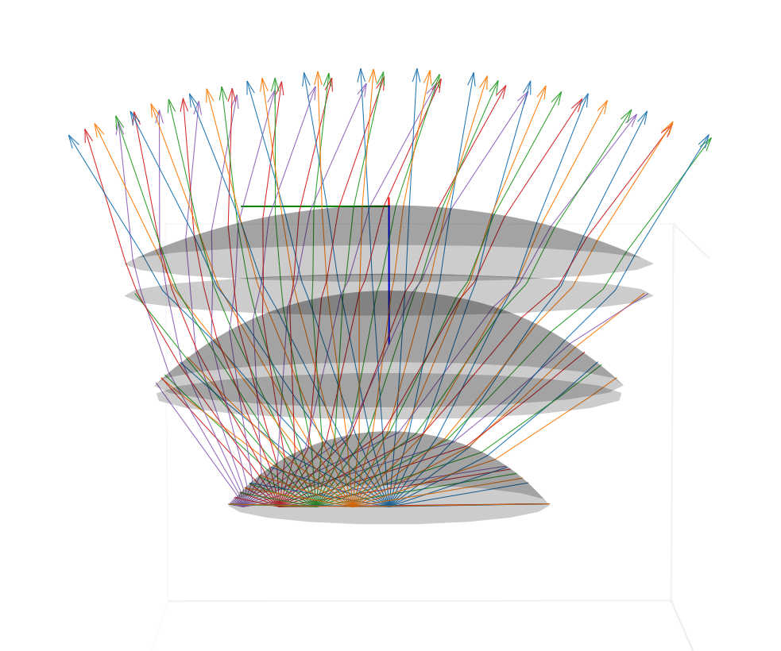
</p>

The rays exiting the lens are, in this cases, diverging, the entrance pupil can then be thought as the virtual image of the stop. It is then possible to locate the entrance pupil by inverting the exiting rays and calculate their intersection. 

<p align="center">
	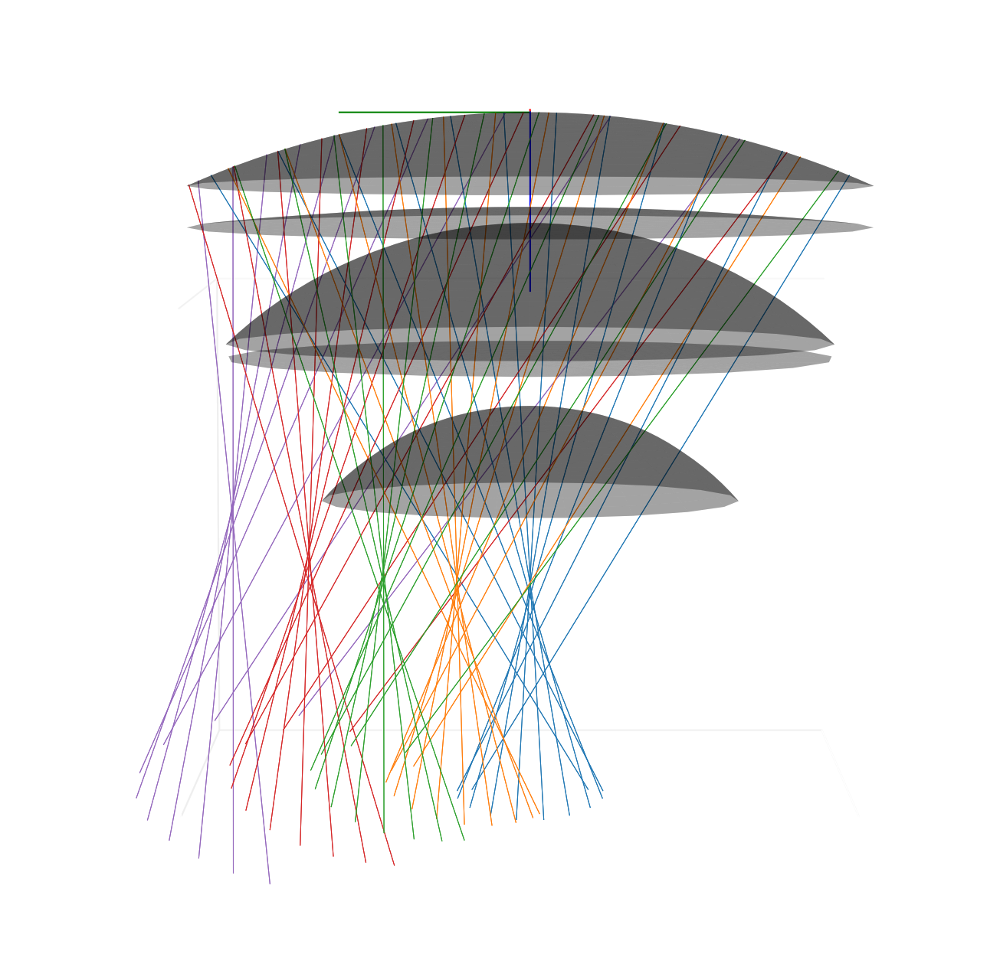
</p>

However, as would expected for thick lens simulation, the inverted rays do not intersect nicely and conveniently at a single point. The task is then to find a point that best approximate their intersections. In this case, it can be a point that has the smallest distance to all the rays. 

Since each ray is given by a direction $\mathbf{d}$ and an origin **$\mathbf{o}$**, they can be defined as:

$$
\mathbf{ r} _i \left ( t \right )=\mathbf{o} _i + t \mathbf{d} _i 
$$

Assuming the position of the point whose sum of distance to all the lines are the smallest is $\mathbf{P}$, there is: 

$$
A\mathbf{P}=b 
$$

And:

$$
A=N\mathbf{I}-\mathbf{D}^T \mathbf{D} 
$$

$$
b=\sum \left ( \mathbf{o} _i - \left ( \mathbf{D} \mathbf{D}^T \right ) \mathbf{o} _i \right )
$$

Where $N$ is the number of lines, and $\mathbf{D}$ is a matrix where each row is a direction vector. It is then possible to find $\mathbf{P}$ by: 

$$
\mathbf{P}=A^{-1}b 
$$

Apply this onto each of the ray groups: 

<p align="center">
	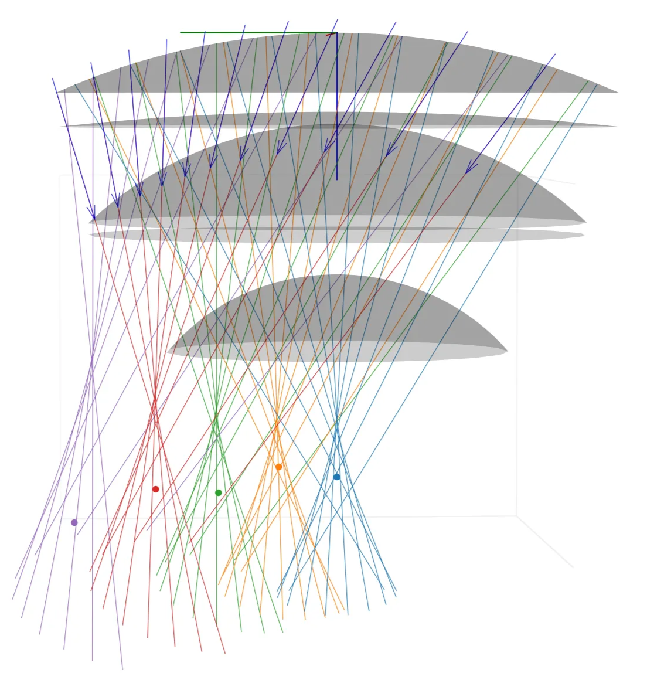
</p>

It would appear that the approximated intersections lay far away from the visually perceived intersection. This, however, is not a algorithmic mistake. Notice in the figure above, the inverted rays from the right do not converge as much and when the heuristic is to find the point that is closest to **all** of the rays, these rays from the right side will then drag the resulting point further away from the perceived center. 

Since it is quite obvious that it is the ray further away on the meridional plane that is contributing significantly to the offset, the result can be improved by simply ignoring their contribution. Here an interactive algorithm is adopted: 

```python
delta = SOME_BIG_CONST
while (more than 2 rays in the group) and (delta > THRESHOLD):
	Find the transversal distance between o_i and P
	remove the o_i with longest transversal distance
	recalculate the intersection position P
	delta = old P position - new P position 
```


<p align="center">
	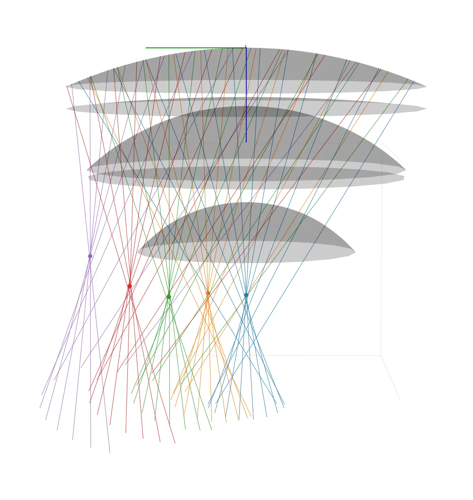
</p>

There remains a minor problem. Pruning the rays can introduce some slight disturbances, especially when more groups of rays are sampled: 

<p align="center">
	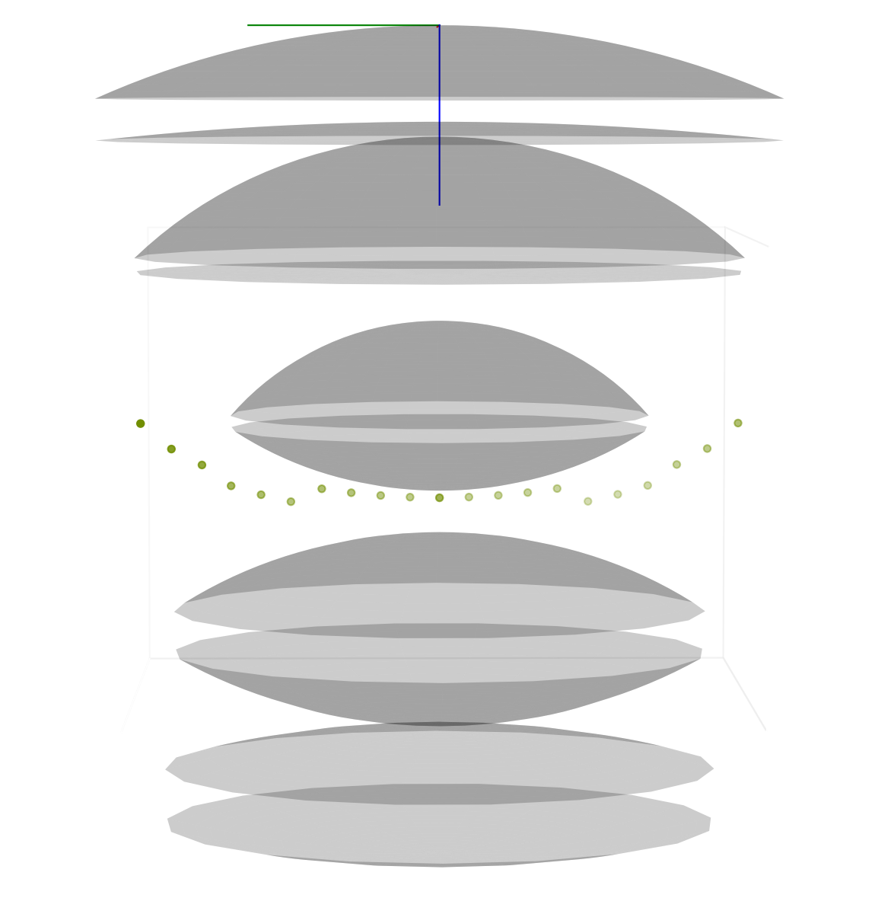
</p>

But as the primary focus of finding the entrance pupil is to find its on-axis position and the furthest off-axis position, the fluctuations in the middle is not off great importance. A small smoothing can be applied to ease the shape with the 2 ends preserved: 

<p align="center">
	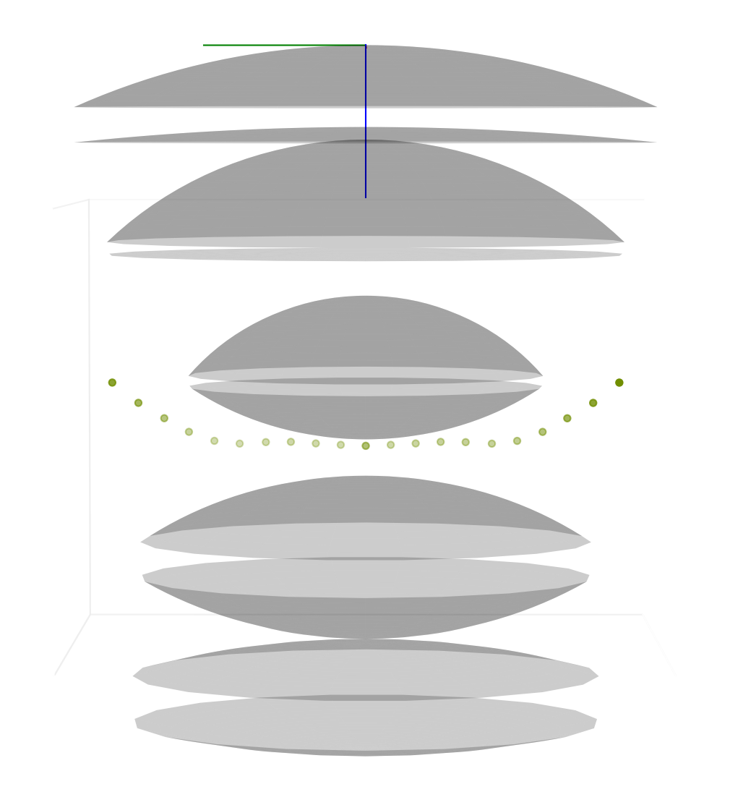
</p>

$$
\textsf{Gaussian smoothing with } \sigma=1
$$

In this example it is quite apparent that the entrance pupil is not a plane, but rather a curved surface. This is part of the reason why in the figure at the beginning, the pupil does not look like a perfect circle. 

When stopping down the lens, the physical diaphragm shrinks. But since its location and $z$ position does not change, the new entrance pupil can be acquired by simply clipping the pupil surface with the diameter of the stopped down entrance pupil. 

Note that this discussion about the entrance pupil is ignoring the change of shape caused by the diaphragm blades. The effect of blades shall be discussed later. 

## 2.4.2.1 - Pupil representation and stop

There might be some problems when a surface behave practically as a field stop. For example, Zeiss Hologon 15mm f/8 is a fixed aperture wide angle lens. For this lens, the Stop is not a diaphragm consists of a set of moving aperture blades, but literally the glass element itself, as shown in the figure below: 

<p align="center">
	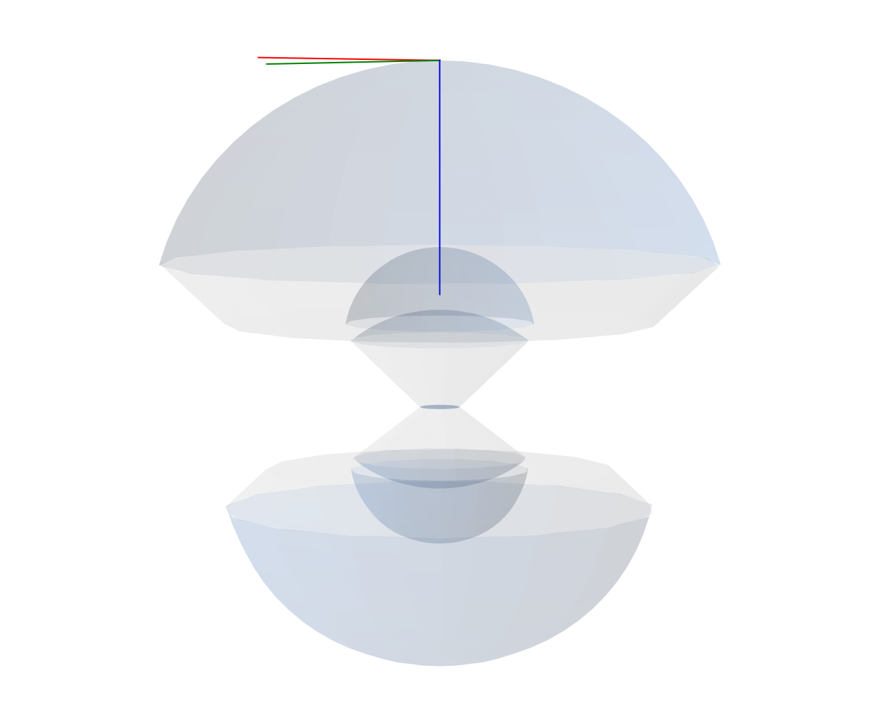
</p>

The middle element is shaped like an hourglass, and the thin waist works as the lens stop. 

However, in software, the middle section might have been modelled as follow:

```python
Sufarace(5.6685,	    4.1685,     3.6,     "H-LAK7") # 0
Surface(INFINITY,	    0,          0.8)               # 1
Stop(                 0)                             # 2
Surface(INFINITY,	    3.48,       0.8,     "H-LAK7") # 3
Surface(-5.508,	      2.4045,     3.5)               # 4
```

Due to the “waist” of the middle element has to function as the system stop, the software representation of this single element is broken into two parts, both sharing the same material. Together, the two elements sandwich the Stop. As a result, surface number 1, 2, and 3 in the chart above are effectively describing the exact same thing. 

When the rays hit surface 1, the simulation will calculates index of refraction by using the material on the two sides of the surface. This, however, creates a problem, surface 1 does not have a material, which by default will be treated as having an environment material, such as Air. So, from the perspective of the program, the rays are exiting `H-LAK7` into the air. This will almost definitely cause total internal reflection for the large angle fields. These fields will then stop contributing to the sequential image formation, instead creating a hard vignette around the corners:

<p align="center">
	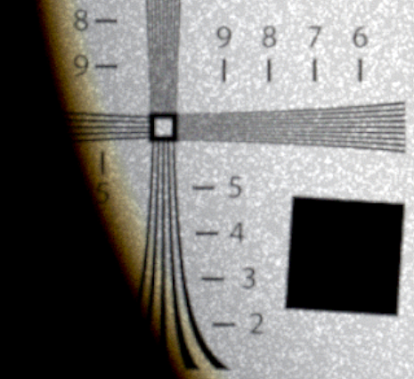
</p>

To combat this, an additional attribute should be introduced to mark if a surface functions only as a field stop. This way, rays may be culled but they can propagate through these surfaces without the directions being altered. 

## 2.4.2,2 - Mirror Surfaces

Lenses with mirror surfaces need a bit more attention. In itself, a mirror surface is pretty much the same as a standard surface, both defined with a radius, a thickness, and a material. However, mirror surfaces differ from others in three significant ways: 

- Mirror surfaces reflects rays instead of refracting them.
- Mirror surfaces invert the direction of rays.
- Mirror surfaces can cause previous surface to be traced again.

The reflection vs. refraction is easy to understand and to implement, as already stated in Chapter 2. The other two are a little more tricky. 

Recall that thickness defines the distance between this surface and the next surface. If a surface has a thickness of 10 (in whatever units) and is sitting at the origin, then the next surface would be sitting at the 10 position along the optical axis. However, for mirror lens, since the rays will no longer traverse in the same direction as they came, the thickness needs to be a negative number. 

The negative thickness would make sense as rays are literally traveling in the opposite direction, but it also means that if a ray just passed a refractive surface before reaching this mirror surface, it might be reflected to that refractive surface again. However, in sequential definition, rays are treated to never go back, which apparently contradicts the demand here. The solution for making mirror surface - and, consequently, catadioptric lenses - also work with sequential propagation, is to just define the previous surface(s) again. 

Say a mirror surface is sitting behind a refractive surface, a common occurrence for an element with one side silver coated to become a mirror. They can be represented in the following order, with the mirror surface having the material of “MIRROR”: 

|  | Radius  | Thickness  | Material  |
| --- | --- | --- | --- |
| 1 | -200 | 10.1 | F4 |
| 2 | -250 | — | MIRROR |

The thickness of the mirror is not included in the chart above. But since surface 1 is supposed to be traced again after rays are reflected off the mirror, the mirror surface should have the same magnitude of thickness, just inversed (in optical design software, this is typically set as a “pick up from” operation). Then adding the first surface back as the third surface: 

|  | Radius | Thickness | Material |
| --- | --- | --- | --- |
| 1 | -200 | 10.1 | F4 |
| 2 | -250 | -10.1 | MIRROR |
| 3 | -200 | — |  |

Note that the third surface does not have a material assignment. This is due to the space “behind” it is technically air (or whatever environment material). So when tracing through the third surface, the program need to pick up material from before the mirror surface, in this case from surface 1. 

When this order is abided, ordinary sequential tracing can automatically perform the tracing of a mirror system despite the rays may seems to have went astray. Technically the rays are still sequential as they are traversing one surface after another, it’s just the position of these surfaces are not in a monotonic increasing order along the optical axis. 

# 2.4.3 - Sampling from the pupil

Not all rays from the object space can be received by the imaging system, in fact, barely any can be imaged. To boost efficiency, a common way is to set the lens as a target for the rays to ensure they will reach the system. However, even within the rays that reached the imaging system, some of them still will not exit the lens. To further boost efficiency, the entrance pupil can be used as the target. 

The remaining question is then how to sample from the pupil. Optical design software such as Zemax OpticStudio uses Sobol sequence as the input for spot simulation. As a quasi-random generation, Sobol sequence definitely helps avoiding patterns, but at the same time, Sobol sequence tend to become rectangular symmetric, which is also not ideal. 

It happens that the framework is intended to be situated within media production pipeline, which is very likely to be using Monte Carlo to approximate stochastic processes. As such, it is totally fine to randomly select a local coordinate from the pupil and use it as the target. 

Mere spot simulation can have an extremely high pupil sampling thanks to the small source count. When set to 20480 random pupil samples, an even spot can be acquired: 

<p align="center">
	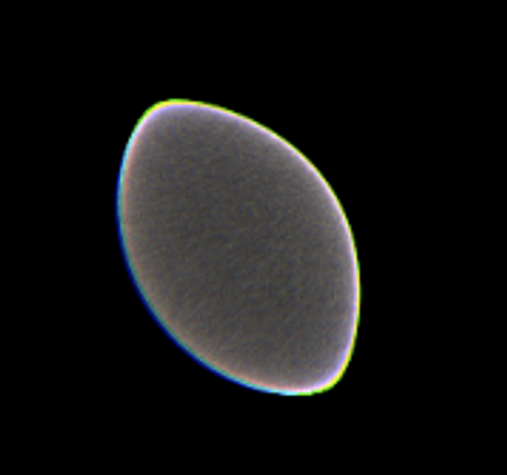
</p>

$$
\textsf{Defocused off-axis spot of a Biotar 50mm f/1.4 with 20480 pupil sampling}
$$

However, such sample amount can be extremely inefficient for image simulation due to the raybatch size is at $\theta \left( n_{s} \cdot n_{p} \cdot n_{\lambda} \right)$. Where $n_{s}$ is the number of source points,  $n_{p}$ is the number of pupil samples, $n_{\lambda}$ is the number of wavelength sampled. Since the number of source point has a hard requirement (i.e., number of pixels),  $n_{p}$ should be as small as possible to accelerate the process. 

In comparison, when set to randomly sample 128 points, with not enough Monte Carlo iterations, the defocus spot could look like this: 

<p align="center">
	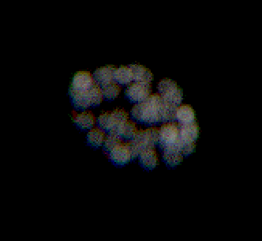
</p>

$$
\textsf{Defocused off-axis spot of a Biotar 50mm f/1.4 with 128 pupil sampling}
$$

The cause of this is rather simple, notice that $\sqrt{128}\approx 11.31$, i.e., the horizontal and vertical direction sample only has about 10 units. In another word: the sparse bokeh is merely the result of lack of total pupil sample points. Similar situation could also happen for smaller bokeh size, as shown in the figure below. 

<p align="center">
	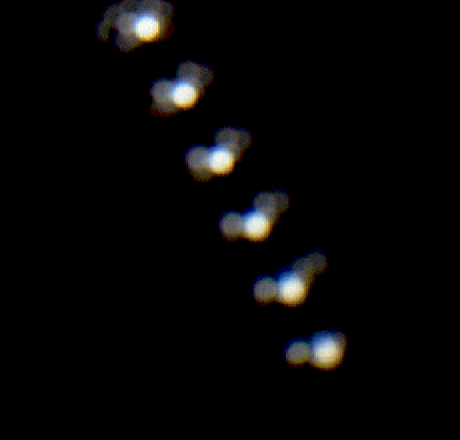
</p>

# 2.4.4 - Partition the elements

It is quite common to see in new lens release note and reviews that the lens has “X elements arranged in Y groups”. For the common users, these numbers mean next to nothing. But for the more seasoned professionals, the number of elements and groups can inform which optical paradigm the lens could be using, and even infer what performance and characteristic(s) is to be expected from the lens. 

For example, “6 elements in 4 groups” indicates a high chance of the lens being a *double Gauss* (or *Planar*, these two are largely interchangeable now) design, which tend to have great on-axis correction but lacks in field curvature and coma. As such, this lens is likely to have a great center image quality and dwindling corners. However, being a double Gauss also means that stopping down the lens could greatly improve the image quality, and a clear image can be expected three or four stops below the maximum aperture. 

The element and group information is also important here in this framework, especially for creating the clear boundaries that connects the surfaces. 

A single “element” can be recognized as a group that contains 2 surfaces, with only the first surface (index ”C” in the chart below) having a material definition: 

|  | Radius | Thickness | Material |
| --- | --- | --- | --- |
| C | R1 | D1 | SF1 |
| C+1 | R2 | D2 |  |

The surface after (index ”C+1” in the chart above) has no material designation, which means there is no specific optical material in the space after the second surface. These two surfaces together envelope a spatial area and form a lens. This lens is also referred to as a singlet when the discussion is focused on this pair of surfaces only. 

To avoid any confusions between “lens” consists of two surface and the compound “lens” that is made of many individual lenses, a singlet consists of two surfaces would be referred to as an “element” or “lens element”, as in “an element in the whole lens made of many elements”. 

In optical design, quite often there are 2 elements cemented together. In this scenario, there are 4 surfaces among the two elements, but the surfaces that are cemented together share the same radius and semi-diameter (in almost all cases). In the case that they share the same radius and semi-diameter, the one in front would have a thickness of 0. For this reason, optical data tend to combine this pair as a single surface, only some dated patents would listed both surfaces. 

When the cemented surfaces are merged, a lens data sheet would look something like this: 

|  | Radius | Thickness | Material |
| --- | --- | --- | --- |
| C | R1 | D1 | SF1 |
| C+1 | R2 | D2 | LAK33 |
| C+2 | R3 | D3 |  |

This form of twin elements cemented together is commonly referred to as a doublet. 

# 2.4.5 - Ray Transport

A fully defined lens here finally enabled us to starting propagating rays through it. The whole process can be described as follow:

1. Create object space emission sources (see chapter 2.5)
2. Define an emission target, this can be either the entrance pupil or the first surface. 
3. From emission source, shot rays towards the target. 
4. Iterate through the surfaces of the lens system. In each surface:
    1. Calculate initial intersection. 
    2. Using the intersection to calculate corresponding surface normal. 
    3. Using intersection and normal to calculate refraction and reflection with respect to polarization (see chapter 2.2). 
    4. For refractive system, mark the reflected rays in case flare is needed, and store the reflected rays in a basket for future use. 
5. After the rays exit the lens system, calculate their intersection and reaction on the imager, convert wavelengths and radiance into color (see chapter 2.6)

# 2.4.6 - Stray rays and internal reflections

One important aspect of the vintage look is the flare. Flare typically manifest as bright highlights on that image that are not caused by an object at the corresponding position, but rays emitted from other positions bouncing inside the lens. 

In principal, this is very easy to calculate, but the cost of doing so is tremedous. For a refractive lens with $n$ surfaces and casting $m$ rays towards it, in a single propagation iteration, there will be $m \cdot n$ number of reflected rays as every ray will spawn a reflected ray at each surface, creating a total of $2 \cdot m \cdot n$ rays. In a second iteration, all these rays will keep being refracted and reflected at the same time, making $4 \cdot m \cdot n$ number of rays. The third iteration $8 \cdot m \cdot n$ and so on. 

To ensure the ray count does not explode immediately, two things need to be implemented: 

- A minimum radiance threshold, below which will lead the ray to be culled.
- A very low initial ray count.

The culling line can be set according to project need, although it is suggested to be around $0.5 ^ {12}$, this is effectively “12 stops lower than full radiance”, a decent starting point for imaging considering that most cameras record 12-bits. 

For the ray count, it is not a big issue for single point simulation, but will become a big problem in image simulation. Even if the relay source is a FHD image, there are still over 2 million sources. Even only sample a small chuck from them will still run out of memories in seconds. 

To combat that, another threshold should be implemented so that darker sources are entirely ignored in stray ray calculation. This will be detailed in later chapters, but in short, EXR holds 32 bit info, so when the input is CGI image in EXR format, it is often safe to discard all pixels lower than 1, and only treat pixels brighter than 1 as effective stray ray sources. 

<p align="center">
	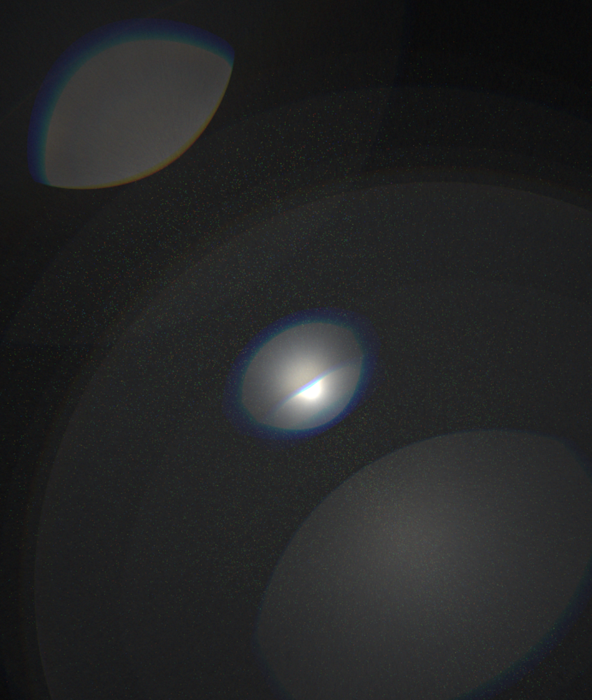
</p>

# 2.4.7 - Focusing

A lens’ stats, such as focal length and f-number, are exclusively measured when the incoming rays are collimated, i.e., emitted from infinity and parallel to each other when reaching the lens. The lens - assuming its an objective and not an afocal lens - should focus the rays into tiny points on the image plane and thus forming an image of what the scene at infinity look like. 

However, aside from astronomical imaging and landscape photography, objectives rarely focus at infinity. Quite the opposite, in most of the working scenarios of a photographic objective, the thing needs to be imaged is at a much closer distance. Which means the lens should be focused at somewhere else rather than infinity. 

*(Not very related but even in astronomical imaging and landscape photography, it is also often not the case that they will focus at infinity. Astronomical instruments needs to factor in both the thermal expansion of the instruments themselves and atmosphere turbulence, plus the common use of UV and IR imaging, whose best focus differs from that of the visible spectrum, they rarely uses true infinite conjugate. Serious landscape photography almost always uses small aperture and long exposure, and in order to cover the largest depth of field, the focus is often set at a hyperfocal distance, which is closer than infinity)*

## 2.4.7.1- Block Focusing

There are two main methods for lenses to change the distance of focus. The first one is based on the thin lens formula: 

$$
\frac{1}{s_o} + \frac{1}{s_i} = \frac{1}{f}
$$

Where $s_o$ and $s_i$ represents **o**bject side distance and **i**mage side distance respectively. The image side distance means the distance between the thin lens and the image plane, and the object side distance is, of course, the distance between the thin lens and the object, i.e., the focus distance. 

This does bear the obvious question that physical optics are never an ideal thin lens, but a stack of individual lenses with thicknesses. However, in the typical engineeringly manor, the difference can be temporarily ignored, and a thick lens can be focused in the exact same way as a thin lens. 

Observing the equation above, when $s_o$ decreases, $s_i$ would increase to keep the focal length a constant. And this is the first focusing method: **block focusing**. The entire lens moves forward, away from the image plane, in order for the image system to acquire images focusing at closer distances.  

## 2.4.7.2 - Internal Floating Elements

While block focusing has been the standard for almost the entirety of the photographic history, it has some drawbacks, most significant: block focusing lenses often only have one focus distance at which the image quality s good, and aberrations will only increase with further astray from that distance. Most of the vintage lenses have the best performance when focusing at infinity, and the image quality deteriorates as the focus pulls to closer distances. 

There are some old lenses that are not optimized for infinity, such as many macro lenses, which performs best only at macro distance and deteriorates when focusing afar. Paul Rudolph’s Kino Plasmat is also fairly famous for having a great image quality at portrait distance while giving up at infinity. But they also do not escape the performance loss at other distances. 

To combat this and also playing to the need to auto focusing motor, floating elements were introduced. Instead of the entire lens moving back and forth, only a selection of the elements or groups change their position according to the focus distance. 

In patents, such relation is often represented as the following: 

|  | Radius | Thickness | Material |
| --- | --- | --- | --- |
| C-1 | -850 | 2.72 | BK7 |
| C | 26.5914 | D1 |  |
| C+1 | 49.3187 | 2.38 | F4 |
| … |  |  |  |

For surface index C, its thickness is not a fixed value, but a placeholder. This D1 is often described in a later table and given several different values at different object distances. 

So to implement such relationship, the easiest way is to just let the element’s thickness to become certain values at the given object distances. However, since it is only discrete values given, not a function of the relationship, determining the in-betweens need a bit more work. 

Recall the thin lens focusing equation: 

$$
\frac{1}{s_o} + \frac{1}{s_i} = \frac{1}{f}
$$

The relationship between object distance and image distance is not linear. As such, it is more often fitting to model the thickness in the following relationship with object distance:

$$
D \propto  \frac{1}{O}
$$

Where $D$ is the thickness of the given surface, and $O$ is object distance. Than perform interpolation based on this relationship. 

## 2.4.7.3 - “Auto” Focus

At this point of the chapter, changing the focus distance is now achievable, done by manually changing the back focal distance for block focusing, and linearly interpolate keys for IFE. However, no human should be expected to remember the BFD of every lens when focusing at every distance — BFD is simply too unintuitive for humans to work with. 

A better way to change the focus of the system would be directly asking the system to focus at a certain distance, let the system itself decide how the elements should be moved to focus at the desired distance, almost like the auto focus of a modern digital camera. 

For block focusing, there seem to be an easy way for auto focus. 

<p align="center">
	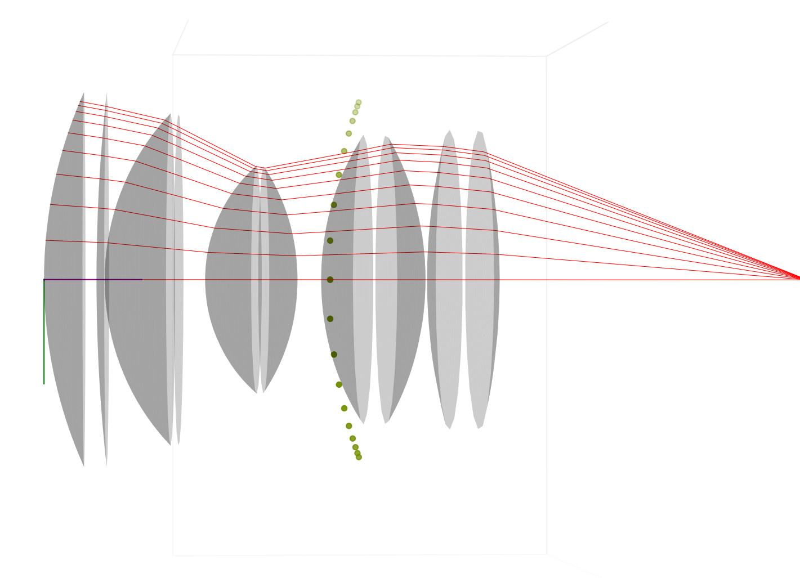
</p>

The exiting rays from a lens, as shown in the figure above, should be tapering down before expanding again. Intuitively, when the ray bundles have the smallest radius, the point would be the smallest and thus rendering the image to be the “clearest”. This could then be achieved by solving a linear equation and finding the converging point of the rays, effectively locating where the RMS radius of the rays are the smallest. 

In many cases, the RMS method works fine, especially when the lens is focused at medium or far ranges. However, if the lens is focusing at a close distance and the lens happens to be a fast lens wide open, there could be some complications. 

The RMS method made an important assumption: every sample ray is equal. However, rays at the edge tend to be reflected more and thus carrying less radiance, which makes them contribute less in the final image. Plus, over or under corrected spherical aberration could shifts the RMS results due to the PSF having the shape of a mountain or a bowl, and the existence of sensor glass could further disrupt the ray convergence. As a result, the smallest RMS may not be the best focus at all. Or to say it at a higher abstract level: **smallest spot may not give the best definition**. 

As an example, when a lens modeled after the Canon EF 50mm f/1.2 L is set to auto focus at `200` meters onto an image plane with `2` mm of sensor glass consists of material `FK5`, the smallest RMS yields a BFD of `32.926564` mm (bear in mind this distance does not contain sensor glass and the glass-image plane gap), and the resulting ISO 12233 look like this: 

<p align="center">
	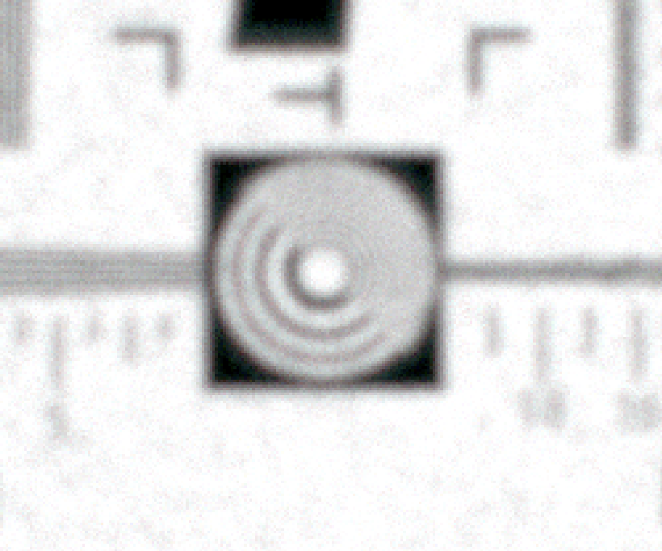
</p>

It should be fairly obvious that this is not in focus. 

However, manually override the BFD to `33.5` mm, and the result looks a lot more focused:  

<p align="center">
	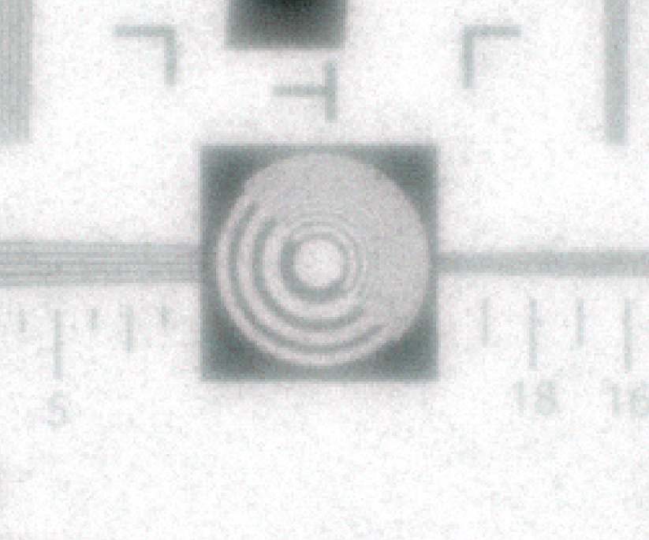
</p>

The reason is likely because that the Canon EF 50mm f/1.2 L was designed to have a moderate amount of spherical aberrations left, especially when wide open, which is further exemplified by the sensor glass. However, the focusing process uses the beam RMS diameter without considering the energy distribution, so if the thinnest RMS beam location is different from there the integrated energy distribution centroid, then the auto focus will be a bit off. Or in simpler terms:

> Smallest beam RMS radius does not imply best focus.
