# 2.5 - Object space

The concept of object space is what makes this framework different from many other optical simulations for media production: instead of a direct imaging application, **the framework is based on a relay imaging system**. 

A relay imaging system is not an objective in the typical sense; the image is already formed before the relay lens, and the relay lens simply transfer this image to the eyepiece. This concept is important because in media productions, the process to get the rendered image is the most resource consuming. Should optics be added in the render logic, it will inevitably increase resource consumption by several magnitude, and makes art-direct significantly more difficult. However, within the rendered image, the information needed already exists as explicit RGB or latent depth, so it is entirely possible to use these information and a relay system to recreate accurate optical effects. 

To maximize compatibility, especially with the VFX production pipeline, the primary focus of this chapter would be creating an object space using 2D images. There is, however, a section at the end that will discuss the extendibility of applying this concept of object space directly in a true 3D space. 

# 2.5.1 - Point Source

A point source consists of six parameter divided into two sets:  

$$
\mathbf{s}_p=\left( x,\ y, \ z, \ r, \ g, \ b \right)^T 
$$

The first three terms are position of the point source, and the latter three are the color information. RGB is used instead of wavelength because modern animation/VFX production pipeline uses RGB and not wavelength. These RGB information will be used to create wavelength, so other vectorized color format can also work, as long as there is a corresponding wavelength conversion implementation. 

A purely cartesian representation of point position may not always be ideal, especially in the context of optical design. In optics, fields are typically denoted by an angle and a distance. As such, another form of point source format would be: 

$$
\mathbf{s}_p=\left( \theta _x, \ \theta_y, \ d, \ r, \ g, \ b   \right) ^T 
$$

Where $\theta_x$ and $\theta_y$ are field angle along $x$ and $y$ axis, and $d$ is distance from the origin, i.e., front vertex of the lens. In complete rigorous the front vertex will introduce error at close conjugate, but that can be mitigated by offsetting it with the entrance pupil position. 

Since most of the calculations in this project are still conducted in Cartesian space, field angles still needs to be converted to Cartesian coordinates, which can be easily calculated by: 

$$
 \left\{\begin{matrix}x=d \tan \left ( \theta _x \right )  \\y=d \tan \left ( \theta _y \right ) \end{matrix}\right. 
$$

## 2.5.1.1 - Color to wavelength conversion

While Rec.709, Rec.2020, and many other standards have provided great definitions for converting wavelength into color, for imaging simulation for VFX production, such standards faces some problems. 

For the intended usage, the input for this application is more than likely to be RGB information from an image, regardless of whether the image is an 8-bit lossy compressed JPG or 32 bit lossless OpenEXR. Even if this application is somehow integrated into the renderer of a modern 3D program, the radiometry-based rendering equation is still RGB based and does not provide any information regarding the wavelength of the scene. 

After somehow converting the RGB colors into wavelength and propagated through, the wavelength needs to be converted back into wavelength. And here lies the problem: the RGB color converted from wavelength may not be the same as the RGB color that generated the wavelength. Phenomena such as Metamerism dictates that the same perceived color may have entirely different wavelength composition. 

There are two ways in the framework to convert RGB color into wavelength. The first is to replace the color with a designated Fraunhofer line and add interpolations if needed. 

Notice that for this application, there does not exist the need for any form of color-space conversion, gamma correction, or de-mosaic process. All operations can be done in the exact same color space as the input RGB signals. 

Thus, it is reasonable and quite convenient to simply use some important Fraunhofer lines to represent key RGB information. The input RGB can be converted into these key lines, after propagating through the imaging system, convert back to RGB.    

The following code shows the Fraunhofer lines used in the framework. By default, the C’, e, and g line are used for RGB respectively. Shifting the lines can also replicate the effect of environmental white balance. 

```python
LambdaLines = {
    "i" : 365.01, 
    "h" : 404.66, 
    "g" : 435.84, 
    "F'": 479.99, 
    "F" : 486.13, 
    "e" : 546.07, 
    "d" : 587.56, 
    "D" : 589.3, 
    "C'": 643.85,
    "C" : 656.27, 
    "r" : 706.52, 
    "A'": 768.2, 
    "s" : 852.11
}
```

For white light, it is also possible to interpolate between the lines and introduce a more densely distributed wavelengths. 

<p align="center">
	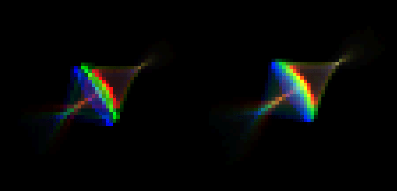
</p>

The figure above models the 10-degree field spot of the Biotar 50mm f/1.4 focusing at about 50m when the objects are located at the same distance, imaged onto a full frame (24mm x 36mm) imager at 4000 x 6000 resolution. The left one shows the result when only the three primary RGB Fraunhofer lines are used, whereas the right side one had 5 interpolations between each primary wavelengths and has a significantly more smooth color transition. 

Interpolation, however, takes some extra efforts. The framework uses the following process to calculate the weight of the added wavelengths. 

Assume that between red and green, green and blue, there are $a$ more wavelengths ($a$ as in “**a**dd count”) that needs to be inserted, then the total number of wavelengths would be:

$$
N=3+2a
$$

Set up a normalizer sequence with length $N$ and each element having an weight of:

$$
\frac{1}{a+1}
$$

This effectively averaged all the elements. 

Then, within this normalizer sequence, multiply the first and last element by:

$$
\frac{a+2}{2}
$$

Which yields a weight of:

$$
\frac{a+2}{2 \left(a+1 \right)}
$$

So the total weight of the sequence is:

$$
 \sum_{j=1} ^{N} \omega _j = \left ( N-2 \right ) \frac{1}{a+1} + 2\cdot \frac{a+2}{2 \left ( a+1 \right )}=3
$$

The process guarantees two things:

- The sum of an (1, 1, 1) RGB value still adds up to 3, so that the color value will not change.
- Each RGB channel still has an independent total contribution of 1 from all the wavelengths when converted back, so that the color will not be tinted.

This is a quite painful process to execute (more painful to design), it works only when the RGB channel is assumed to be equal in intensity. If there is a channel with low intensity or even zero, then the interpolated wavelength between the high intensity and null intensity will mean that - when converting back into RGB - the null color channel will received spilled color from the high intensity one, effectively creating phantom colors out of thin air. 

There are ways to go around that, such as refining the interpolation formula above or use the lowest intensity channel as a threshold and only perform interpolation below this threshold. But all of these efforts are of marginal return, this is where the second approach of color to wavelength conversion comes in. 

The alternative color to wavelength conversion is based on several probability density functions and an additional entry in the ray data structure. Each RGB channel is assigned with a unique probability density function of wavelength, and in every iteration, some wavelengths will be generated from this probability density function. To ensure the generated wavelength does not create phantom colors, an additional index is appended in the ray indicating which channel this wavelength is for. 

It should be apparent that this method does require the user to abide the contract and not create absurdly inaccurate probability density function. For example, if a Gaussian distribution is used for the red color, then its peak, i.e., the $\mu$, needs to lie somewhere in between 600nm to 660nm. If the user sets a $\mu$ of 400nm, then there still will be red color in the final image, but they will behave like they are blue. 

By default, the color probability density functions uses three skewed Gaussian distribution, defined as: 

$$
f\left( x \right)= g \cdot \frac{2}{\sqrt{2 \pi \sigma ^2}}e ^{- \frac{\left ( x-\mu \right ) ^2}{2}} \left [ 1+ \textrm{erf}\left ( \frac{\alpha x}{\sqrt{2}} \right ) \right ]
$$

Four key parameters are exposed to the user to fine tune the shape of the distribution:

- $g$ represents the global gain.
- $\mu$ of the normal distribution.
- $\sigma$ of the normal distribution.
- $\alpha$ controlling the skewness of the distribution.

The advantage of the probability density function approach is that it allows a near continuous wavelength distribution over millions or billions of Monte Carlo iterations, and it greatly reduced the time cost on the detector side as it could directly deposit a ray’s radiance into a channel. More on that will be discussed in later chapters. 

## 2.5.1.2 - Cast rays from the point

Point source is what enabled this project to use forward raytracing model, it also allows this to work for both 3D and 2D animation. 

Start by defining some emission targets, this can be sampled from the first surface of the lens, or from the virtual entrance pupil surface. Rays are created by shooting from the point source positions towards the target positions. 

For each ray, their wavelength are determined using the aforementioned color to wavelength conversion, which also handles the radiance. By default, the rays are not polarized, but if needed, the rays can be set to a specific polarization direction by manipulating the elliptical terms, which is discussed in chapter 2.2. 

## 2.5.1.3 - Natural falloff using Monte Carlo

The irradiance of a photographic objektive varies as the fourth power of the cosine of the angle between the axis and the chief ray, i.e.: 

$$
E \left( \theta \right)= E \left( 0 \right) \cos ^4 \theta
$$

This can be further broken into four induvial cosine terms: 

1. A perfectly matte subject patch looks dimmer when viewed obliquely (Lambert’s cosine law). This can be expressed as $L = L _0 \cos \theta$ . 
2. Seen from the off-axis object point, the circular stop looks like an ellipse whose area scales with $\cos \theta$. This can be expressed as $A _{pupil} = A _0 \cos \theta$.
3. The bundle that reaches the pupil subtends a smaller solid angle when its axis is tilted; étendue contains a $\cos \theta$ term. This can be expressed as $d \Omega = d \Omega _0 \cos \theta$.
4. The flat sensor intercepts the ray bundle at an angle, so the illuminated pixel area is
$\cos \theta$ smaller. This can be expressed as $E = E _0 \cos \theta$.

While it is possible to model them accurately by calculating them at the point where each phenomena occurs, it will take a significantly large amount of effort and giant chucks of code, quite possibly also reduce the runtime speed. But as will be shown here, when the simulation is based on Monte Carlo, there could be a better way of doing this. 

It is already established previously that instead of using RGB to inform the radiance of each ray, the RGB information is used to inform **the number of rays** that can be emitted from each source in each iteration, each ray still have full radiance. This is only possible thanks to Monte Carlo, which converts the discrete and quite sparse amount of rays into more analogous radiance when they are intergraded into the resulting image. 

The same logic can be used here, since the cosine fourth fall off will happen regardless of the state of the system, it can be modelled as a form of drop off. 

After generating the rays, calculating their angle using the direction property and acquiring their cosine fourth power: 

$$
\cos ^4 \theta = \left( \frac{v _z}{ \sqrt{v _x ^2 + v _y ^2 + v _z ^2 } } \right) ^4
$$

At the same time, generate a random array the same size as the rays with each entry in $\left[0, 1 \right]$. 

Then, comparing each rays’ cosine fourth power with the corresponding entry in the random array, if it is larger than the random number, drop this ray. 

With enough sample, this will have the same effect as modeling the cosine falloff in place onto the radiance property of each ray. 

Culling the rays also brings two distinct advantages: 

1. In each Monte Carlo iteration, there are less rays, reducing memory consumption and possibly also accelerate runtime speed. 
2. Each ray still remains full radiance when casted towards the system, making them having a higher efficiency, i.e., more radiance is contributing to the formation of the image. 

For people not of optics and photographic background, a fourth power term might sounds a lot, and it may feels inaccurate to cull so many rays just for the falloff. However, for normal focal lengths such as 50mm, a fourth power is actually quite negligible. A standard 50mm lens on a 135 format imager has a diagonal angle of view of roughly 44 degrees, so the chief ray at the corner would have a $\theta$ of 22 degrees. This will result: 

$$
\cos ^4 \left(  22  ^{\circ} \right) \approx 0.74
$$

Which is about half a stop’s drop in the relative illumination.

This $0.74$ value might occur to some people to be too high. As many 50mm lenses seem to have a much higher falloff. For example, below is the relative illumination of a Zeiss Planar T 50mm f/1.4 wide open: 

<p align="center">
	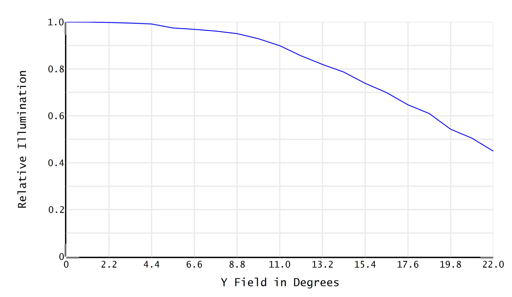
</p>

$$
\textsf{Simulated RI of Zeiss Planar T* 50mm f/1.4 wide open}
$$

Apparently, the image corner has over a stop’s illumination loss with RI dropping to below $0.5$. This, however, is not solely caused by the cosine falloff. When the lens is wide open, the pupil suffers not only from foreshortening, but also clipping by the front and rear surface. The outer diameter of the front and rear surface cuts into the pupil and makes its shape more of a football (or lemon, or cats eye). The clipped area contributed further to the fall off and is also the reason why bokeh around the corner cannot remain as circles. 

## 2.5.1.4 - Precision

Virtually all lenses were designed in infinite conjugate, meaning the incident rays are parallel to each other. This form of input is easy to acquire for on axis object, but would become tricky if there are millions of objects that are off axis. Fortunately, the effect of distance dwindles as it grow larger, such is the fundamental cause of hyperfocus, so a large but finite distance can be used to approximate infinity with very few sacrifice. It should be emphasized, however, that longer focal length would “compress” far distances, so a larger value should be used to approximate infinity when the lens in the system is of long focal length.  

This then faces a problem, `float32` has about 7 decimal digits of precision. For infinite conjugate, if the numerical representation of infinity is higher than $1e5$, the normalized direction vector will only have **at most** 2 effective digits on its $x$ and $y$ direction. This could introduce some serious numerical instability, many rays may fail to intersect with the first lens surface, especially when the lens has a small first element. As such, it is recommended to use `float64` for the calculation. The implementation corresponding to the framework uses `float64` by default. 

However, note that this framework has two traits in ray operations: 

- Transformation is represented as direction + position.
- Initial direction is acquired by subtracting the source position from the target position.

Such method clearly has the possibility to invoke catastrophic cancellation. 

The machine epsilon for `float64` is $2.22 \times 10^{-16}$, it is then possible to derive:

$$
D_{max} \approx \frac{s}{\epsilon}
$$

Where $s$ roughly equals the unit in last place. 

When setting $s=1$, i.e., requiring two rays whose direction is still differentiable when they have a 1-meter positional difference, $D_{max}=4.5\times 10 ^ {15}$. This is roughly $0.48$ light years, which far exceeds the magnitude of any human daily interaction (this is true when the writer wrote this line in 2026 January). Although $D_{max}$ shrinks with smaller positional differences, the scene size almost always shrinks with it. In general, it is safe to say that the framework and its implementation can provide an accurate representation of photographic uses. 

## 2.5.1.5 - Sample record and efficiency

In most cases where the amount of memory is limited, not all points can be sampled in one Monte Carlo iteration. Instead, during each iteration, only a part of the points can be selected as the samples. This situation does not really improve with higher end computer since source image resolution often increases with the computer performance and offsets the performance gain. 

If every iteration the program randomly selects points to sample, then this sampling process could sample some points more often than others, thus creating new noises onto the possibly already noisy CGI image. This completely random point sample is thus not desirable. 

For the more seasoned reader, this problem might sound familiar to the Apple Music shuffle joke, and the solution to source point sample is exactly the same as the solution to music shuffle: biased randomness. 

A sample record is created to keep a track of the number of times each point sources have been sampled. In each new iteration, the programs puts a sample priority to the points with a low past sample count. Whenever a point is sampled, its corresponding sample count is increased by 1. Thus, as the iteration continues, there will eventually be a near-even sample from all points.  

This record is a 2D array of integer the same size as the image dimension, for example, a FHD image would produce a 1920x1080 array of integers. Compare to the memory required to track the rays, this amount of entry is inconsequential. 

For an image consists of millions of pixels, controlling the sample count and efficiency also is a problem. If a pixel’s color is very dark, converting it to rays with radiance proportionate to the pixel value is rather inefficient, because the contribution these rays have are comparatively insignificant. 

Since it is almost certain that an imaging system that requires millions and billions of samples will use Monte Carlo, transferring the rays and properly reflect the original pixel’s brightness can be done entirely by varying the sample ratio of the pixel rather than the radiance of the rays. 

For example, a pixel whose value is $0.5$ emits $20$  rays in each iteration, and a pixel with value $1$ emits $40$ rays per iteration. In both cases, the rays have the same radiance and thus contribute equally to the imaging process. But thanks to the difference in sample count based on the value, the original pixels’ value difference can still be reflected in the result. 

An additional optional optimization method is to drop the pixels whose opacity is 0, since they do not contribute to the emission anyways. But to do that, the record and sample also needs to be changed accordingly, as the total amount of pixel has decreased, and the same sample would make the image to become over-sampled. This will become a huge problem for multi-layer sampling. 

# 2.5.2 - Image source

Between a single point in space and a full on 3D scene, there exists another form that could dwell in the object space: an image acquired from the first imaging pipeline. For hand drawn animation, the image are likely 8-bit `.png` or other lossless formats like `.tif` *(while possible, it is highly questionable to use `.jpg` or any other lossy format)*. For CGI animation, it will almost certainly be a series of `.exr` files representing different channels, but images nonetheless. 

An image can be viewed as a collection of point sources. Given the focal length of the system and assume the image fills the field of view, each pixel’s angular position can be calculated. And if a distance is also supplied, then it is possible to know precisely where every point locates in the object space. 

It should be clear that this forward ray tracing is a sampling method based on the angular resolution rather than the spatial resolution. Such approach offers the advantage that complex scene does not have to have a spatially even distribution of frequencies, things that are further away can have much lower level of detail while remining a relatively high imaging quality in the rendered result. However, this also means that for an image source, its imaging result will have brightness difference should it be tilted and no longer perpendicular to the optical axis. 

<p align="center">
	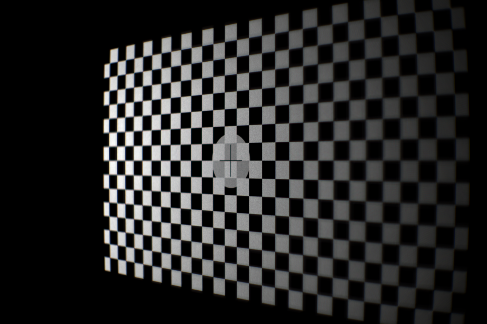
</p>

The figure above is a simulated result of a grid image source. The input image has a chequered pattern and is first transformed into points in space, then a 3D rotation is applied to all of them along the center point. 

It is quite obvious that the left side of the grid is brighter than the right side. This is due to the order of the aforementioned process, because the spatial points are first calculated, the left and right side has the same spatial density. However, the right side is closer to the camera and the foreshortening makes the right side to look bigger, i.e., they occupy a larger field of view. The uneven field of view occupancy then causes the two sides to have a different angular density. Since each point emits the same amount of total radiance, the right side ended up having a lower brightness. 

For this reason, when performing focus falloff testing, it is much better to use a rendered image of a tilted grid, rather than reading a flat grid image and rotate it in the script. The image below shows an example of focus falloff test; aside from ordinary vignette, there no longer exist a large brightness difference. 

<p align="center">
	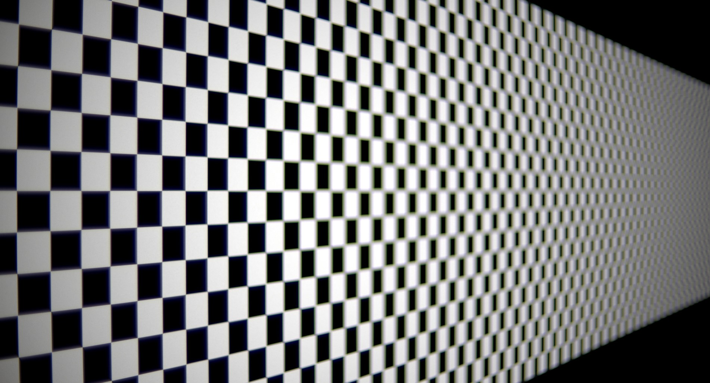
</p>

## 2.5.2.1 - Moiré

After converting into spatial points, the point sources (the image) may be sparse, and they are **definitely** discrete. Real objects, however, would not be discrete, which means sampling these virtual sources may cause problems. It also happens that, field angle wise, the point sources are aligned both horizontally and virtually, when the imager also has the same type of alignment, there is a chance of causing moiré. 

And indeed it does. For instance, when both the source image and the imag**er** resolution are set to 1920 horizontally, propagating through a Helios 44-2 and focusing at the middle, the result look as follow: 

<p align="center">
	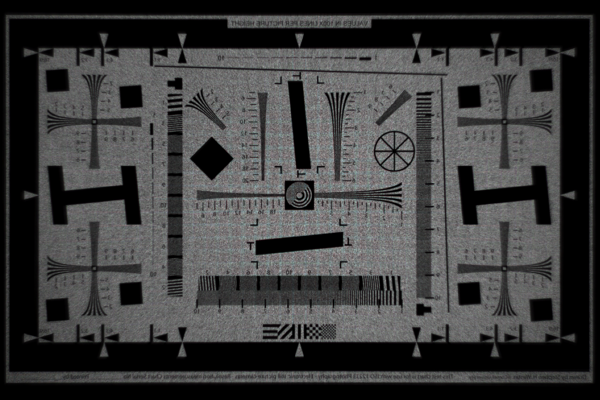
</p>

A grid pattern is clearly visible. This pattern would also shift with focus distance, and at one point inverting the square and edge color: 

<p align="center">
	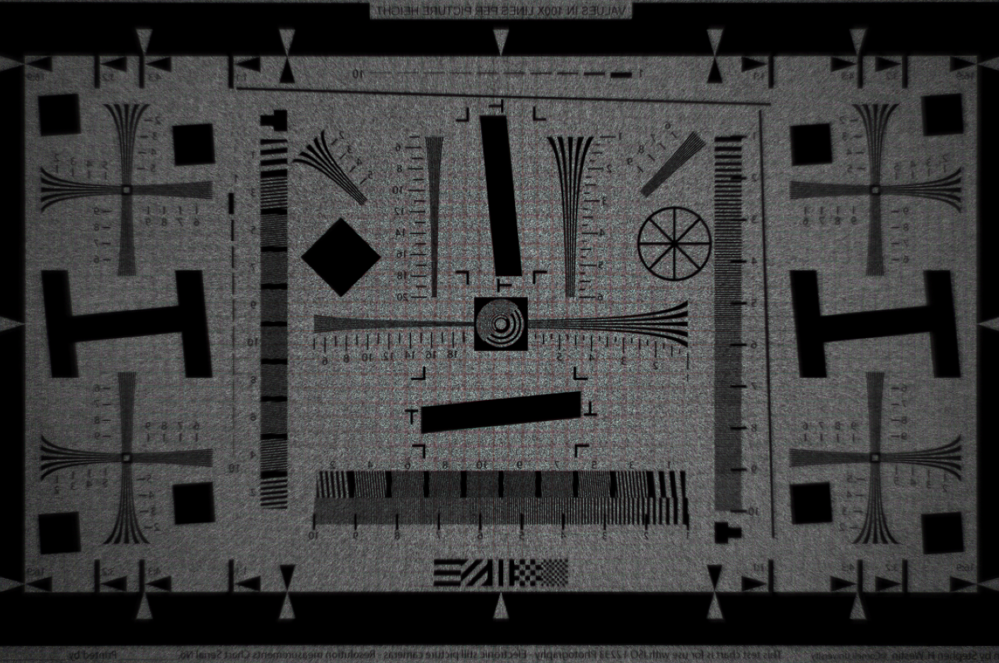
</p>

This is of course caused by the sample frequency coupling between the object space and image space. The solution is also simple: **add some positional noise to the point sources**. 

During each run, when computing the source position, randomly offset the source point so that it does not strictly sits in the center of the calculated position. Apparently, such offset also has to be regulated within a certain range, the range being the area of the pixel that this point represents. This can be calculated by:

$$
 w _{ i, j}=d _{i, j} \tan \left( \frac{\theta _x}{W} \right)
$$

Where $w _{i, j}$ is the angular resolution of the pixel at index $i, j$ and $d _{i, j}$ is its distance. Apparently it is assumed the pixel aspect ratio is $1:1$, which holds true for almost all occasions, and even in its negation, the calculation is trivial. 

Regardless, using $w _{i, j}$ to limit the maximum random jittering for the given pixel would then remove the grid pattern caused by frequency coupling. It should also be noted that, in each propagation iteration, the jitter must be added before calculating the directional vector from the points to the target (the pupil, in most cases). 

## 2.5.2.2 - Image source with varied z-depth

Prior images are all flat planes in 3D space, which in optical imaging would be classified as **flat fields**. But a flat field is almost never the case for photo/video applications. In almost all scenarios, the scene would contain many depth, an accurate rendition of a scene thus requires an accurate depth information. Luckily, because the framework situates itself in the second imaging process of post-production, depth is one of many information available. 

In animation and VFX pipelines, the image tend to have other channels representing different information, including the z-depth, i.e., how far away from the camera is each pixel. For instance, the image below shows an RGB representation and its z-depth channel. 

<p align="center">
	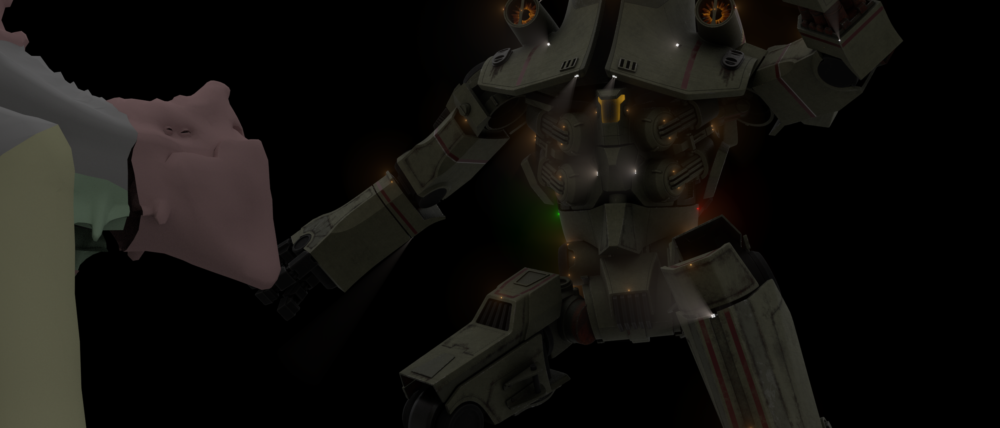
</p>

<p align="center">
	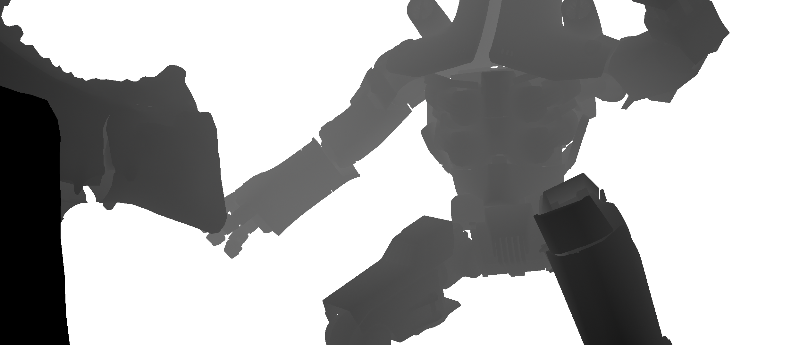
</p>

It is thus possible to reconstruct the 3D from the 2D images scene using the RGB information and the z-depth. The depth reconstruction, however, cannot be achieved by simply replacing the constant distance of the flat image with a varied array of distances. The z-depth from rendered images are not the distance on the world z-axis from the object to the camera. Rather, the z-depth describes the z distance **from the object to the near clipping plane in camera space**. 

There is another caveat, in traditional computer graphics, the near clipping plane distance is marked as the axial length from the plane to the hole of the “pinhole”. However, physical optics does not have an ideal hole, which requires the distance to be defined using something else. 

For most photographic scenarios, the following can be taken for granted:

$$
t_o \gg t_i
$$

That is, when focused, the object distance $t _o$ is significantly greater than the image distance $t _i$. 

In a similar sense, it is also reasonable to assume that:

$$
t _o \gg t_L 
$$

Where $t _L$ is the axial length of the lens. 

Under this assumption, it becomes relatively inconsequential where the pinhole is, it can be the first surface vertex, the last surface vertex, or any of the cardinal points. 

However, in macro photography, where the subject can be right on top of the lens, the position of the hole begin to matter. In this case, **the thing in a real lens that corresponds to the ideal hole is the entrance pupil**. 

The advantage of simulating an entire imaging system can be seen here as entrance pupil is already calculated (more on this can be seen in chapter 2.4). It is then possible to just use the known info to reconstruct the scene. 

One last note on depth reconstruction for post-production is that the numerical value in the z-depth channel does not tend to reflect the actual distances. So a mapping is recommended to indicate where the furthest and closest distance is, of course, the closest distance is taken into account the near clipping plane. 

With these in consideration, below is a reconstructed image. 

 
<p align="center">
	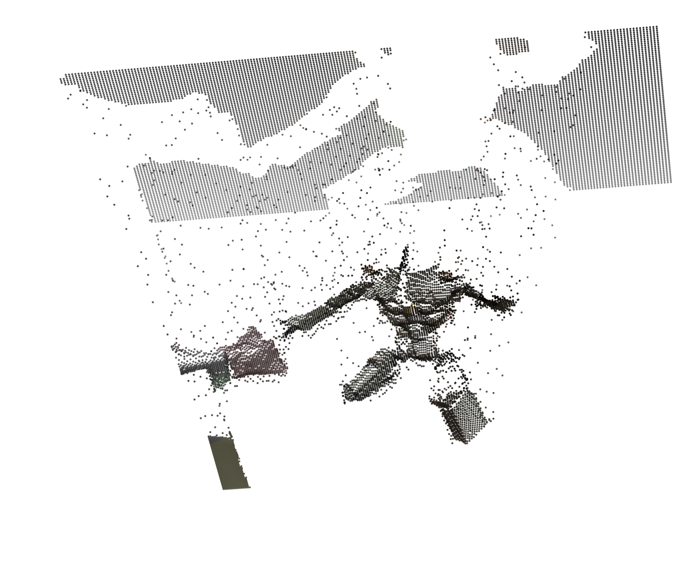
</p>

Sending these points back through the imaging system would then yield an image of a virtual scene that look as if it is actually shot on a real imaging system. 

<p align="center">
	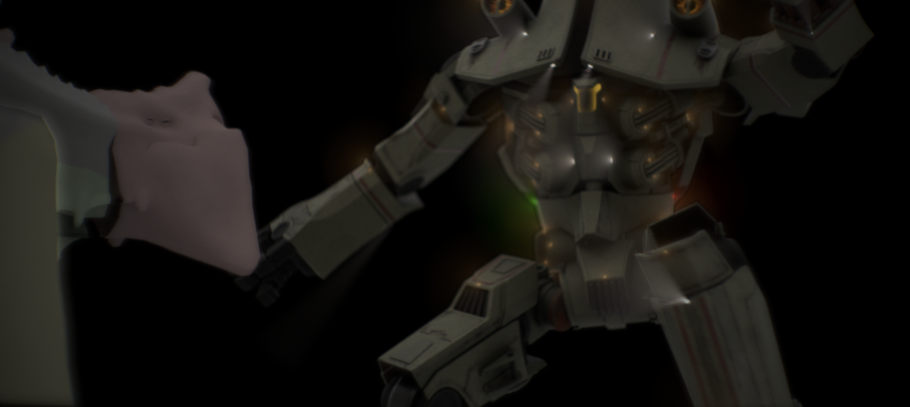
</p>

## 2.5.2.3 - Stacked images with varied z-depth

With the ability of rendering a single layer of image with varied z-depth, the next step would be to render a scene with several of these images stacked together. 

A question might arise, especially from those with image editing experience: why not just render a single layer and include the alpha channel, so that the several layers can be effectively reassembled in post? The answer is that **it is impossible to render a scene layer through a physical imaging system while maintaining valid alpha information**. This is because alpha is an image editing concept, not a real physical measurement. And the only way to make sense of it still relies on the ability to render at least two layers of image with varied depth. 

We shall first explicate why alpha is fundamentally incompatible with physical imaging system. Recall how alpha is “preserved” in traditional image editing software. Take Gaussian blur in Photoshop, for example. The kernel is a matrix of values usually in the form of: 

While often taken for granted, it must be emphasized here that, for typical convolution: 

> The kernel is the same through the entire signal area.
> 

i.e., regardless of where, the kernel used to convolute the local signal is the exact same as everywhere else. This would then also indicate: 

> Taking an integral over the kernel, the result is the same for all kernels.
> 

Quite often, the integral of the kernel is used to normalize the convoluted value, or applied pre-convolution onto the kernel so that the entries are in decimal. But either way, for a signal valued `1` , the sum of its effect after convolution still adds up to `1` , i.e., signal intensity is conserved through this type of convolution. 

But neither of the two observations are true for an imaging system. Treat the point spread function (PSF) as kernel, then for one, the shape of the kernel could vary drastically according to the field angle and distance, as shown in the figure below. 

<p align="center">
	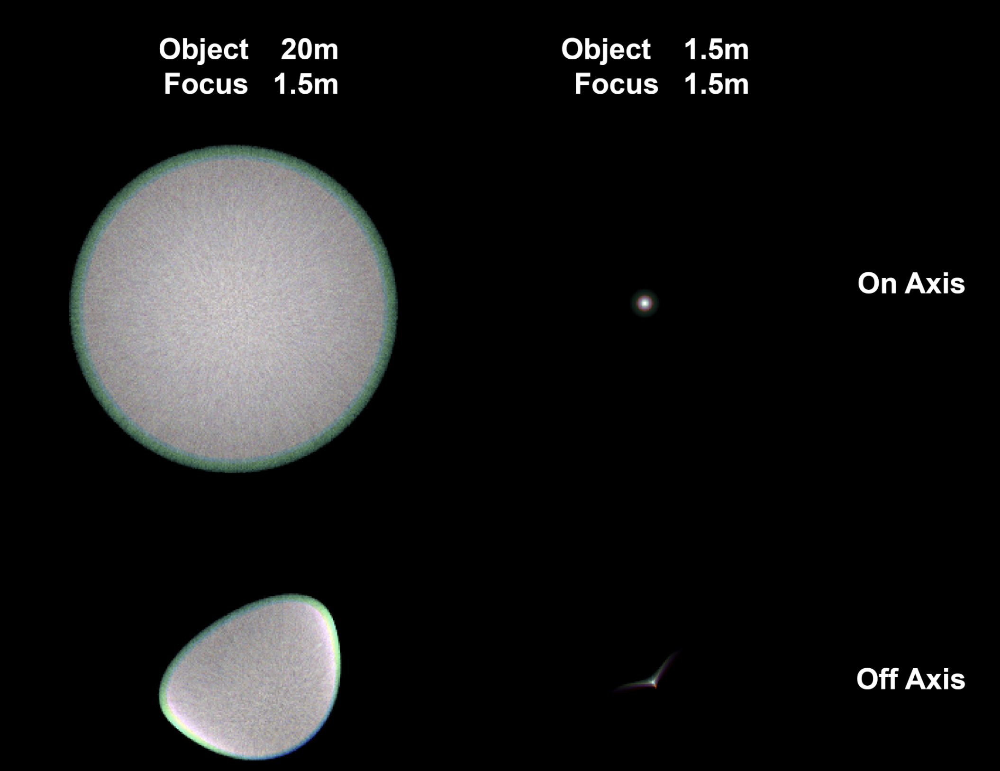
</p>

And secondly, these kernels does not sum to the same value. This should be quite intuitive, as oblique rays are more likely to be occluded by optical and mechanical structures on their path, thus having less of them arriving at the imaging plane. This can also be proved by the resulting image. Assume, for the purpose of reductio, that all kernels share the same constant integral value. Then it follows that an even input signal will remain to be even after the convolution. However, such is never the case for photographic lenses and virtually all image corners have a significant drop of illumination, which contradicts the assumption. The kernels do not have the same sum value. 

<p align="center">
	
</p>


The only way that opacity becomes meaningful in the context of physical imaging is to regard it as **the ratio between foreground and background information weight**. Suppose there are two objects that overlaps each other from the perspective of the imaging system, at their edges, the pixel color is affected 40% from the foreground object and 60% from the background object. It is then fair to say the foreground object has 40% opaqueness at that pixel. But such definition would, again, require a layered rendering algorithm, which brings the topic back to how to render several layers of image objects in the object space, all of which contains depth and alpha information. 

The challenge here is that the plane-line intersection cannot be used, because there is no single plane that the spatial image resides in. Due to the varied depth, the ray may even have more than one intersection with this plane. In other words, there is no close form solution for finding the intersection between a ray and an image with varied depth. 

However, in chapter 2, a proxy surface encasing method is proposed to calculate the intersection between a ray and an even aspheric surface. It would appear that the only difference between the even aspheric surface and the depth-varied image is that instead of surface sag function, a depth indexing is used. Thus, the intersection between a ray and the image with varied depth here can be simplified as the following two steps:

- Intersecting the ray with two proxy planes.
- Use the Secant method to iteratively approximate the solution.

<p align="center">
	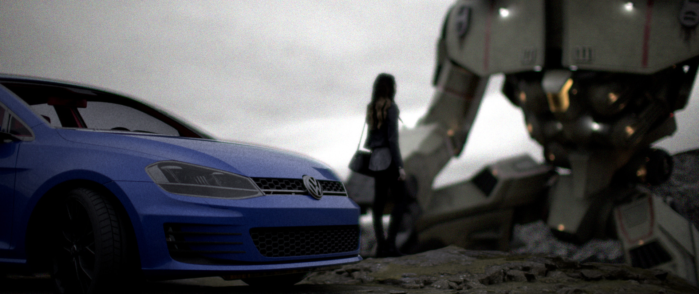
</p>

# 2.5.3 - Direct conversion in 3D renderer

Direct 3D integration is not the main focus of the framework. This part only serves as a reminder that since the frameworks is a relay imaging system operating on the basis of the imaging equation (or the Huygens principle for wave optics), it has the ability to be integrated into a 3D renderer and use rendered pixels as inputs.