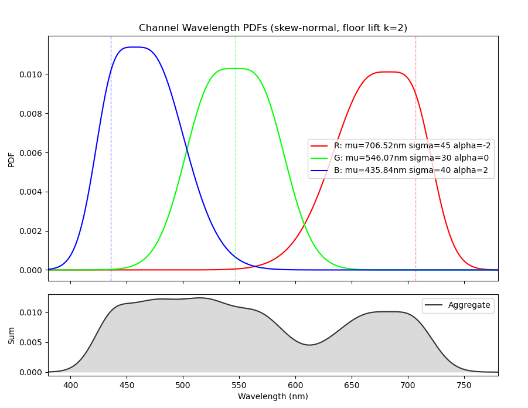
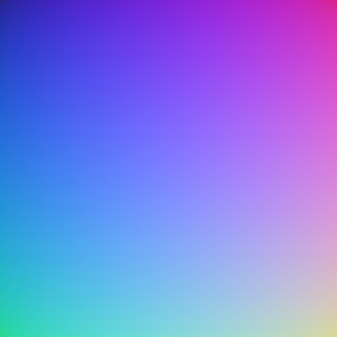
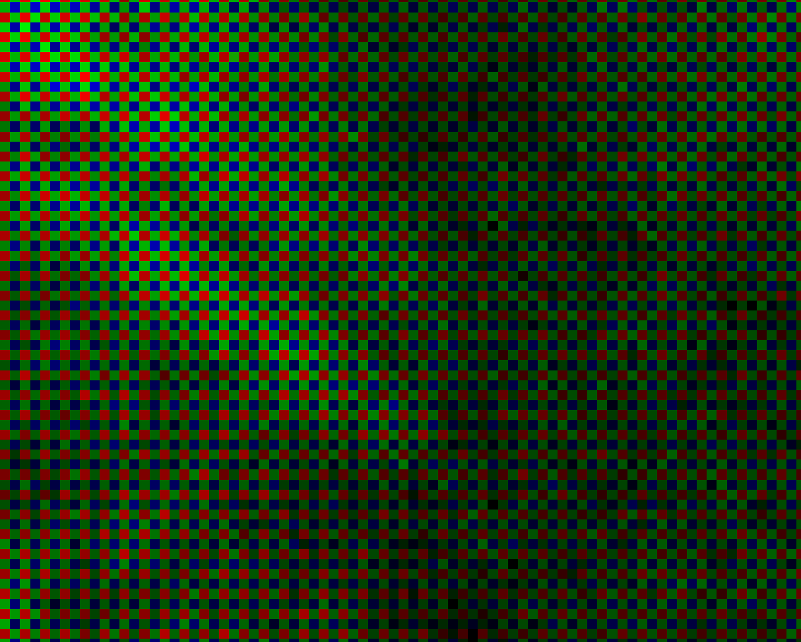
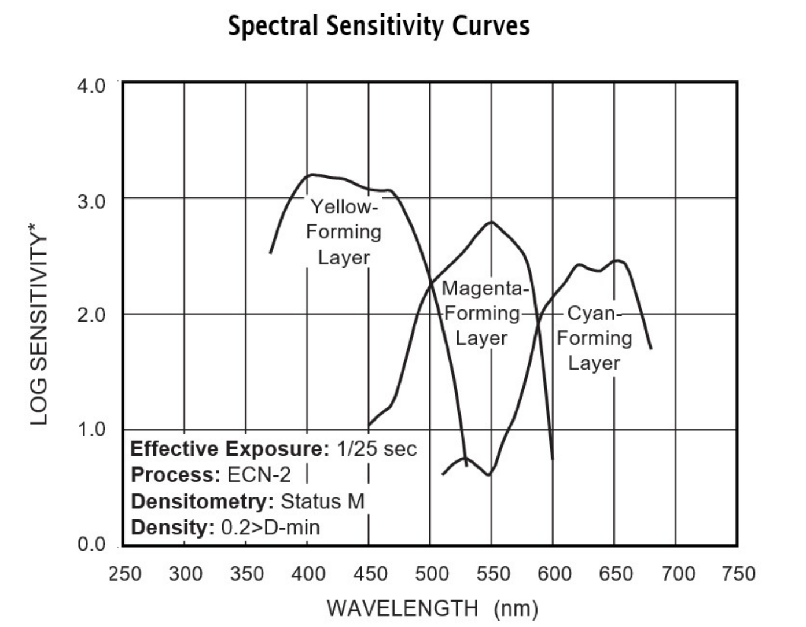

# 2.6 - Imager

The imager is sometimes also called a detector, but regardless of the name, it refers to the component in the imaging system tasked to gather lights (or other forms of electromagnetic waves) and convert it into an image. 

# 2.6.1 - Plain imager

A plain imager is an ideal plane that simply intercepts and takes an integral over all incident rays. 

Recall that the ray definition is:

$$
\mathbf{r}=\left(  x,\\ y, \\ z, \\ v _x, \\ v _y, \\ v _z, \\ \lambda, \\ \Phi, \\ i _{\Phi}, \\ b, \\ s, \\ C, \\ AOV \right) ^T 
$$

The position and direction of the ray can be used to locate the place where the ray falls at on the plane and map that 3D position to a pixel on an image. a very trivial idea. 

There are two ways of reading the radiance info of the ray. The first is to simply read the $\Phi$ term, which is suitable when the system is set to the basic radiometry model. However, if polarization is enabled, reading only the first term will be inaccurate and may create unevenness on the horizontal and vertical direction of the image. 

The second way would be to use the combined terms $\Phi$, $i_ {\Phi}$, and $b$ to construct the polarization ellipse, then use the ellipse to get the radiance. Detailed ways on how to construct the polarization ellipse is described in previous chapter 2.2.3. 

After getting the radiance, the next step would be to distribute the radiance into one or more color channels. This framework uses another two ways to perform such allocation, depending on how rays on the object side are generated.

If the rays are generated using Fraunhofer line replacement and interpolation, it means that the rays only have a handful of unique wavelengths. In this case, it is more efficient to pre-calculate a per-channel weight for each unique wavelengths, then allocate the ray’s radiance accordingly.

If, on the other hand, the wavelengths are generated with probability density function, then with millions of unique wavelengths, the same pre-calculated weight will generate an overhead more consuming than the rest of the system combined. The work around, however, is surprisingly easy. 

As described in the initial ray structure, an optional $C$ term is reserved for channel information. By the design contract, when the probability density function method is adapted during emission, the $C$ term will be filled with a designated channel index. By default, 0 for red, 1 for green, and 2 for blue. So, when the ray reaches the imager, there is no need to decompose it into RGB channels; the framework only looks at the channel index $C$ and directly deposit the radiance into the channel indicated by the index. 

It may occur to some that this method ignored how wavelengths often converts to more than one channel of color. While this intuition is true, the PDF are not entirely isolated, but with some overlaps. So it is quite often the case where two rays carry nearly the same wavelength but different color channel index. In this case, the two rays contribute to two different channels despite having roughly the same wavelength, effectively replicating the weighing process. 

The figure below shows an example of the color PDF and their aggregate. It can be seen that while each channel has a peak, they overlap with each other and creates a smoother transition in-between. This overlap could thus help creating the secondary colors. 

	

While named "plain", the plain imager is only plain in the sense that it has no other modifiers outside or inside of it, i.e., rays are intersected and radiance are deposit directly without modifications. 
There are still things that the plain imager is capable of. For example, some old film point and shot cameras have a curved image plane, which aims to solve the field curvature caused by the cheap lens. The plain imager is nevertheless a surface, which means it could inherit the behaviors of a lens surface and have curvature of its own. In this way, the imager itself can also be curved. 

# 2.6.2 - PDA 

Digital sensors are mostly divided into two categories, CMOS and CCD, but their difference primarily lies in how they read the data. CCD does have some unique image characteristics such as blooming, but its logic also made it near impossible for motion picture production, so it can be ignored temporarily for this framework. 

Both CMOS and CCD sensor are treated as PDA here. Please note that this means certain phenomena caused by the circuit design of CMOS or CCD will not occur. For example, CCD blooming is not going to happen even if the brightness of the pixel meets the condition.  

Since silicon based PDA has a spectral sensitivity up to 1100nm, and the framework technically has the ability to produce wavelengths in UV and IR range, there is a non-zero chance that non-visible lights will be recorded. For this purpose, it is recommended to include a bandpass filter that culls rays beyond the visible spectrum range. 

The more important behavior for PDA imager type is the structures in front of them, namely: 

- UVIR glass 
- Micro Lens Array (MLA) 
- Color Filtering Array (CFA) 

Modelling the UVIR glass is quite simple. They themselves are just another 2 instances of refractive surface, which is already discussed with ample detail in chapter 2.3. The emphasis here is MLA and CFA. 

For MLA, they can be treated the same as other refractive surfaces in the lens. However, there is a micro lens in front of every sensor pixel, so even for a 1920x1080 imager there will be 2073600 microlenses. Even with GPU acceleration, this is not a trivia amount to fully compute. As such, they are receiving a simplified treatment here. 

First, the axial difference of the microlenses caused by the radius is ignored. That is, when a ray arrives at a plane representing the MLA, its intersection with that plane is regarded as the intersection with the conceptually spherical microlens. In this way, intersection becomes significant cheaper to compute. 

The world space intersection coordinate is then mapped into the local microlens coordinate. Here, a pre-computed normal map is used to find the normal direction of the microlens surface at that intersection. 

	

The normal map above probably looks quite confusing. This is because, by default, the diameter of the microlens is set to equal to the diagonal of the pixel pitch. 

Shrinking the diameter to 0.25x of the default size should make it a lot easier to understand: 

	

The same normal map is used for every micro lens since, as far as I know, there does not exist a photographic image sensor that has differently sized microlens. 

Anyhow, the normal map here functions as a look-up table that quickly returns the normal direction of all the intersections. With the normal direction and incident direction (which is recorded directly by the ray), refraction becomes easy to calculate. 

There is one case that the MLA does change. As briefly mentioned in the frst chapter, some old film lenses have an extremely large incident angle, which causes a lot of trouble for digital sensors, as the microlens cannot bend these rays to fall into the well below. Some sensor thus scales the MLA so that microlens at the edge is moved towards the optical axis. In this way, oblique rays are "pre-bent" and could thus fall into the right well. Leica sensors are famous for using this design. 

CFA is next after the MLA. Here another simplification is made, as the two are regarded to sit in the same plane. 

By default, Bayer pattern is used as the CFA pattern. It is possible to specify which Bayer pattern is used, `RGGB`, `BGGR`, `GRBG`, or `GBRG`, although the result makes no visible difference. 

One limitation here is that for the CFA to work, the system has to be operating using the channel based wavelength (refer to 2.5.1.1). The Fraunhofer interpolation could work but would be slower and less accurate. 

With the channel based wavelength, CFA becomes quite easy to model. If a ray is marked with the channel that is the same with the color filter it hits, then it is an automatic pass. If it is marked with a different channel, then it would be dropped probabilistically depending on a spectral response defined again by a color PDF. 

Notice that, with CFA, the rays arriving at each pixel would consist of almost exclusively around a single peak wavelength. For this reason, if the data is directly saved as an image, it will look very odd: 

	

Saving the image as an `EXR` thus makes little sense. To make things easier, it is better to just save the data as some photographic raw image format, such as `DNG`. When this format is opened in other software, the color filter will automatically be fed through a de-mosaic process and thus give a normal looking result. 

To do that, first sum up the RGB values on each pixel, so that the image data becomes a simple 2D array (width + height) instead of a 5D array (width + height + RGB). The value on each pixel receives an optional normalization process, and is then saved into a `DNG` file. 

It should be noted, however, that the RGB data saved in an DNG is the camera RGB, which often needs to be translated into XYZ and then translate back into a camera-invariant display RGB space. This process is done by a color matrix. And in the case of this framework, whose wavelength and radiance is derived from a linear RGB input (in most cases), the color matrix should be using values below: 

$$
\left[
\begin{matrix}
3.2404542,  & -1.5371385,  &  -0.4985314, \\
-0.9692660, & 1.8760108,   & 0.0415560, \\
0.0556434,  & -0.2040259,  &  1.0572252
\end{matrix} 
\right]
$$

# 2.6.3 - Film

Film is similar to a plain imager, but it has additional grain and spectral response settings, if necessary, the effect of halation can also be added. 

The spectral response by default is defined using the same skewed Gaussian distribution as used in the object space probability density function:

$$
f\left( x \right)= g \cdot \frac{2}{\sqrt{2 \pi \sigma ^2}}e ^{- \frac{\left ( x-\mu \right ) ^2}{2}} \left [ 1+ \textrm{erf}\left ( \frac{\alpha x}{\sqrt{2}} \right ) \right ]
$$

However, while in object space, the gain coefficient $g$ and the skewness coefficient $\alpha$ are often left unused or used only at default values, the film spectral response approximation often used all of these terms. Results from invoking one of these spectral responses are also not used as a probability, but as a multiplier that scales the radiance. 

If the object space emission is using the same probability density function as the spectral response of the film detector, then the resulting color will be a one to one replication (not including the aberrations), with no color shifts or white balance difference. But any difference between the two will create a shift of color. For example, if the blue response received a boost in gain, then the resulting image will have a blue tint. This would be the case for many tungsten balanced film, as is the case for Kodak Vision-3 5219 500T, as shown in the figure below. 

	

Note that 5219 is a color negative film, whose RGB color is represented by emulsion layers with dyes of their opposite color. That is why the layers are written as yellow-forming, magenta-forming, and cyan-forming, instead of blue, green, and red.