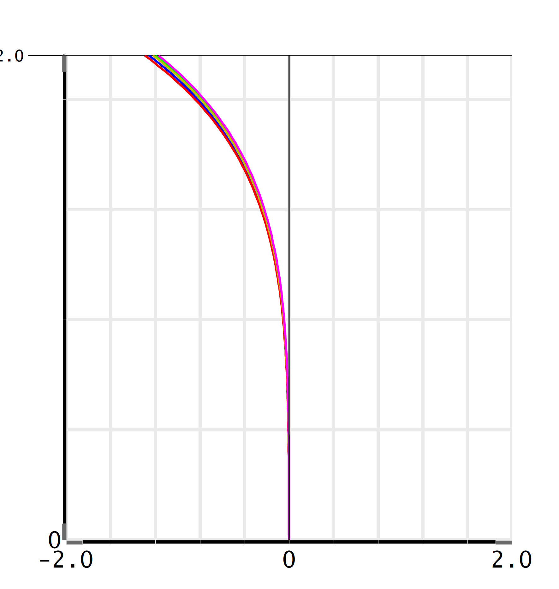

# The Vintage Myth

The vintage resurgence has popularized many terms describing the visual trait of images produced by a certain lens or film. Like buzz words, these terms are often used in a rather arbitrary way with little to no scientific, objective, or quantitative definitions. However, if a certain visual trait exists, that is, it can be recognized by observers with a high consistency and success rate, then it would make logical sense that there exists a measurable metric that could describe this trait.

However, it is difficult to perform tests in the hope of proving or disproving a visual trait. Since most of these image traits describe holistic effects, a reductionism spot test like the ones used in the last chapter would not be sufficient. But for testing with real lenses and cameras in real environments, it would be hard and expensive to control random errors and guarantee consistency.

This framework provides a possibility for perfect consistency and variable control. A virtual scene can be set up, in which different lens and camera combinations can be tested. If a perceptual or computational difference occurs after changing a variable, then there must be a correlation between the variable and the perceptual difference. While this process may not yield a definitive causation, it is still an effective way of narrowing down the observation hypothesis and could help eventually with deriving rigorous definitions for those vague visual terms.

Take the “Cooke Look” as an example. Some cinematographers believe it to be a real visual characteristic from the Cooke lenses (Fauer 2023; Maxwell 2013). Cooke themselves also expressed how it is a result of specific optical design decisions (Han 2020) and have trademarked this name. However, no sources have been found that show a quantitative difference between images produced by the Cooke lenses and other lenses, which supposedly do not have the “Cooke Look”. Common mentioning of the “Cooke Look” consists of extremely broad terms such as high resolution or subtle flares (“The Cooke Look,” n.d.), which in the realm of optical imaging is akin to saying a person has one head and two legs – it is not a universal trait, but it certainly is not exclusive either.

Among the many explanations, one stated that the Cooke Look is largely caused by **out-of-focus background having a barrel distortion** (Holben and Probst 2022, 423).

If this claim is true, then it would follow that at least some Cooke Lenses would have a barrel distortion in the background in situations that other lenses do not.

Distortion measures the difference between the ideal imaging point and the actual imaging point. If the actual imaging point falls closer to the optical center than the ideal one, the image would look as if it were being pushed from the center. This type of distortion is commonly referred to as barrel distortion. Conversely, if the actual imaging points fall further, the image will look to be stretched towards the corner, often named pin-cushion distortion.

A distortion chart calculates the difference between the ideal and actual imaging points from the image center to the edge. For barrel distortion, their curve should thus be leaning towards the left, i.e., having negative values. Figure 68 shows a distortion graph of the Leica Summilux (1996) 50mm f/1.4 when focusing at infinity. It is a typical barrel distortion.

	

If the distortion claim about the Cooke lens is true, then it would be expected to see Cooke lenses showing the same distortion pattern in an out-of-focus background consistently. It would also be expected that other non-Cooke lenses have less or none of this distortion pattern.

However, measuring background distortion is easier said than done. This is due to out-of-focus spots being much larger than the in-focus spots, so there is not a clear position for where the imaging point actually falls. But the framework offers the ability to quickly simulate spots with extremely high samples, so the energy distribution of the spot can be used to calculate a centroid, which can be viewed as the actual imaging point. Using this method, Figure 69 shows the difference between Cooke and non-Cooke lenses when it comes to out-of-focus distortion.

