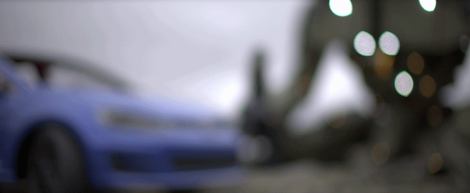
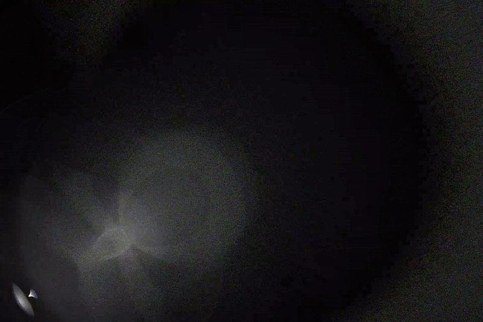
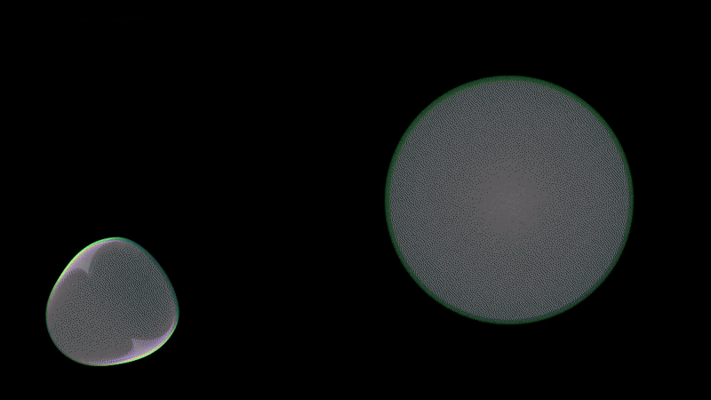
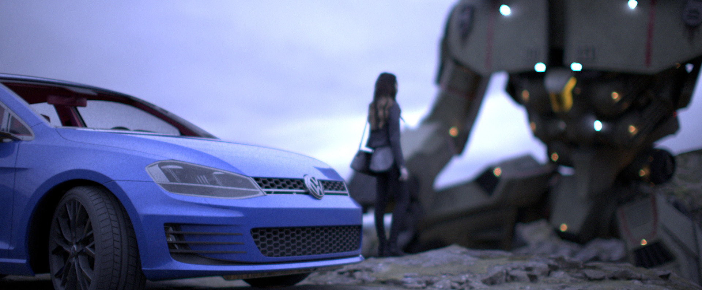
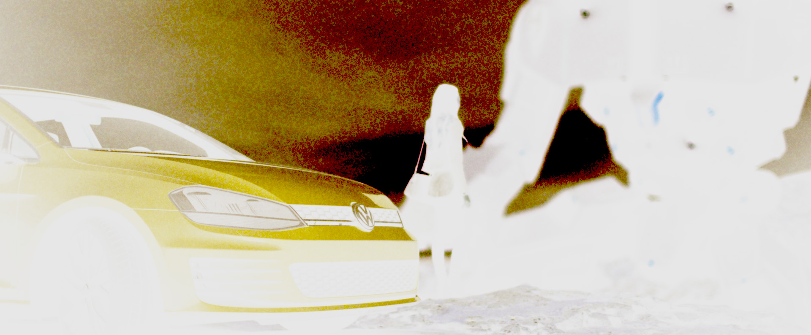
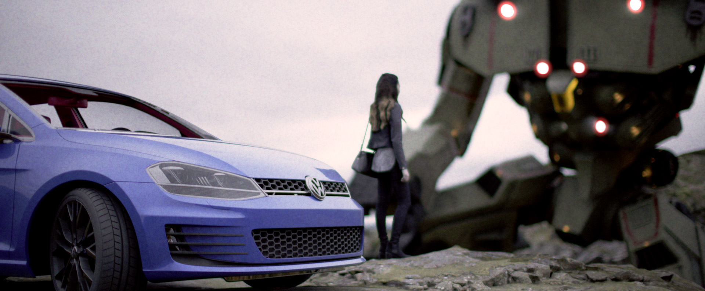
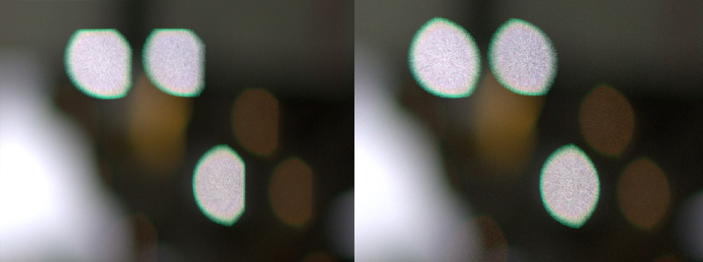
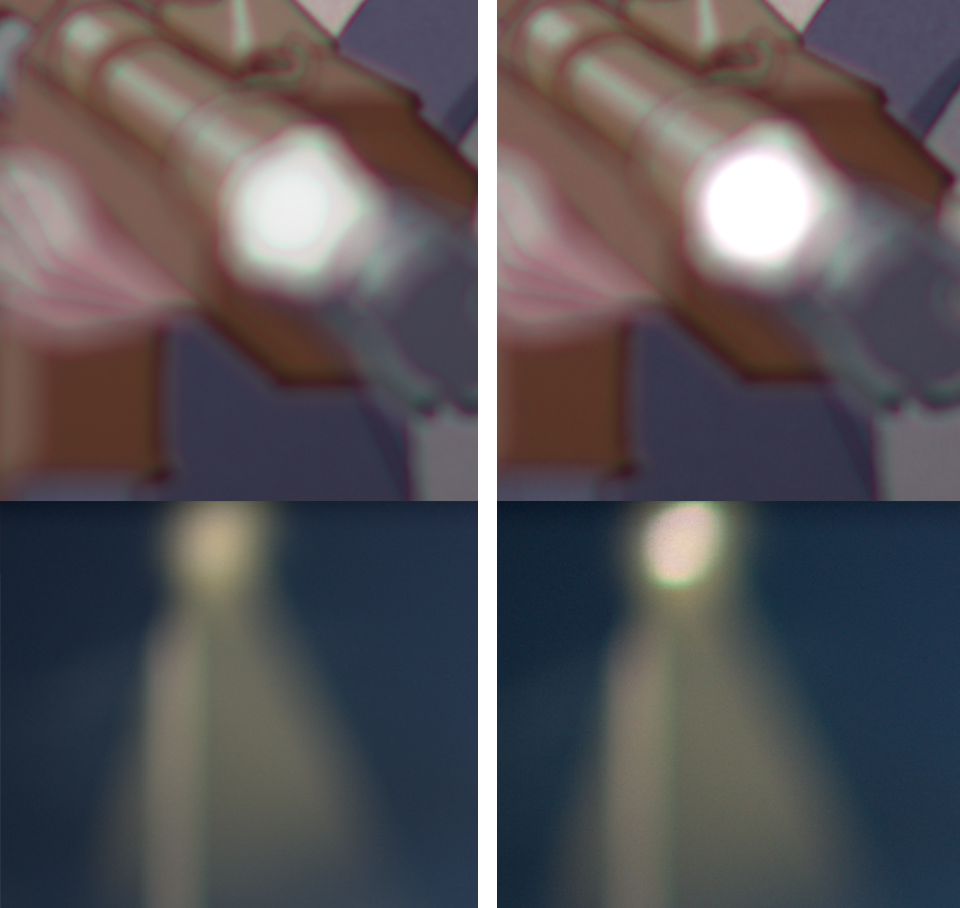
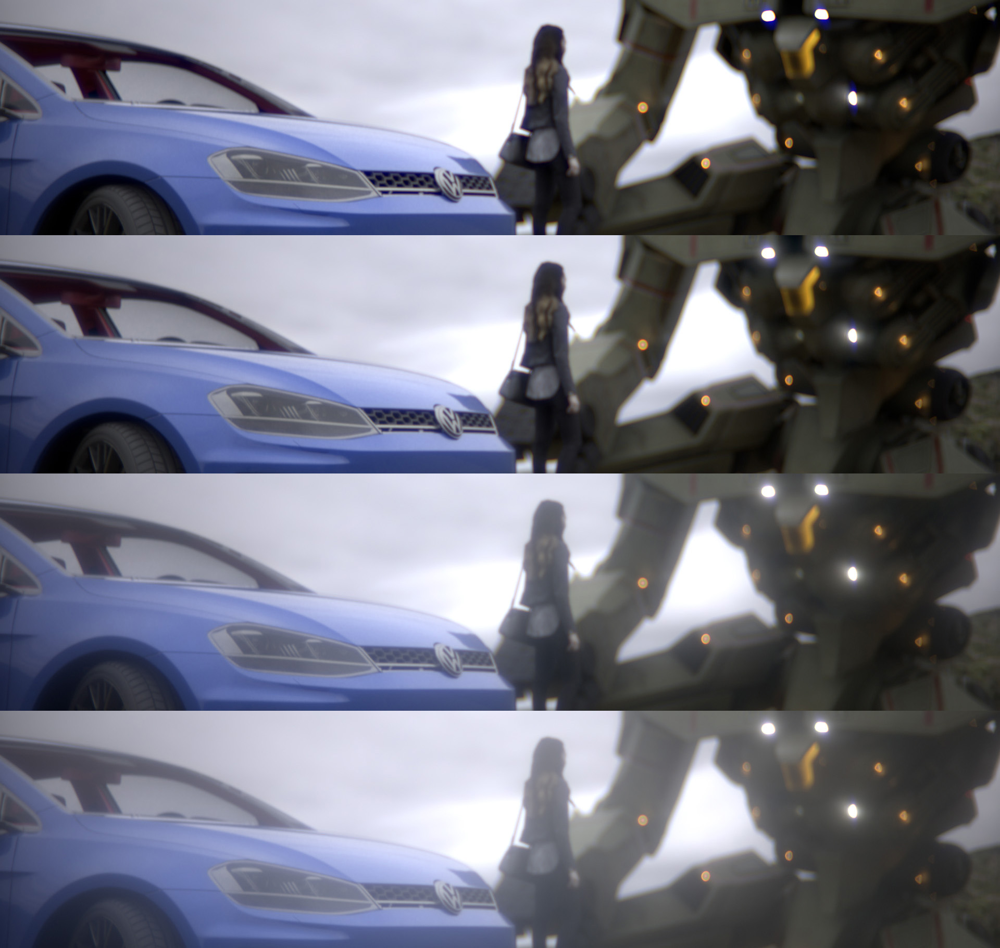
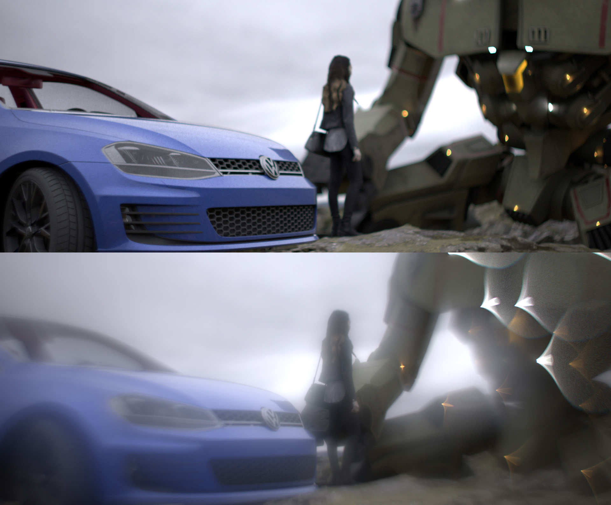

# ISS - Imaging System Simulation

This repo is the proof of concept implementation of [my](https://www.amarthchen.com/nerdy-stuff/imaging-system-simulation) thesis title **A Framework for Imaging System Simulation**, which seeks to create a framework capable of simulating an imaging system consists of at least:

- An **object space** from which lights are emitted. 
- A **lens** that bends the incoming lights.
- various **attachments and modifiers** that affect how the lights travel.
- An **imager** to capture the lights and convert them into an image. 

The goal is to help animators and CG artists such that: 

- CGI sequences can be better blended with live action footage when the live action has shot with a lot of deliberately introduced image artifacts.

- accurate optical effects can be easily added into animations, 2D and 3D alike, while keeping the effect art-directable. 

Additionally, it could also:

- help computer vision and AI researchers to generate "ground truth" image results without physically possessing the optical instruments. 

- help lens and optics enthusiasts to gain more insights of photographic objects by offering them a way to perform 100% repeatable and reproducible experiments. 

The novelty of the thesis is that it builds a framework that can be used for both direct 3D renderers as "in-camera effect" and the 2D postproduction composition stage. The framework showed that a well designed application of the imaging equation can reproduce optical effects accurately and easily without requiring a drastic change of the media production workflow. 

This repo is basically an abridged and open-source version of FRED with additional specializations in media production compatibility. But please **do not use this thing directly in production**. If you are a production studio, reference the [framework documentation](https://muddy-mouse-6bd.notion.site/2-Geometric-Optics-162ee08ae1108055a5e0d884d1a1cc02) _(I will try to transplant them onto GitHub once I find a way to seamlessly bridge the LaTex issues and image embedings)_, use your technical team and AI to rewrite it in a way that fits your software and your pipeline _(ideally not in Python)_. 

## Features 

### Direct sequential propagation 

The most fundamental way of imaging. The image below is formed by reading several EXR images with depth and alpha channel, then reconstructing the scene and populating the scene through the imaging system. 

<p align="center">
	
</p>

### Non-sequential propagation 

The framework could also simulate how rays bounce between each surface, the lens edge, or the interior barrel of the lens, creating flares and glares.

<p align="center">
	
</p>

### Diaphragm blade and aperture control 

The framework models individual blades in the diaphragm, including their shape and how they rotate as the aperture stops down. This makes it possible to simulate the changing bokeh shape as aperture stops down. 

<p align="center">
	
</p>

Notice how as the aperture stops down, the depth of field increases and vignette decreases. Both of these effects are not explicitly coded, they are the natural results of following the physical rules. 

<p align="center">
	
</p>

The image above compares the center bokeh/spot (top right) and the higher field bokeh (bottom left). Notice how, as the aperture stops down, the higher field bokeh first loses its edge aberrations before starting to reflect the aperture shape. The lens being used here is a Canon EF 50mm f/1.2 L, and is a prime example of how Double Gauss formula tends to quickly gains clarity around the image corner as the lens is stopped down. 

### Wavelength emission and spectral response 

Many other applications solve the dispersion issues by either scaling the RGB channels or assigning the RGB color with a certain wavelength during tracing. Results from this approach may look fine on a thumbnail, but they break down once enlarged or encountering any high dispersion material.

The framework takes RGB inputs but operates entirely in wavelength. It uses a set of probability density functions to convert RGB into wavelengths, which also ensures that there will be little to no color banding regardless of sample count (also effectively outsourcing Metamerism to the user). 

The framework also has imagers whose spectral response can be customized. The image below shows the scene (default balanced emission) rendered onto an imager that has a spectral response that favors the shorter wavelength, basically a tungsten balanced film.

<p align="center">
	
</p>

### Film emulsions 

Since the framework already propagates rays at the scale of hundreds of millions or billions, another several million would not hurt too much either. The framework also models the film grain with their individual densities, making color negative film possible.

<p align="center">
	
</p>

The framework could also model how rays bounce back from the film plate and create halation, shown in the image below. 

<p align="center">
	
</p>

### Additional apertures 

Cine rigs contain many things that would affect the final image but are seldom noticed. For example, the matte box is a contraption in front of the lens used to hold filters/gels and provide barn doors to block unwanted lights. However, matte box also restrains the path of light, consequently affects out-of-focus highlights (which by definition makes them apertures of the system). Observe how in the image below on the left, the bokeh look as if they are cut from two sides. 

<p align="center">
	
</p>

### 2D highlight reconstruction

2D animation is also starting to incorporate more optical effects, but the low bit-depth makes many highlights disappear once out of focus. This is due to the energy that should theoretically be in there being clipped thanks to the low bit depth. 

This framework provides a way to recreate the highlights and make the editing process feel more like 32-bit EXR rather than 8-bit TGA.


<p align="center">
	
</p>

### Forward scattering 

Vintage lens often accumulates small dusts, oils, or balsam separations. These factors introduce more scattering inside the lens and creates a foggy image. The framework models this forward scattering process and thus allows a more natural mist effect to be created. 

<p align="center">
	
</p>


### Lens element transform 

Some production or enthusiasts modify the lens by editing how each glass element is placed. The framework is also capable of replicating this effect. For example, the image below shows the scene shot on a Helios-44 normally (top) and when the first element is reversed (bottom). 

<p align="center">
	
</p>

Small manufacturing errors, such as misalignment and rotation, can also be replicated by transforming the surface. 

### Other features: 

- Polarization. 

- Through focus distortion. 

- Diffraction star (through Fraunhofer diffraction via the aperture stop). 

- Automatic optical material matching.


### Demo use 

```python
    # Create or load a lens 
    lens = LensFromZmx(RectPath(r"resources/Zmx/Elmarit90f2.8.zmx")).GetLens()
    lens.UpdateLens()

    # Instantiate an imager, adjust its attributes 
    imager = StdImager(horiPx=2160)

    # Read input images 
    FG = Image2DVariDepth()
    # Source size is determined by the system, pass in the lens angle of view to establish the scene size 
    FG.horizontalAoV = lens.GetAoV(halfAngle=False)[0]
    FG.LoadFromEXR(r"resources/LeicaFG.exr")
    BG = Image2DVariDepth()
    BG.horizontalAoV = lens.GetAoV(halfAngle=False)[0]
    BG.LoadFromEXR(r"resources/LeicaBG.exr")

    # Load images into a stack if needed 
    exampleStack = ImageStack()
    exampleStack.AddImage(BG, "BG")
    exampleStack.AddImage(FG, "FG")

    # Assemble things into an imaging system 
    IS = ImagingSystem(lens, imager)
    IS.object = exampleStack

    # Render the inputs into an image 
    IS.Render(focusDistance=1500, renderTime=2*60, fileName="LeicaTest", realTimeUpdate=False)
```


## Coding Conventions 

I must admit that there are a lot of inconsistencies in the coding convention here. 
For example, likely due to my prior habit with `C++` and `C#`, I started the project defaulting to my normal `UpperCaseCamel` naming paradigm, but later I learned that that Python is supposed to be using the `under_score_format`... 
Through the IDE (thanks, PyCharm) I also learned that Python `if` statement does not necessarily need the parenthesis; and that function notes have more than one standard and `:param NAME:` is not to be taken as universal. 

As a result, there are quite a lot of variations of method/variable names and commenting styles. 

## TODO: 

None of the universities I applied seems to be interested in admitting me. So despite already having plans on how to implement them, I'll only be able to start working on them after I find a job, whcih could be never :D. 

- Add a pure brute force ASPH solver. 

- Add channel summing in the imager. 

- Add opacity based on image staking. 

- Add propagation based film grain. 

- Add onion rings in ASPH bokeh.

- Add transform for gamma corrected inputs. 

- Finish conical elements.


## AI 

The core lens construction and ray propagation are AI-free, not because of some moral standard, but because AI was not good enough when I wrote them. Later modules have seen much more use of AI, mostly in a "design by contract" style, as AI is asked to complete a method that fulfills certain tasks, which they perform quite well. 


## Known issues 

- Matplotlib after a certain version has become practically unusable. This happened at some point in late 2024, no plotting logic was changed but all of a sudden it drops to single digit FPS and refresh plot for real time update automatically halts after like 5 calls. 

- Close focus (relative close focus with respect to effective focal length) may result in edge ray rejection, visually appears as dark lines around the object border. This is likely caused by the implementation calculating the location of the scene from first vertex instead of the principal point. 

## Future work

This repo is still largely based on geometric optics, with the primary improvement being a comprehensive representation of the entire imaging system and the virtual of a spectral tracer. 

The consequence of not embracing full physical optics is that effects like diffraction and interference do not naturally occur. Consequently, image phenomena like the sun star cannot be easily recreated. 

The next step apparently is to devise a way to perform full image simulation based on physical optics. Technically this is already possible, but the computational cost is several orders of magnitude higher than this framework, plus the same production-incompatibility issue and lack of comprehensiveness. The bulk of research work would then be about how to represent the wavefront so that it is cheap to calculate while still being accurate by rigorous optics standards. 

Computer graphics as a field has long been doing emulating work, that is, as long as the result looks convincing, how to get there is of less importance. This philosophy of computer graphics has, to some degree, dug its own grave as AI is doing exactly that, but faster and often better. So naturally, computer graphics in the future will branch into the two directions, one being AI and other implicit methods, the other is more explicit and physically accurate methods. 

Of course, for the AI branch, there would then be a more crucial question: if 3D is meant to create 2D images **eventually**, what are those 2D images **eventually** for?  Daß alle unsere Erkenntnis mit der Erfahrung anfange, if the goal of all these audio-visual experiences is to invoke a certain feeling or acquiring certain recognition, it would be much more effective to directly manipulate the subjective perception via biological interventions, such as neurochemistry injection, than to painstakingly recreate a representation of some part of the objective world. It would seem that, from this perspective,  the AI end-to-end generation philosophy at its fullest is a direct and complete denial of lived experience, replaced with… drugs?  


