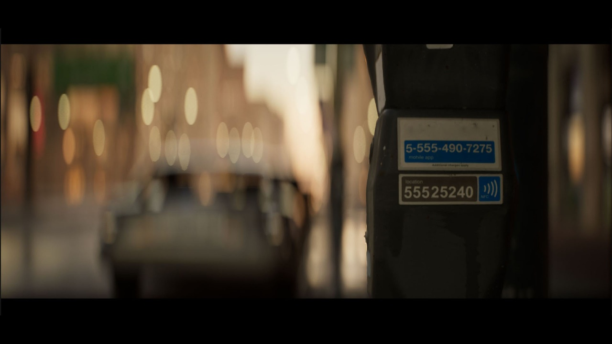
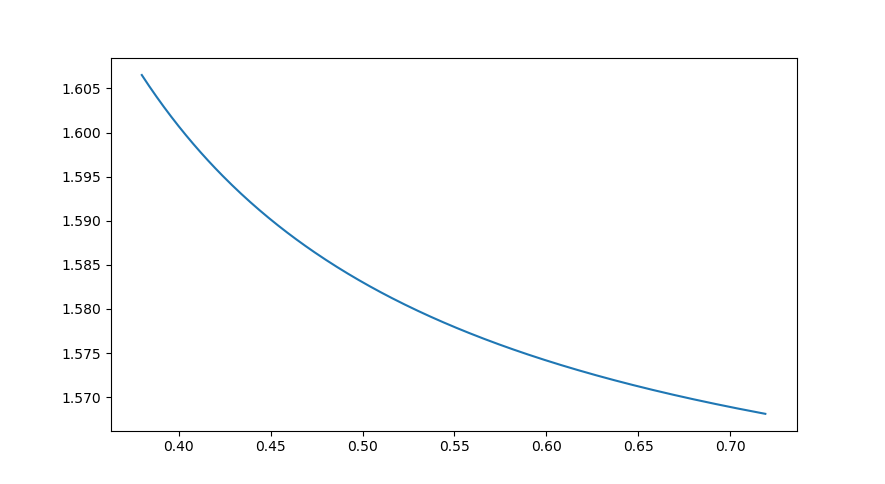

# ISS

Imaging System Simulation. 

## Table of Content

- [1 - General](#1---general)
  - [1.1 - Background](#11---background)
  - [1.2 - Optical Artifacts](#12---optical-artifacts)
  - [1.3 - Current Field and Similar Applications](#13---current-field-and-similar-applications)
  - [1.4 - End Goal](#14---end-goal)
    - [1.4.1 - "Must Accomplish"](141---must-accomplish)
    - [1.4.2 - "Should Try to Accomplish"](142---should-try-to-accomplish)
    - [1.4.3 - Good to have](143---good-to-have)
  - [1.5 - Examinations](15---examinations)
- [2 - Geometric Optics](#2---geometric-optics)
  - [2.1 - Wavelength and RGB Conversion]
  - [2.2 - Object Space]
  - [2.3 - Surface]
    - [2.3.1 - Standard Spherical Surface]
    - [2.3.2 - Even Aspherical]
    - [2.3.3 - Cylindrical]
  - [2.4 - Object to Entrance Pupil]
  - [2.5 - Sequential Propagation]
    - [2.5.1 - Index of Refraction]
  - [2.6 - Non-Sequential Propagation]
  - [2.7 - Imager]

# 1 - General 

This project aims to establish a way to digitize lenses with physical accuracy for media production use. Digital animation can then add accurate optical characteristics in the film and live-action footages shot with vintage lenses can be matched with CGI sequences more easily.

Additionally, it may also be used to deconvolute images for information reconstruction, and in some cases, historical preservation of optics. 

## 1.1 - Background 

The 2012 movie _The Avengers_ used Canon 5D II and Canon 7D, two models of consumer level cameras in their production [^1]. The inclusion of these two models was mainly due to their ability to capture videos using a relatively large sensor area at FHD resolution. These two models also marks a point that digital cameras, even at the consumer level, have become good enough for large productions. As digital cameras and sensors get better and more advanced, so are the lenses coupled in front of them. An early landscape lens consists of only 1 solid piece of spherical glass, while a modern Arri/Zeiss Master Anamorphic can have 17 elements arranged in 14 groups, including spherical, cylindrical, and hybrid elements [^2], with over tens of layers of coating on each element, effectively correcting every aberration and distortion. The images produced by those modern lenses can be near perfect, something that the early image makers could only dream of. 

What goes around comes around. With an abundance of sharpness and clarity in the image, some filmmakers, cinematographers, and photographers started to feel a staleness in the images. To counter the clinically sharp image out of the digital sensor, they started to adapt older and optically inferior lenses onto the camera, deliberately reducing the image quality and using the lens to breathe their own aesthetics into the image. Dune: Part Two was released during the writing of this handbook, and the lenses used to shoot the movie include the Helios 44-2 and several other Soviet made lenses [^3], the Helios was also used in the new Batman movie [^4]. Zack Synder used the Canon 50mm f/0.95 on Army of the Dead and Rebel Moon [^5], even going as far as adopting Cineovision anamorphic fronts from 1960s onto ultra-fast Leica vintage lenses [^6]. 

Combined with some other factors, there appears to be some emerging problems/conflicts:

- The demand for vintage lenses is rising
  - But the number of vintage lenses is dwindling. 

- Animation and visual effects increasingly require ways to replicate real lens artifacts more easily and accurately.
  - But current implementations of optical artifacts in 3D animation/VFX software are mostly `[0, 1]` slider based qualitative control and operate almost exclusively in RGB instead of wavelength. Which is not accurate and can often be cumbersome. 

- Most artists do not possess the technical ability to recreate the optical artifacts with physical accuracy; most scientists/engineers do not have the artistic experience to see the subtle differences and understand the demand. 

This project aims to address these problems and conflicts. This project aims to address these problems and conflicts. The end product should supply animation and VFX productions a tool to replicate optical lens effect quickly and accurately. The user does not need to be an expert in optical physics or computer science but still able to obtain imaginaries faithful to the actual optics. For the detailed goals, see section [1.4 - End Goal](#14---end-goal). 

## 1.2 - Optical Artifacts 

## 1.3 - Current Field and Similar Applications 

Academically, there have been countless papers and journal articles about optical effects and their simulation/emulation[^8][^9][^10][^11][^12][^13], this project has been and will be referencing and drawing inspirations from many of them. However, there tend to have some recurring themes among these papers. Many of them:

- Focusing on one specific optical effect.

- Heavily rely on machine learning artificial intelligence. 

- Assumes the input to be an 8-bit RGB image. 

- Requires depth reconstruction. 

Outside of the acdemia, there are also many attempts of people trying to emulate optical lens effects inside a software, Blender, After Effect, Unreal, etc. However, most of them are limited by the software since these software was not designed for optical simulation and does not have the underlying infrastructure to perform accurate wavelength-based ray tracing. 

For example, one plugin tries to replicate anamorphic effects in Unreal [^7]: 

	
  
Effect of an Unreal plugin

While convincing at the first glance, the effect is way too perfect. The bokeh around the edges are still able to maintain a perfect elliptical shape, which is virtually impossible for all anamorphic lenses used in production. Using a real image from an anamorphic setup as an example: 

	
  
Image taken with a real anamorphic lens on film

The bokeh around the edges are “cut” and“stretched” due to pupil occlusion and astigmatism; there is a yellow color cast around the center caused by transmission and coverage difference; the bottom of the image shows veiling glare due to the strong sunlight from top left. Those phenomena may still be replicated by careful tuning inside the plugin, but the tuned result is restricted to one scene and cannot be applied to another scene with the same level of effectiveness. 

Offline rendering might give a higher degree of accuracy since they are more insensitive to time cost but this has not been the case for optical simulation. 

There are people trying to model the lens in the 3D scene in front of the camera, but that faces 2 problems: 

1. The virtual camera itself, despite being an ideal pin-hole camera, do have a focal length. And modeling the lens in front of the virtual camera is effectively stacking 2 lenses together, the result is thus inaccurate. 

2. Most 3D packages do not have the ability to accurately simulate dispersion, how different wavelengths behave differently in the same material. 

There are content creators trying to solve the first problem by using an orthographic camera as a render[^14], which in itself is afocal, avoiding the lens stacking issue. However, this assumes that the rays passing through the lens are all perpendicular to the image plane, which is almost never the case. In fact, many lenses for mirrorless digital cameras and rangefinder cameras have an exit pupil very close to the image plane, which causes the rays exiting the lens to have a big oblique angle. Orthographic cameras would be incapable of simulating these lenses. 

## 1.4 - End Goal 

The end goal of the project can be divided into several categories depending on their importance and urgency.

### 1.4.1 - "Must Accomplish"

Items in this category are mandatory for the project. The project **must** accomplish: 

- An open-source application written in Python or C++ or C# that: 

  - Supports inputs typically seen in digital animation and visual effect productions, such as `.exr` and `.tif` images. Also supports corresponding outputs. 

  - Able to **explicitly** define an imaging system and all its parts. Include but not limited to objects, refractive/reflective surfaces, optical materials, and imagers either ideal or based on chemical film / digital sensor. 

  - The parts are specifically designed to facilitate animation and VFX production. Meaning that it implements and emphases elements that are commonly used in these fields, such as anamorphic lens, split diopter. 

  - Able to propagate an object through the virtual imaging system and acquire its image with physical accuracy. 

  - The propagation process contains both [sequential](#25---sequential-propagation) and [non-sequential](#26---non-sequential-propagation) methods. 

- An algorithm that describes the mathematical/physical process of the virtual imaging system that: 

  - For a known point source in space, could form an image of it through the virtual imaging system. 

  - The process is based on geometric optics and could perform accurate ray tracing based on wavelength. 

  - The process is clear enough that people can follow this process and implement a similar program using the programming language/package they are comfortable with. 

### 1.4.2 - "Should Try to Accomplish"

Items in this category are not mandatory. **They still need to be implemented**, but due to theoretical or technical limitations, do not have to be fully operational and production ready. The project should try to accomplish: 

- A wave optics implementation in the application. So that to simulate diffraction and its visual phenomena, such as diffraction spikes (a.k.a. sun stars). 

- An implementation that simulates $s$ and $p$ polarization. 

- A machine learning model that, when given enough info of the object and its image, could construct a "lens black box" that can be used in the same way as the explicit version of the application and simulate images of other objects. 

- A standardized lens measurement process such that the results can be used in the machine learning model to create a digital black box of the lens.

### 1.4.3 - Good to have

Items in this category are not mandatory. Ideally they should be included or at least attempted, but only if the previous two categories are already fulfilled. 

- A GUI interface. 

- Real-time result update when changing the parameters of the imaging system. 

## 1.5 - Examinations 

The project aims to define everything in a clear, quantifiable, and falsifiable way. This means all goals listed above should have a way to exanmine their validity. For example, the bare imaging system can be tested by running a spot test, and compare the spot diagram of the same lens (with same object distance and aperture) simulated in Zemax OpticStudio or CodeV. 

 

# 2 - Geometric Optics 

Geometric optics here is largely built upon the concept of ray batch, a form of representation similar to rays in ray tracing but with additional entries for the physical-based simulation. 

$$\mathbf{r}=\left(  x,\\ y, \\ z, \\ v _x, \\ v _y, \\ v _z, \\ \lambda, \\ \Phi, \\ i _{\Phi}, \\ s, \\ b _s \right) ^T$$

In those components: 

- $x$, $y$, and $z$ are the location of the base point of rays, typically their position on a surface. $v _x$, $v _y$ and $v _z$ are the vector directions. These 2 sets of parameters can be used to express the position and direction of rays. 
- $\lambda$ is the wavelength, which is used to calculate the refraction index.
- $\Phi$ can be treated as the radiant, i.e., the number of photons per unit time. But it can also be viewed as a normal unitless scalar representing the intensity of the the ray at the given wavelength.
- $i _{\Phi}$ is also the radiant, but it is the imaginary part of the radiant. This term is reserved for the polarization of light. Combined with $\Phi$, this can represent the $s$ and $p$ polarization. 
- $s$ is an index denoting after which **s**urface this ray is currently located. This can help determining the relative location of the ray more easily than using the position and direction. 
- $b _s$ is boolean variable, with `True` meaning the given ray is propogating sequentially, and `False` meaning the ray is no longer treavling sequentially, i.e., reflected or vignetted. This can be helpful making the lens more art directable by isolating the propogation type. 

## 2.1 - Wavelength and RGB Conversion 

## 2.2 - Object Space 

For a real lens, its object space is the real world. In this application, however, object space may be in several different forms. 

The simplest case is a **point source**. This can be defined as a point residing in the position $\mathbf{P}=\left ( x, y, z \right )^{T}$ emitting light of a certain wavelength(s) $\lambda$, with radiant flux $\Phi$. 

For optical imaging, the position of the source can also be represented as a field angle instead of a 3D position, basically using the polar coordinate instead of the Euclidean one. 

	
  
The point source.

As figure 3.3 illustrated, the point can be represented using 2 field angles $\theta_{x}$ and $\theta_{y}$, plus a distance $d$. This is particularly useful since the angle of view of lenses is easier to test using field angle than Euclidean positions. However, it is worth noting that in the actual computation, the polar coordinates will still be converted to Euclidean positions, the polar form is just for ease of use, similar to the relationship between HSV and RGB color space. 

For wavelengths, due to modern computer graphics and animation software uses almost exclusively RGB, the wavelength representation should better be regarded as an intermediate. As such, in this program, the color of the light from the point source shall be represented as RGB values. The RGB is either `[0, 1]` or a discrete range depending on bit depth, `[0, 255]` for `8` bits.

Note that a point source may also be expanded as the return value of a ray cast from a ray tracing renderer. 

Another case of an object that shall be used here is a 2D image. The image can essentially be viewed as a collection of points, propagating every one of these points through the system and integral the result will then yield the image as if shot through the lens. However, an image will introduce more variables than a single point, and they must be defined to convert the image into a grid of points. 

Assuming the image is a single image in typical 8 bit RGB format (that is, without channels for z-depth etc.). Then the $z$ distance of all the points will be the same, it is only the $x$ and $y$ position that will vary. Due to the image itself being a discrete sample of colors (as pixels), the pixel density (i.e., resolution) difference between the image and the imager may introduce mosaic pattern. 

While an adaptive sampling may be implemented to cover the minimum amount needed to create a smooth image, it may cause burden on the hardware and may not be deemed as controllable as some users want, a manual definition is thus more ideal. The image thus has 2 set of parameters:

- **Dimension**

  The physical size of the image in the object space, like `300mm x 200mm`. 

- **Sample per millimeter**.

  As the name indicates, how many samples to have per millimeter, denoted as $s$. Note this is a scalar parameter, and for an image area in $1mm^2$, the actual samples will be $s^2$. 

In practice, the dimension will be timed with a sample per millimeter to get the sample count on each axis. The image will then be resized to that size, then each pixel on the resized image will be treated as a sample. This also allows the space sample algorithm to be converted into image resolution resampling algorithm 

## 2.3 - Surface

A typical spherical surface in this application has 4 attributes:

- **Radius** $r$. The surface curvature.

- **Thickness** $t$. The distance between this surface and the next surface, only refer to the distance measured on the optical axis. 

- **Material**. A material attribute is used instead of $n_D$ and $v_D$ since refraction and reflectance vary by wavelength, using material could ensure that refractive index can be freely calculated depending on the wavelength. This attribute is presented in the form of a `string` like `LASFN1`, a look-up table is used to retrive the parameters of the material. 

- **Clear semi-diameter** $s _d$. The name “semi-diameter” is borrowed from Zemax and similar optical design software, it essentially describes the working radius of the surface, calculated by height from the optical axis. Radius larger than that will be treated as a flat plane perpendicular to the axis. This value is non-negative, and for a lens group with 2 or more surfaces (such as a doublet), the clear semi-diameter of the first surface will be used for the rest of surfaces as well. 

### 2.3.1 - Standard Spherical Surface 

### 2.3.2 - Even Aspherical 

### 2.3.3 - Cylindrical

## 2.4 - Object to Entrance Pupil 

## 2.5 - Sequential Propagation

Sequential propagation (in a refractive system) is when rays never interact with the same surface twice and keep moving forward. 

### 2.5.1 - Index of Refraction 

One of the most important aspect of determining the wavelength is to use it in calculating the refraction index of this wavelength in a certain material, different wavelenth will have different IOR in the same material, i.e., dispersion. 

The dispersion characteristic of a material can be described using several different formulas listed below (listing only the common ones): 

- **Schott** 

$$n ^2 = a _0 + a _1 \lambda ^ 2 + a _2 \lambda ^ {-2} + a _3 \lambda ^ {-4} + a _4 \lambda ^ {-6} + a _5 \lambda ^ {-8}$$

- **Sellmeier 1** 

$$n ^2 - 1 = \frac{K _1 \lambda ^2}{\lambda ^2 - L _1} + \frac{K _2 \lambda ^2}{\lambda ^2 - L _2} + \frac{K _3 \lambda ^2}{\lambda ^2 - L _3}$$

- **Extended 2**

$$n ^2 = a _0 + a_1 \lambda ^2  + a_2 \lambda ^{-2} + a_3 \lambda ^ {-4} + a_5 \lambda ^{-8} + a_6 \lambda ^4 + a_1 \lambda ^2 + a_7 \lambda ^6$$

- **Extended 3**

$$n ^2 = a _0 + a_1 \lambda ^2  + a_2 \lambda ^{4} + a_3 \lambda ^ {-2} + a_5 \lambda ^{-4} + a_6 \lambda ^{-6} + a_1 \lambda ^{-8} + a_7 \lambda ^{-10} + a _8 \lambda ^{-12}$$

To acquire the IOR of a certain wavelength, an external sheet is created, containing over three thousands of available optical materials. This sheet is used as a lookup table, from which the formula and its coefficients are recorded. The IOR of a given wavelength can thus be calculated. 

	
  
IOR of different wavelengths in the material LF7.

## 2.6 - Non-Sequential Propagation 

Non-sequential is when rays are allowed to return to a surface it has previously visited. This is very common for internal reflections and is one of the primary causes of flares, glares, and image haze. 

## 2.7 - Imager 

With the radiant term, it is then possible to calculate the image formed after the rays arrives at the image plane by taking an integral (discrete integral, since the rays are rather sparse) over the image plane. 

There is, however, one trivia. The pixels on an image are indexed as unitless integers, but the location of the rays on the image plane are decimal numbers representing physical measurements. While the rays can be iterated through one by one and determine its corresponding pixel location, this process is not going to be efficient at all as the time complexity is going to be $\theta \left( n \right)$ where $n$ is the number of rays. A different approach can be adapted here to do the same but with constant time complexity. 

Assume the positions of the intersection is represented as a 2D array $\mathbf{p} = \left( \mathbf{p_x}, \mathbf{p_y}, \mathbf{\Phi} \right) ^T$, the process is as follows: 

- Determine the pixel pitch of the imager by dividing its physical size by the number of pixels on the axis, this results in a $\mu = \frac{L}{p_L} < 1$ for virtually all digital sensors.
- Divide the intersection points' position by the pixel pitch and accquire the scaled up intersection locations.
- Offset the intersection points' position by half of the pixel count on each axis. For example, if the imager has a dimension of `960 x 540`, then offset the positions by `(480, 270)`.
- Floor cast the positions from decimal to integer.

Now, the position of the ray intersections directly represents the index of the pixel it falls into, an iterative look-up operation is thus converted to a simple hashing. Taking the integral of the radiants can be achieved by simply calculating the sum of each hash basket. And the conversion of wavelength radiant can refer to [section 2.1](21---wavelength-and-rgb-conversion). 

 

# 3 - Waveoptics 

## 3.1 - Diffraction 

 

# 4 - Solving As an Inverse Problem 

 

**References**

[^1]: The Avengers (2012). (2019, June 14). https://shotonwhat.com/the-avengers-2012

[^2]: Holben, J., & Asc, C. P. (2022). The Cine Lens Manual: The Definitive Filmmaker’s Guide to Cinema Lenses. BookBaby.

[^3]: Gray, J. (2024, March 5). “Dune: Part Two” Was Shot Using Vintage Soviet Photo Lenses. PetaPixel. https://petapixel.com/2024/03/05/dune-part-two-was-shot-using-vintage-soviet-photo-lenses/

[^4]: DeRuvo, J. (2022, May 6). The Batman Film Uses Vintage Helios 44 Anamorphic Lenses | 4K Shooters. https://www.4kshooters.net/2022/05/06/the-batman-film-uses-vintage-helios-44-lenses/

[^5]: Mendelovich, Y. (2021, May 28). Zack Snyder Shot the Entire ‘Army of the Dead’ on Wide Open Aperture (f0.95). Y.M.Cinema Magazine. https://ymcinema.com/2021/05/28/zack-snyder-shot-the-entire-army-of-the-dead-on-wide-open-aperture-f0-95/

[^6]: Tom, P. (2023, December 12). Zack Snyder built a whole new camera lens to give Netflix’s Rebel Moon a “distorted retro” look. TechRadar. https://www.techradar.com/streaming/netflix/zack-snyder-built-a-whole-new-camera-lens-to-give-netflixs-rebel-moon-a-distorted-retro-look

[^7]: Fab.com. “Anamorphic Depth of Field for Cinematics.” Accessed November 14, 2024. https://www.fab.com/listings/b3300975-bd5a-4693-be04-869d04744c27.

[^8]: Keshmirian, Arash. “A Physically-Based Approach for Lens Flare Simulation.” M.S., University of California, San Diego. Accessed November 3, 2023. https://www.proquest.com/docview/304658692/abstract/D5A3C4AF2DE14759PQ/1.

[^9]: Zheng, Quan, and Changwen Zheng. “Adaptive Sparse Polynomial Regression for Camera Lens Simulation.” The Visual Computer 33, no. 6 (June 1, 2017): 715–24. https://doi.org/10.1007/s00371-017-1402-9.

[^10]: Hach, Thomas, Johannes Steurer, Arvind Amruth, and Artur Pappenheim. “Cinematic Bokeh Rendering for Real Scenes.” In Proceedings of the 12th European Conference on Visual Media Production, 1–10. CVMP ’15. New York, NY, USA: Association for Computing Machinery, 2015. https://doi.org/10.1145/2824840.2824842.

[^11]: Liu, Damon Shing-Min, and Che-wei Hsu. “Ray-Tracing Based Interactive Camera Simulation,” n.d.

[^12]: Wu, Jiaze, Changwen Zheng, Xiaohui Hu, Yang Wang, and Liqiang Zhang. “Realistic Rendering of Bokeh Effect Based on Optical Aberrations.” The Visual Computer 26, no. 6 (June 1, 2010): 555–63. https://doi.org/10.1007/s00371-010-0459-5.

[^13]: Ignatov, Andrey, Jagruti Patel, and Radu Timofte. “Rendering Natural Camera Bokeh Effect With Deep Learning,” 418–19, 2020. https://openaccess.thecvf.com/content_CVPRW_2020/html/w31/Ignatov_Rendering_Natural_Camera_Bokeh_Effect_With_Deep_Learning_CVPRW_2020_paper.html.

[^14]: Achieving True Photorealism With Lens Simulation. Accessed November 15, 2024. https://www.youtube.com/watch?v=jT9LWq279OI.

