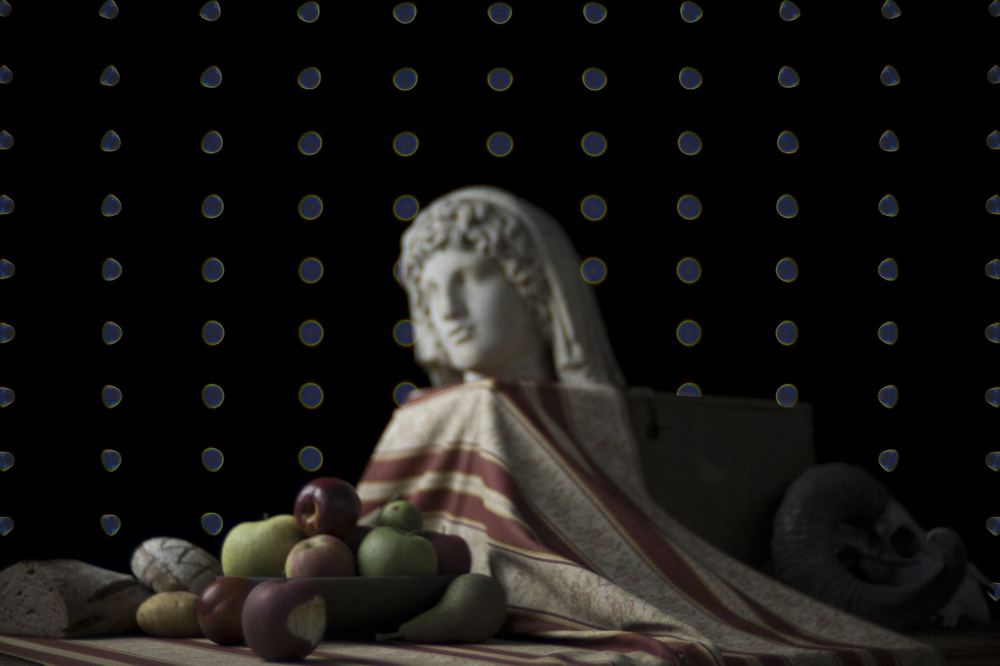

# Testing resources 

This folder holds some commonly used files for lens and scene tests. 

## Readme Img 

Images for the framework documentation. These documentations can be found in Docs, they are also linked in the main page's readme. 

## Var Focal Scene 

Folder name means varied focal length scene. 

This is a scene pre-packaged into a `ExampleStackSpotGrid` inside `ImageStack` class. 
It is intended for a less boring bokeh test while also combining some subjects for in-focus performance examination. 
It contains a still life scene in the middle, and a spot grid behind as bokeh testing. The same scene contains several versions depending on the field of view. 

To focus on the Roman head, the focus distance of each focal lengths are: 

- 24mm focal length: focus at roughly 1070mm 

- 28mm focal length: focus at roughly 1210mm

- 35mm focal length: focus at roughly 1440mm

- 50mm focal length: focus at roughly 1930mm 

- 105mm focal length: focus at roughly 3690mm

Purely for the purpose of my own entertainment, a bitten apple was also placed in the foreground:

	

$$
\textsf{Rendered with a Zeiss Sonnar Opton 50mm f/1.5}
$$

The apple is more obvious in the 50mm range and very much disappears in wider focal length shots. Regardless, to focus on the apple: 

- 24mm focal length: nah

- 28mm focal length: focus at roughly 670mm

- 35mm focal length: focus at roughly 880mm

- 50mm focal length: focus at roughly 1350mm 

- 105mm focal length: focus at roughly 3080mm

## ZMX 

Folder contains `.zmx` files, i.e., Zemax OpticStudio files. These are for easier loading of lenses and saves the effort of manually coding the parameters. 

